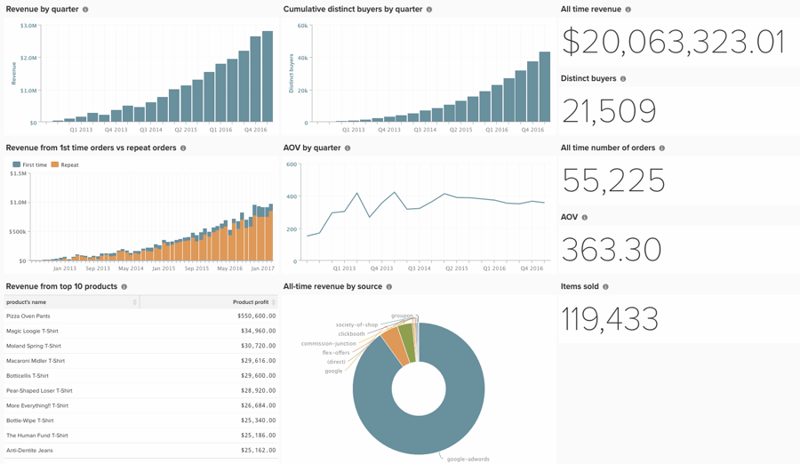

# Crea Cruscotto Investitore

Molti clienti lavorano con gli investitori e devono condividere le informazioni dalla piattaforma, ma le dashboard che crei per prendere decisioni aziendali quotidiane potrebbero non essere ciò che un investitore sta cercando. Di seguito vengono descritte alcune best practice per la creazione di un dashboard completo ma semplice, ideale per la condivisione con investitori attivi e potenziali.

Di seguito è riportato ciò che è necessario creare rapporti per il dashboard investitori:

## Rapporti scalari

* **[!UICONTROL All-time revenue]**
* **[!UICONTROL Distinct buyers]**
* **[!UICONTROL All-time number of orders]**
* **[!UICONTROL AOV]**
* **[!UICONTROL Items sold]**

## Rapporti visivi

* **[!UICONTROL Revenue by quarter]**
   * Metrica - Ricavi
* **[!UICONTROL Revenue from 1st time orders vs repeat orders]**
   * Metrica - Ricavi primo ordine
      * Filtro: il numero di ordine dell’utente è uguale a 1
   * Metrica 2 - Ricavi da ordini ripetuti
      * Filtro: il numero di ordine dell’utente è maggiore di 1
   * Deseleziona la casella per più assi Y
   * Passare a un istogramma in pila
* **[!UICONTROL AOV by quarter]**
   * Metrica 1 - Ricavi
      * Nascondi questa metrica
   * Metrica 2 - Numero di ordini
      * Nascondi questa metrica
   * Formula - AOV
      * A/B
* **[!UICONTROL All-time revenue by source]**
   * Metrica - Ricavi
   * Raggruppa per `utm_source` del cliente
* **[!UICONTROL Revenue from top 10 products]**
   * Metrica - Entrate da prodotti
      * Nascondi il grafico
      * Raggruppa per nome del prodotto. Seleziona tutti i prodotti.
      * Imposta l&#39;intervallo di tempo su All-Time
      * Imposta l&#39;intervallo di tempo su Nessuno
      * In &quot;Show top/bottom&quot; (Mostra superiore/inferiore), mostra solo i primi 10 in base al profitto sul prodotto
* **[!UICONTROL Cumulative distinct buyers by quarter]**
   * Metrica: acquirenti distinti
      * Prospettiva - Cumulativa
* **[!UICONTROL Site visits - New vs. repeat by month]**
* Sessioni

Con l&#39;integrazione di [!DNL Google Analytics], è possibile includere report su:

* Visite al sito
* Tasso di conversione

Con i [Servizi di arricchimento dati di Commerce](https://business.adobe.com/products/magento/magento-commerce.html) è possibile includere report su:

* Clienti univoci per stato/regione, età, genere.

## Altri suggerimenti

* Utilizza una convenzione di denominazione [chiara e concisa](../best-practices/naming-elements.md)
* Condividere il dashboard con gli utenti investitori
* Oppure inviarlo tramite **[!UICONTROL Automated email summary]**(../data-user/export-data/email-summaries.md)
* Crea un solo dashboard. Questo rende il contenuto più semplice da gestire e sai esattamente cosa stanno guardando gli investitori.

Organizza i tuoi report in modo attento e presta attenzione ai dettagli. Una volta completato, il dashboard avrà un aspetto simile a quello riportato di seguito:

