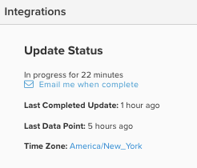

# Avanzamento ciclo di aggiornamento

Quando si accede al dashboard di [!DNL Adobe Commerce Intelligence], è possibile controllare lo stato dell&#39;ultimo ciclo di aggiornamento in diversi modi. Dipende tutto dal tipo di [autorizzazioni utente](../administrator/user-management/user-management.md) di cui disponi.

## Perché devo controllare lo stato del ciclo di aggiornamento?

La verifica del ciclo di aggiornamento dello stato è utile quando si controllano i dati nell&#39;account [!DNL Commerce Intelligence]. Se vedi [risultati che non soddisfano le tue aspettative](../data-analyst/data-warehouse-mgr/data-and-updates-faq.md), ad esempio, le vendite giornaliere in [!DNL Commerce Intelligence] non corrispondono a quelle che vedi nella tua piattaforma di e-commerce o nei tuoi [[!DNL Google] ricavi di e-commerce](https://experienceleague.adobe.com/docs/commerce-knowledge-base/kb/troubleshooting/miscellaneous/diagnosing-google-ecommerce-revenue-discrepancies.html?lang=it), puoi controllare l&#39;ultimo punto dati per vedere se il problema è risolto una volta completato un aggiornamento.

## [!UICONTROL Read-Only] e [!UICONTROL Standard] utenti

`Read-only` utenti possono accedere al proprio dashboard e vedere quanto recentemente i dati sono stati aggiornati passando con il mouse sull&#39;icona in alto a destra della pagina. Questo mostra quando è stato estratto l’ultimo punto dati.


## [!UICONTROL Admin] utenti

`Admin` utenti possono accedere al dashboard e visualizzare l&#39;ultimo punto dati in alto, insieme a una breve icona di stato delle loro integrazioni account.

Per ulteriori dettagli, gli utenti amministratori possono fare clic su **[!UICONTROL Manage Data]** > **[!UICONTROL Integrations]**.



Questa pagina mostra lo stato attuale dell’aggiornamento e l’ora dell’ultimo aggiornamento completato.

Se è in corso un aggiornamento, viene visualizzato un collegamento per richiedere una notifica e-mail al termine dell’aggiornamento.

Se un aggiornamento non è in corso, viene visualizzato un collegamento per forzarne l’avvio.

>[!NOTE]
>
>Se sono state impostate ore di sospensione attività (periodo di tempo in cui non si desidera che [!DNL Commerce Intelligence] aggiorni i dati), forzare un aggiornamento avvia un ciclo di aggiornamento che non rispetta le limitazioni di tali ore di sospensione attività.


## Controlla lo stato del ciclo di aggiornamento utilizzando l’API

È possibile recuperare il ciclo di aggiornamento completato più recente utilizzando l&#39;**API di aggiornamento dello stato del ciclo**.

**Richiesta**

```bash
curl -sS -H "X-RJM-API-Key: <EXPORT-API-KEY>" \
  https://api.rjmetrics.com/0.1/client/<CLIENT_ID>/fullupdatestatus
```

**Risposta (esempio)**

```json
{
  "clientId": 194,
  "lastCompletedUpdateJob": {
    "id": 13554,
    "type": { "id": 2, "name": "Full Update" },
    "start": "2025-12-09 03:26:25",
    "end": "2025-12-09 03:29:03",
    "status": { "id": 4, "name": "Completed Successfully" }
  },
  "lastCompletedUpdateJobWithDataSync": null,
  "timezoneAbbreviation": "EST"
}
```

Per i parametri, l&#39;autenticazione, gli errori e i limiti di velocità, vedere [Aggiorna API di stato ciclo](https://developer.adobe.com/commerce/services/reporting/update-cycle/) nella documentazione per gli sviluppatori.
