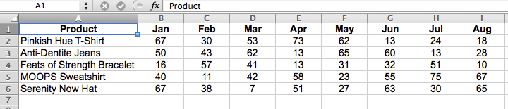

# Formattare e importare dati finanziari

Questo argomento illustra il modo migliore per importare i dati finanziari per l&#39;analisi in [!DNL MBI].

Una tabella di dati bidimensionale e incrociata è spesso il formato utilizzato per i dati finanziari. Con valori organizzati per etichette in colonne e righe, questo tipo di layout può essere facile da visualizzare con occhi umani e strumenti per fogli di calcolo, ma non è molto semplice da usare nei database.

Importazione e analisi dei dati in [!DNL MBI], la tabella deve essere appiattita in un elenco unidimensionale. Una volta appiattito, ogni valore di dati è classificato in più etichette che si trovano tutte in una singola riga, dove ogni riga è univoca o avrebbe un identificatore univoco, ad esempio una colonna chiave primaria.

## Formattazione dei file Excel per l&#39;importazione

Per appiattire una tabella bidimensionale utilizzando una tabella pivot Excel:

1. Apri il file con la tabella di dati bidimensionale.
1. Aprire la Creazione guidata tabella pivot. In Windows, la scelta rapida è `Alt-D`. In Mac OSX, immetti `Command-Option-P`.
1. Seleziona **[!UICONTROL Multiple consolidated ranges]** e fai clic su **[!UICONTROL Next]**.
1. Seleziona **[!UICONTROL I will create the page fields]** e fai clic su **[!UICONTROL Next]**.
1. Seleziona l’intero set di dati nella tabella bidimensionale, incluse le etichette. Assicurati che `0` è selezionato per il numero di campi di pagina desiderati e fai clic su **[!UICONTROL Next]**.
1. Crea la tabella pivot in un nuovo foglio e fai clic su **[!UICONTROL Finish]**.
1. Deselezionare i campi colonna e riga dall’elenco dei campi.
1. Fare doppio clic sul valore numerico risultante per visualizzare i dati di origine appiattiti in un nuovo foglio.
   
1. Salva come `CSV` file.

Tutto qui! La tabella di dati è stata convertita in un formato elenco, conservandone tutte le informazioni originali e può ora essere [importato in [!DNL MBI]](../data-analyst/importing-data/connecting-data/using-file-uploader.md) per l&#39;analisi.
