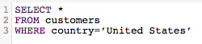

# Ottimizzare le query SQL

[!DNL SQL Report Builder] consente di eseguire query e iterazioni su tali query in qualsiasi momento. Questa opzione è utile quando è necessario modificare una query senza dover attendere il completamento di un ciclo di aggiornamento prima di realizzare che è necessario aggiornare una colonna o un report creato.

Prima dell&#39;esecuzione di una query, [[!DNL Commerce Intelligence] ne stima il costo](https://experienceleague.adobe.com/docs/commerce-knowledge-base/kb/troubleshooting/miscellaneous/sql-queries-explain-cost-errors.html). Il costo considera il tempo e il numero di risorse necessari per eseguire una query. Se il costo è ritenuto troppo elevato o se il numero di righe restituite supera i limiti di [!DNL Commerce Intelligence], la query non riesce. Per eseguire una query sulla [Data Warehouse](../data-analyst/data-warehouse-mgr/tour-dwm.md), in modo da garantire la scrittura delle query più semplici possibile, l&#39;Adobe consiglia quanto segue.

## Utilizzo di SELECT o selezione di tutte le colonne

La selezione di tutte le colonne non consente di eseguire una query tempestiva e semplice. L&#39;esecuzione delle query che utilizzano `SELECT *` può richiedere un po&#39; di tempo, soprattutto se la tabella contiene molte colonne.

Per questo motivo, Adobe consiglia di evitare di utilizzare `SELECT *` laddove possibile e di includere solo le colonne necessarie:

| **Invece di questo...** | **Prova questo!** |
|-----|-----|
|  |  |

{style="table-layout:auto"}

## Utilizzo dei join esterni completi

I join esterni selezionano la totalità di entrambe le tabelle collegate in join, il che aumenta il costo di calcolo della query. Ciò significa che l’esecuzione della query richiede più tempo ed è più probabile che non riesca, in quanto la restituzione dei risultati potrebbe richiedere più tempo del limite di esecuzione.

Invece di utilizzare questo tipo di join, è consigliabile utilizzare un inner join o left join. I join interni restituiscono i risultati solo in presenza di una corrispondenza a livello di colonna tra le tabelle (ad esempio, `order_id` esiste sia in una tabella tipica `customers` che in una tabella `orders`). I join a sinistra restituiscono tutti i risultati della tabella sinistra (prima) insieme ai risultati corrispondenti della tabella destra (seconda).

Osservare come è possibile riscrivere una query FULL OUTER JOIN:

| **Invece di questo...** | **Prova questo!** |
|-----|-----|
|  |  |

{style="table-layout:auto"}

Queste query sono identiche in tutti i modi tranne che per il tipo di JOIN utilizzato.

## Utilizzo di più join

Sebbene sia possibile includere più join nella query, tenere presente che questo potrebbe determinare un aumento dei costi della query. Per evitare di raggiungere la soglia di costo, Adobe consiglia di evitare più join, ove possibile.

## Utilizzo dei filtri

Se possibile, utilizza i filtri. Le clausole `WHERE` e `HAVING` filtrano i risultati e forniscono solo i dati desiderati.

## Utilizzo dei filtri nelle clausole JOIN

Se si utilizza un filtro durante l&#39;esecuzione di un join, assicurarsi di applicarlo a entrambe le tabelle del join. Anche se è ridondante, questo riduce il costo di elaborazione della query e il tempo di esecuzione.

| **Invece di questo...** | **Prova questo!** |
|-----|-----|
|  |  |

{style="table-layout:auto"}

## Utilizzo degli operatori

Quando scrivi le query, puoi utilizzare gli operatori &quot;meno costosi&quot; possibili. Ogni query ha un costo computazionale determinato dalle funzioni, dagli operatori e dai filtri che la compongono. Alcuni operatori richiedono un minore sforzo di calcolo, il che li rende meno costosi di altri.

Gli operatori di confronto (>, &lt;, = e così via) sono i meno costosi, seguiti da [LIKE. Operatori LIKE TO e POSIX](https://www.postgresql.org/docs/9.5/functions-matching.html) che sono gli operatori più costosi.

## Utilizzo di EXISTS e IN

L&#39;utilizzo di `EXISTS` rispetto a `IN` dipende dal tipo di risultati che si sta tentando di restituire. Se si è interessati a un solo valore, utilizzare la clausola `EXISTS` anziché `IN`. `IN` viene utilizzato con elenchi di valori separati da virgole, che aumentano il costo di calcolo della query.

Quando vengono eseguite `IN` query, il sistema deve prima elaborare la sottoquery (l&#39;istruzione `IN`), quindi l&#39;intera query basata sulla relazione specificata nell&#39;istruzione `IN`. `EXISTS` è molto più efficiente perché la query non deve essere eseguita più volte. Viene restituito un valore true/false durante la verifica della relazione specificata nella query.

In parole povere: il sistema non deve elaborare altrettanto quando utilizza `EXISTS`.

| **Invece di questo...** | **Prova questo!** |
|-----|-----|
|  |  |

{style="table-layout:auto"}

## Utilizzo di ORDER BY

`ORDER BY` è una funzione costosa in SQL e può aumentare notevolmente il costo di una query. Se viene visualizzato un messaggio di errore che indica che il costo EXPLAIN della query è troppo elevato, provare a eliminare `ORDER BY` dalla query se non necessario.

Ciò non significa che `ORDER BY` non possa essere utilizzato, ma solo che debba essere utilizzato solo quando necessario.

## Utilizzo di GROUP BY e ORDER BY

In alcune situazioni questo approccio non è conforme a quello che stai cercando di fare. La regola generale è che se si utilizza un `GROUP BY` e un `ORDER BY`, è necessario inserire le colonne in entrambe le clausole nello stesso ordine. Ad esempio:

| **Invece di questo...** | **Prova questo!** |
|-----|-----|
|  |  |

{style="table-layout:auto"}

## Ritorno a capo

Il modo migliore per imparare a scrivere SQL - e farlo in modo efficiente - è tramite tentativi ed errori. Per individuare le operazioni più appropriate, provare a ricreare alcuni report utilizzando solo l&#39;editor SQL.
