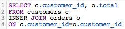

# Ottimizzare le query SQL

Il Report Builder SQL consente di eseguire query e iterazioni su tali query in un dato momento. Questa opzione è utile quando è necessario modificare una query senza dover attendere il completamento di un ciclo di aggiornamento prima di realizzare una colonna o un report creato e occorre aggiornarlo.

Prima dell’esecuzione di una query, [[!DNL MBI] valuta il costo](https://experienceleague.adobe.com/docs/commerce-knowledge-base/kb/troubleshooting/miscellaneous/sql-queries-explain-cost-errors.html?lang=en). Il costo prende in considerazione la durata e il numero di risorse necessarie per eseguire una query. Se tale costo è considerato troppo elevato o se il numero di righe restituite supera i limiti, la query non verrà eseguita. Abbiamo messo a punto un elenco di raccomandazioni per eseguire query sul data warehouse, in modo da garantire la scrittura delle query più semplificate possibili.

## Utilizzo di SELECT o selezione di tutte le colonne

La selezione di tutte le colonne non rende necessaria una query tempestiva e facilmente eseguita. Query che utilizzano `SELECT *` L’esecuzione può richiedere un po’ di tempo, specialmente se la tabella presenta un numero elevato di colonne.

Per questo motivo, si consiglia di evitare di utilizzare `SELECT *` ovunque possibile e includi solo le colonne necessarie:

| **Invece di questo...** | **Provate questo!** |
|-----|-----|
|  |  |

{style=&quot;table-layout:auto&quot;}

## Utilizzo di join esterni completi

I join esterni selezionano l&#39;intero insieme di entrambe le tabelle da unire, il che aumenterà il costo di calcolo della query. Ciò significa che l’esecuzione della query richiederà più tempo ed è più probabile che si verifichi un errore, in quanto la restituzione dei risultati potrebbe richiedere più tempo del limite di esecuzione.

Invece di utilizzare questo tipo di join, è consigliabile utilizzare un join interno o sinistro. I join interni restituiscono i risultati solo quando è presente una corrispondenza colonna tra tabelle (ad esempio, `order_id` esiste in entrambi i `customers` e `orders` tabella); i join a sinistra restituiranno tutti i risultati della tabella a sinistra (prima) insieme ai risultati corrispondenti nella tabella a destra (seconda).

Dai un&#39;occhiata a come possiamo riscrivere una query FULL OUTER JOIN:

| **Invece di questo...** | **Provate questo!** |
|-----|-----|
|  |  |

{style=&quot;table-layout:auto&quot;}

Come puoi vedere, queste query sono identiche in tutti i modi tranne il tipo di JOIN che utilizzano.

## Utilizzo di più join

Anche se è possibile includere più join nella query, tenere presente che potrebbe determinare un aumento del costo della query. Per evitare di raggiungere la soglia dei costi, si consiglia di evitare più join, ove possibile.

## Utilizzo dei filtri

Utilizza i filtri quando possibile. `WHERE` e `HAVING` Le clausole filtrano i risultati e ti forniscono solo i dati desiderati.

## Utilizzo di filtri nelle clausole JOIN

Se si utilizza un filtro durante l&#39;esecuzione di un join, assicurarsi di applicarlo a entrambe le tabelle del join. Anche se è ridondante, questo ridurrà il costo di calcolo della query e accelererà il tempo di esecuzione.

| **Invece di questo...** | **Provate questo!** |
|-----|-----|
|  |  |

{style=&quot;table-layout:auto&quot;}

## Utilizzo degli operatori

Quando scrivi query, considera l’utilizzo degli operatori &quot;meno costosi&quot; possibili. Ogni query ha un costo di calcolo, determinato dalle funzioni, dagli operatori e dai filtri che compongono la query. Alcuni operatori richiedono uno sforzo di calcolo inferiore, il che li rende meno costosi di altri operatori.

Gli operatori di confronto (>, &lt;, = e così via) sono i meno costosi, seguiti da [COME. OPERATORI SIMILI A E POSIX](https://www.postgresql.org/docs/9.5/functions-matching.html) che sono gli operatori più costosi.

## Utilizzo degli ESISTENTI rispetto a IN

Utilizzo `EXISTS` contro `IN` dipende dal tipo di risultati che si sta tentando di restituire. Se sei interessato a un solo valore, utilizza la variabile `EXISTS` anziché `IN`. `IN` viene utilizzato in combinazione con gli elenchi di valori separati da virgole, che aumenteranno il costo di calcolo della query.

Quando `IN` le query vengono eseguite, il sistema deve prima elaborare la sottoquery (la `IN` , quindi l&#39;intera query in base alla relazione specificata nel `IN` istruzione. `EXISTS` è molto più efficiente perché la query non deve essere eseguita più volte - viene restituito un valore true/false durante il controllo della relazione specificata nella query.

Per dirla semplicemente: il sistema non deve elaborare altrettanto quando si utilizza `EXISTS`.

| **Invece di questo...** | **Provate questo!** |
|-----|-----|
|  |  |

{style=&quot;table-layout:auto&quot;}

## Utilizzo di ORDINE PER

`ORDER BY` è una funzione costosa in SQL e può aumentare notevolmente il costo di una query. Se ricevi un messaggio di errore che indica che il costo EXPLAIN della query è troppo elevato, prova ad eliminare qualsiasi `ORDER BY`viene dalla query a meno che non sia assolutamente necessario.

Ciò non significa che `ORDER BY` non può essere utilizzato, solo che deve essere utilizzato solo quando necessario.

## Utilizzo di GROUP BY e ORDINE BY

Anche se ci possono essere alcune situazioni in cui questo approccio non è conforme a quello che si sta cercando di fare, la regola generale è che se si utilizza un `GROUP BY` e `ORDER BY`, dovresti mettere le colonne in entrambe le clausole nello stesso ordine. Ad esempio:

| **Invece di questo...** | **Provate questo!** |
|-----|-----|
|  |  |

{style=&quot;table-layout:auto&quot;}

## Ritorno a capo

Il modo migliore per imparare a scrivere SQL - e farlo in modo efficiente - è attraverso tentativi ed errori. Per trovare ciò che funziona meglio, prova a ricreare alcuni rapporti utilizzando solo l&#39;editor SQL.
