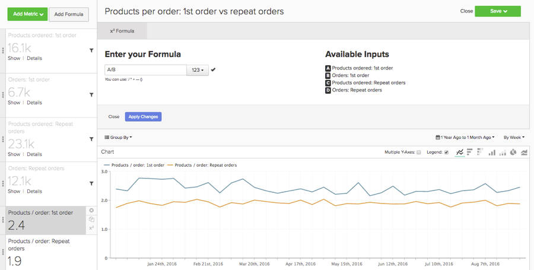
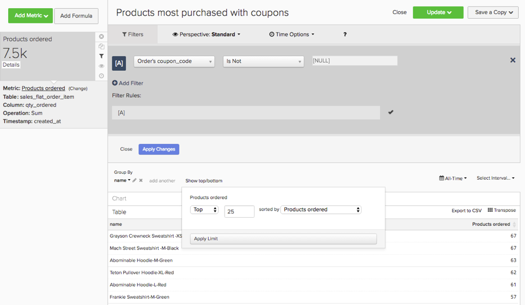

# Analytics di base

Una volta che hai familiarità con il [!DNL MBI] e avere una comprensione di base dello strumento, è necessario iniziare a creare report. Una delle domande più comuni che potresti avere è &quot;Cosa dovrei guardare?&quot;

Le informazioni riportate di seguito illustrano alcune delle metriche e dei rapporti comuni che potrebbero essere utili. Diversi di questi rapporti esistono già all’interno del tuo account, quindi assicurati di rivedere le metriche e i rapporti esistenti all’interno del tuo account per evitare la creazione di duplicati.

## Tabelle e colonne da comprendere

Quando si crea una metrica, è necessario conoscere quattro informazioni:

1. La tabella su cui vivono i dati,
1. L&#39;azione specifica da eseguire,
1. La colonna sulla quale si desidera eseguire l&#39;azione e
1. La marca temporale che desideri utilizzare per il tracciamento di tali dati.

Molto probabilmente, i nomi delle tabelle utilizzate in questi esempi sono leggermente diversi dai nomi delle colonne e delle tabelle nel database, in quanto ogni database è univoco. Se hai bisogno di aiuto per identificare una tabella o una colonna corrispondente nel database, fai riferimento alle definizioni riportate di seguito.

## Tabella clienti

Questa tabella contiene informazioni chiave su ciascun cliente, ad esempio un ID cliente univoco, un indirizzo e-mail, la data di creazione dell’account e così via. Negli esempi seguenti, utilizzeremo **[!UICONTROL customer_entity]** come nome di una tabella cliente di esempio.

Se alcuni di questi calcoli non esistono attualmente nel database, qualsiasi utente amministratore nel tuo account può generarli. Inoltre, assicurati che queste dimensioni siano raggruppabili per tutte le metriche applicabili.

**Dimension**

* **[!UICONTROL Entity_id]**: Identificatore univoco per ogni cliente. Può anche essere un numero cliente univoco o un indirizzo e-mail del cliente e deve fungere da chiave di riferimento per la tabella del tuo ordine.
* **[!UICONTROL Created_at]**: Data di creazione e aggiunta dell&#39;account del cliente al database.
* **[!UICONTROL Customer's lifetime revenue]**: Il totale dei ricavi per tutta la vita generati da un cliente.
* **[!UICONTROL Customer's first 30-day revenue]**: L&#39;importo totale dei ricavi generati da un cliente nei primi 30 giorni.
* **[!UICONTROL Customer's lifetime number of orders]**: Il numero di ordini immessi da un cliente nel corso della sua vita.
* **[!UICONTROL Customer's lifetime number of coupons]**: Il numero totale di coupon utilizzati da un cliente nel corso della sua vita.
* **[!UICONTROL Customer's first order date]**: Data del primo ordine del cliente. Questo può essere diverso dalla data create_at se un cliente non ha effettuato un ordine al momento della creazione.

**Accettate gli ordini dei clienti?**

*In tal caso, questa tabella potrebbe non contenere tutti i tuoi clienti. Contatta il nostro [team di supporto](https://support.magento.com/hc/en-us/articles/360016503692) per assicurarti che le analisi dei tuoi clienti includano tutti i clienti.*

*Non sei sicuro se accetti gli ordini degli ospiti? Fai riferimento a [argomento](../data-warehouse-mgr/guest-orders.md) per saperne di più!*

## Tabella ordini

In questa tabella, ogni riga rappresenta un ordine. Le colonne di questa tabella contengono informazioni di base su ciascun ordine, ad esempio l’ID dell’ordine, la data di creazione, lo stato, l’ID del cliente che ha effettuato l’ordine e così via. Negli esempi seguenti, utilizziamo **[!UICONTROL sales_flat_order]** come nome di una tabella degli ordini di esempio.

**Dimension**

* **[!UICONTROL Customer_id]**: Identificatore univoco per il cliente che ha effettuato l&#39;ordine. Questo viene spesso utilizzato per spostare le informazioni tra le tabelle cliente e ordini. Nei nostri esempi, ci aspettiamo l’id_cliente sul **[!UICONTROL sales_flat_order]** tabella da allineare con **[!UICONTROL entitiy_id]** sulla **[!UICONTROL customer_entity]** tabella.
* **[!UICONTROL Created_at]**: Data di creazione o di inserimento dell’ordine.
* **[!UICONTROL Customer_email]**: Indirizzo e-mail del cliente che ha effettuato l’ordine. Può essere anche l’identificatore univoco del cliente.
* **[!UICONTROL Customer's lifetime number of orders]**: Una copia della colonna con lo stesso nome sul tuo `Customers` tabella.
* **[!UICONTROL Customer's order number]**: Numero dell&#39;ordine sequenziale del cliente associato all&#39;ordine. Ad esempio, se la riga che stai guardando è il primo ordine del cliente, questa colonna è &quot;1&quot;; ma, se si tratta del quindicesimo ordine del cliente, questa colonna mostra &quot;15&quot; per questo ordine. Se questa dimensione non esiste sul tuo `Customers` tavolo, chiedi [team di supporto](https://support.magento.com/hc/en-us/articles/360016503692) per aiutarvi a costruirla.
* **[!UICONTROL Customer's order number (previous-current)]**: Una concatenazione di due valori nel **[!UICONTROL Customer's order number]** colonna. Viene utilizzato in un report di esempio riportato di seguito per visualizzare il tempo trascorso tra due ordini. Ad esempio, l’ora tra la data del primo ordine di un cliente e la data del secondo ordine è rappresentata come &quot;1-2&quot; con questo calcolo.
* **[!UICONTROL Coupon_code]**: Mostra quali cedole sono state utilizzate per ogni ordine.
* **[!UICONTROL Seconds since previous order]**: Tempo (in secondi) tra gli ordini di un cliente.

## Tabella Articoli ordine

In questa tabella, ogni riga rappresenta un articolo venduto. Questa tabella contiene informazioni sugli articoli venduti in ciascun ordine, quali il numero di riferimento dell&#39;ordine, il numero di prodotto, la quantità e così via. Negli esempi seguenti, utilizziamo `sales_flat_order_item` come nome di una tabella degli elementi dell’ordine di esempio.

**Dimension**

* **[!UICONTROL Item_id]**: Identificatore univoco per ogni riga della tabella.
* **[!UICONTROL Order_id]**: La chiave di riferimento `Orders` tabella che indica gli articoli acquistati nello stesso ordine. Se un ordine contiene più elementi, questo valore viene ripetuto.
* **[!UICONTROL Product_id]**: Se desideri informazioni sul prodotto specifico acquistato (ad esempio colore, dimensioni e così via), utilizza questa colonna per estrarre tali informazioni dalla tabella dei prodotti.
* **[!UICONTROL Order's created_at]**: La marca temporale in cui è stato inserito l’ordine, in genere copiata nel `order line items` dalla tabella `Orders` tabella.
* **[!UICONTROL Order's coupon_code]**: Simile al `Order's created_at` questa colonna viene copiata dalla tabella degli ordini.

## Tabella sottoscrizioni

Questa tabella viene utilizzata per gestire le informazioni sull’abbonamento, ad esempio l’ID abbonamento, l’indirizzo e-mail dell’abbonato, la data di inizio dell’abbonamento e così via.

**Dimension**

* **[!UICONTROL Customer_id]**: Identificatore univoco per il cliente che ha effettuato l&#39;ordine. Si tratta di un metodo comune per creare un percorso tra la tabella Clienti e la tabella Ordini. Nei nostri esempi, ci aspettiamo l’id_cliente sul **sales_flat_order** tabella da allineare con `entitiy_id` sulla `customer_entity` tabella.
* **[!UICONTROL Start date]**: Data di inizio dell&#39;abbonamento a un cliente.

## Tabella delle spese di marketing

Quando analizzi la spesa di marketing, puoi includere [!DNL Facebook], [!DNL Google AdWords]o altre fonti nelle analisi. Se disponi di più origini di spesa marketing, contatta il nostro [Team servizi](https://business.adobe.com/products/magento/fully-managed-service.html) per informazioni su come impostare una tabella consolidata per le campagne di marketing.

**Dimension**

* **[!UICONTROL Spend]**: La spesa pubblicitaria totale. In [!DNL Facebook], rappresenta la colonna spesa nel `facebook_ads_insights_####` tabella. Per [!DNL Google AdWords], questa è la `adCost` nella colonna `campaigns####` tabella.
* La `####` che viene aggiunto a ciascuna di queste tabelle in relazione all&#39;ID account specifico per il tuo [!DNL Facebook] o [!DNL Google AdWords] conto.
* **[!UICONTROL Clicks]**: Numero totale di clic. In [!DNL Facebook], questa sarebbe la colonna dei clic nel `facebook_ads_insights_####` tabella. In [!DNL Google AdWords], questa è la colonna adClicks nel `campaigns####` tabella.
* **[!UICONTROL Impressions]**: Numero totale di impression. In [!DNL Facebook], sono le impression nel `facebook_ads_insights_####` tabella. In [!DNL Google AdWords], queste sono le impression `campaigns####` tabella.
* **[!UICONTROL Campaign]**: Numero totale di clic. In [!DNL Facebook], è la colonna nome_campagna nel `facebook_ads_insights_####` tabella. In [!DNL Google AdWords], questa è la colonna della campagna nel `campaigns####` tabella.
* **[!UICONTROL Date]**: La marca temporale in cui si sono verificate la spesa, i clic o le impression per una determinata campagna. In [!DNL Facebook], questa è la `date_start` nella colonna `facebook_ads_insights_####` tabella. In [!DNL Google AdWords], questa è la colonna data nel `campaigns####` tabella.
* **[!UICONTROL Customer's first order's source]**: L&#39;origine dell&#39;ordine dal primo ordine del cliente. Per prima cosa, controlla di avere una colonna denominata `customer's first order's source` nel tuo account. Se questa colonna non viene visualizzata, puoi creare la colonna desiderata seguendo queste istruzioni.
* **[!UICONTROL Customer's first order's medium]**: Il supporto dell&#39;ordine viene dal primo ordine del cliente. Per prima cosa, controlla di avere una colonna denominata `customer's first order's source` nel tuo account. Se questa colonna non viene visualizzata, puoi creare la colonna desiderata seguendo queste istruzioni.
* **[!UICONTROL Customer's first order's campaign]**: La campagna dell&#39;ordine dal primo ordine del cliente. Per prima cosa, controlla di avere una colonna denominata `customer's first order's source` nel tuo account. Se questa colonna non viene visualizzata, puoi creare la colonna desiderata seguendo queste istruzioni.

## Rapporti e metriche comuni

Di seguito sono riportati alcuni esempi comuni di rapporti e metriche che potrebbero essere utili:

* [Analisi dei clienti](#customeranalytics)
* [Analisi degli ordini](#orderanalytics)
* [Analisi della spesa di marketing](#mktgspendanalytics)

## Analisi dei clienti {#customeranalytics}

### Nuovi utenti

* **Descrizione**: Un conteggio del numero totale di utenti appena acquisiti in un dato periodo di tempo. `New Users` è diverso da `Unique Customers`perché `New Users` ha la marca temporale che un account è stato creato con il servizio (questo non significa che hanno necessariamente effettuato un ordine) mentre `Unique Customers` hanno effettuato almeno un ordine.
* **Definizione della metrica**: Questa metrica esegue un **Conteggio** di `entity_id` da `customer_entity` tabella ordinata da `created_at`.
* **Esempio di rapporto**: Numero di nuovi utenti creati lo scorso mese
   * **[!UICONTROL Metric]**: `New Users`
   * **[!UICONTROL Time Range]**: `Last Month`
   * **[!UICONTROL Time Interval]**: `By Day`

<!--{: width="929"}-->

### Clienti unici

* **Descrizione**: Un conteggio del numero totale di clienti distinti in un dato periodo di tempo. Questo è diverso da `New Users`, perché tiene traccia solo dei clienti che hanno effettuato almeno un ordine. Un rapporto clienti distinti tiene traccia di un cliente solo una volta in un dato intervallo di tempo. Se si imposta l&#39;intervallo di tempo su `By Day` e un cliente effettua più acquisti in quel giorno, il cliente sarà conteggiato una sola volta. Se desideri visualizzare un numero totale di acquisti in generale, consulta `Number of Orders`.
* **Definizione della metrica**: Questa metrica esegue un **Conteggio valori univoci** di `customer_id` da `sales_flat_order` tabella ordinata da `created_at`.
* **Esempio di rapporto**: Clienti distinti per settimana negli ultimi 90 giorni
   * **[!UICONTROL Metric]**: `Distinct Customers`
   * **[!UICONTROL Time Range]**: `Moving range > Last 90 Days`
   * **[!UICONTROL Time Interval]**: `By Day`

<!--{: width="929"}-->

### Nuovi abbonati

* **Descrizione**: Conteggio del numero totale di nuovi abbonati acquisiti in un determinato periodo di tempo.
* **Definizione della metrica**: Questa metrica esegue un **Conteggio valori univoci** di `customer_id` da `subscriptions` tabella ordinata da `start_date`.
* **Esempio di rapporto**: Nuovi abbonati quest&#39;anno per mese
   * **[!UICONTROL Metric]**: `New Subscribers`
   * **[!UICONTROL Time Range]**: `1 Year Ago to 0 Days Ago`
   * **[!UICONTROL Time Interval]**: `By Month`

<!--{: width="929"}-->

### Clienti ripetuti

* **Descrizione**: Il numero totale di clienti che hanno effettuato più di un ordine in un periodo di tempo. In un rapporto clienti ripetuti, puoi utilizzare `Distinct Customers` e `Customer's Order Number` dalle dimensioni `orders` tabella.
* **Metrica utilizzata**: `Distinct Customers`
* **Esempio di rapporto**: Numero di acquisti effettuati nel 2° e nel 3° anno dello scorso anno
   * **[!UICONTROL Metric]**: `Distinct Customers`
   * **[!UICONTROL Time Range]**: `Moving Range > Last Year`
   * **[!UICONTROL Time Interval]**: `By Month`
   * **[!UICONTROL Group By]**: `Customer's Order Number`, quindi seleziona `2` e `3`

   

* **Esempio di rapporto 2**: Numero di clienti ripetuti nell’ultimo anno
   * **[!UICONTROL Metric]**: `Distinct Customers`
   * **[!UICONTROL Filters]**: `Customer's Order Number Greater Than 1`
   * **[!UICONTROL Time Range]**: `Moving range > Last Year`
   * **[!UICONTROL Time Interval]**: `By Month`

   <!--{: width="929"}-->

### Migliori clienti per numero di ordini nel corso della vita

* **Descrizione**: Elenco dei clienti principali in base al numero totale di ordini. Questo ti fornisce un elenco diretto dei tuoi acquisti più frequenti.
* **Metrica utilizzata**: `Orders`
* **Esempio di rapporto**: Primi 25 clienti per numero di ordini nel corso della vita
   * **[!UICONTROL Metric]**: `Orders`
   * **[!UICONTROL Time Range]**: `All Time`
   * **[!UICONTROL Time Interval]**: `None`
   * **[!UICONTROL Group By]**: `customer_email`
   * **[!UICONTROL Show Top/Bottom]**: Primi 25 ordinati per ordini

   <!--{: width="929"}-->

### Principali clienti per fatturato a vita

* **Descrizione**: Elenco dei principali clienti in base ai ricavi per tutto il ciclo di vita.
* **Metrica utilizzata**: `Average Lifetime Revenue`
* **Esempio di rapporto**: Primi 25 clienti per fatturato nel ciclo di vita
   * **[!UICONTROL Metric]**: `Average Lifetime Revenue`
   * **[!UICONTROL Time Range]**: `All time`
   * **[!UICONTROL Time Interval]**: `None`
   * **[!UICONTROL Group By]**: `customer_email`
   * **[!UICONTROL Show Top Bottom]**: Primi 25 ordinati per ricavi del ciclo di vita

   <!--{: width="929"}-->

### Ricavi medi a vita per coorte

* **Descrizione**: Tracciare [ricavi medi su vita di coorti distinte](../dev-reports/lifetime-rev-cohort-analysis.md) di utenti nel tempo per identificare le coorti con prestazioni migliori. Le coorti sono raggruppate in base a una data comune, ad esempio la data del primo ordine o la data di creazione.
* **Metrica utilizzata**: `Revenue`
* **Esempio di rapporto**: Ricavi medi della vita del cliente per coorte
   * **[!UICONTROL Metric]**: `Revenue`
   * **[!UICONTROL Cohort Date]**: `Customer's first order date`
   * **[!UICONTROL Time Interval]**: `Month`
   * **[!UICONTROL Time Period]**: Set mobile di coorti delle ultime 8 coorti con almeno 4 mesi di dati
   * **[!UICONTROL Duration]**: `12 Month(s)`
   * **[!UICONTROL Table]**: `Customer_entity`
   * **[!UICONTROL Perspective]**: Valore medio cumulativo per membro coorte

   <!--{: width="929"}-->

### Clienti per uso coupon

* **Descrizione**: Conteggio del numero di clienti acquisiti che hanno utilizzato un codice coupon/sconto. Questo può aiutarti a ottenere una visione chiara dei tuoi clienti scontati rispetto agli acquirenti a prezzo pieno.
* **Metrica utilizzata**: `New Users`
* **Esempio di rapporto**: Clienti cedole e non cedole per mese
   * **[!UICONTROL Metric A]**: `Non coupon customers`
   * **[!UICONTROL Metric]**: `New Users`
   * **[!UICONTROL Filters]**: Ciclo di vita del cliente Numero di ordini maggiore di 0 e ciclo di vita del cliente Numero di Coupon pari a 0
   * **[!UICONTROL Metric B]**: `Coupon customers`
   * **[!UICONTROL Metric]**: `New Users`
   * **[!UICONTROL Filters]**: Ciclo di vita dei clienti Numero di ordini maggiore di 0 e numero di Coupon di vita del cliente maggiore di 0
   * **[!UICONTROL Time range]**: `All Time`
   * **[!UICONTROL Time interval]**: `By Month`

   <!--{: width="929"}-->

* **Esempio di rapporto 2**: Percentuale clienti coupon e non coupon per mese
   * **[!UICONTROL Metric A]**: `Non coupon customers` (nascondere la metrica)
      * **[!UICONTROL Metric]**: `New Users`
      * **[!UICONTROL Filters]**: `Customer's Lifetime Number of Orders Greater Than 0` e `Customer's Lifetime Number of Coupons Equal to 0`
   * **[!UICONTROL Metric B]**: `Coupon customers`
      * **[!UICONTROL Metric]**: `New Users`
      * **[!UICONTROL Filters]**: `Customers Lifetime Number of Orders Greater Than 0` e `Customer's Lifetime Number of Coupons Greater Than 0`
   * **[!UICONTROL Time Range]**: `All Time`
   * **[!UICONTROL Time Interval]**: `By Month`
   * **[!UICONTROL Formula]**: `B/(A+B)`

>[!NOTE]
>
> **Nascondi tutte le metriche**

<!--{: width="929"}-->

### Ricavi medi dei primi 30 giorni

* **Descrizione**: La media dell’importo dei ricavi generati dai clienti nei loro primi 30 giorni come cliente.
* **Descrizione della metrica**: Questa metrica esegue un **Media** di `Customer's First 30 Day Revenue` da `customer_entity` tabella ordinata da `created_at`.
* **Descrizione del rapporto**: Media temporale dei primi 30 giorni di ricavi del cliente
* **[!UICONTROL Metric]**: `Average First 30 Day Revenue`
* **[!UICONTROL Time Range]**: `All Time`
* **[!UICONTROL Time Interval]**: `None`

<!--{: width="929"}-->

### Ricavo medio della vita del cliente

* **Descrizione**: La quantità media di ricavi generati dai clienti nel corso della loro vita.
* **Descrizione della metrica**: Questa metrica esegue un **Media** del `Customer's Lifetime Revenue` nella colonna `customer_entity` in base alla tabella `created_at`.
* **Descrizione del rapporto**: Media temporale dei ricavi a vita del cliente
   * **[!UICONTROL Metric]**: `Average Customer Lifetime Revenue`
   * **[!UICONTROL Time Range]**: `All Time`
   * **[!UICONTROL Time Interval]**: `None`

<!--{: width="929"}-->

## Analisi degli ordini {#orderanalytics}

### Entrate

* **Descrizione**: La metrica Ricavo visualizza i ricavi totali ottenuti in un periodo di tempo scelto.
* Questa metrica esegue un **sum** di `grand_total` da `sales_flat_order` tabella ordinata da `created_at`.
* **Esempio di rapporto**: Entrate per mese, YTD
   * **[!UICONTROL Metric]**: `Revenue`
   * **[!UICONTROL Time Range]**: `1 Year Ago to 1 Month Ago`
   * **Intervallo di tempo**: `By Month`

>[!TIP]
>
>Assicurati che il calcolo della metrica Ricavo sia coerente con la definizione discussa internamente. Ad esempio, è possibile che si desideri conteggiare solo i ricavi degli ordini spediti, potrebbe essere necessario convertire le valute di diverse aree geografiche e si potrebbe voler escludere l&#39;imposta. Inoltre, puoi utilizzare [Set di filtri](../../data-user/reports/ess-manage-data-filters.md) per garantire la coerenza tra tutte le metriche create sulla stessa tabella.

<!--{: width="929"}-->

### Ordini

* **Descrizione**: Un conteggio del numero totale di ordini in un dato periodo di tempo. Un rapporto Ordini tiene traccia delle modifiche nel volume degli ordini causate da nuove offerte di prodotti, promozioni o qualsiasi altra cosa che possa aumentare (o diminuire) il volume delle transazioni. Spesso può essere utile segmentare questa metrica per una serie di variabili per rispondere alle tue domande.
* **Definizione della metrica**: Questa metrica esegue un **Conteggio** di `entity_id` da `sales_flat_order` tabella ordinata da `created_at`.
* **Esempio di rapporto**: Ordini per mese, YTD
   * **[!UICONTROL Metric]**: `number of orders`
   * **[!UICONTROL Time Range]**: `1 Year Ago to 1 Month Ago`
   * **[!UICONTROL Time Interval]**: `By Month`

>[!TIP]
>
>Proprio come la metrica dei ricavi, dovresti avere [Set di filtri](../../data-user/reports/ess-manage-data-filters.md) per escludere ordini incompleti, di prova o restituiti.

<!--{: width="929"}-->

### Prodotti ordinati

* **Descrizione**: La metrica prodotti ordinati indica la quantità di articoli venduti in un periodo di tempo specifico.
* **Definizione della metrica**: Questa metrica esegue un **sum** di `qty_ordered` da `sales_flat_order_item` tabella ordinata da `created_at`.
* **Esempio di rapporto**: Articoli venduti per mese, YTD
   * **[!UICONTROL Metric]**: `Products ordered`
   * **[!UICONTROL Time Range]**: `1 Year Ago to 1 Month Ago`
   * **[!UICONTROL Time Interval]**: `By Month`

   <!--{: width="929"}-->

* Combina questa metrica con la metrica del numero di ordini per calcolare il numero di elementi per ordine. Quindi, aggiungi i codici coupon al rapporto per determinare in che modo le promozioni influiscono sulle dimensioni del carrello o sui segmenti in base a nuovi ordini rispetto a quelli ripetuti per comprendere meglio il comportamento del cliente.
* **Esempio di rapporto**: Prodotti per ordine: 1° ordine e ordini ripetuti
   * **[!UICONTROL Metric A]**: Prodotti ordinati: 1° ordine
      * **[!UICONTROL Metric]**: `Products ordered`
      * **[!UICONTROL Filter]**: `Customer's order number = 1`
   * **[!UICONTROL Metric B]**: Ordini: 1° ordine
      * **[!UICONTROL Metric]**: `Orders`
      * **[!UICONTROL Filter]**: `Customer's order number = 1`
   * **[!UICONTROL Metric C]**: Prodotti ordinati: ripetere ordini
      * **[!UICONTROL Metric]**: `Products ordered`
      * **[!UICONTROL Filter]**: `Customer's order number > 1`
   * **[!UICONTROL Metric D]**: Ordini: Ordini ripetuti
      * **[!UICONTROL Metric]**: `Orders`
      * **[!UICONTROL Filter]**: `Customer's order number > 1`
   * **[!UICONTROL Time Range]**: `1 Year Ago to 1 Month Ago`
   * **[!UICONTROL Time Interval]**: `By Week`
   * **[!UICONTROL Formula 1]**: `A/B`
   * **[!UICONTROL Formula 2]**: `C/D`

>[!NOTE]
>
>Deseleziona `Multiple Y-Axes box` e `Hide` tutte le metriche

<!--{: width="929"}-->

### Valore medio dell&#39;ordine

* **Descrizione**: Tenere traccia del valore medio degli ordini immessi in un periodo di tempo. Utilizza questa metrica per determinare rapidamente in che modo il valore medio dell’ordine (AOV) ha oscillato in seguito alle attività di marketing, all’offerta di prodotti e/o ad altri cambiamenti nella tua attività.
* **Definizione della metrica**: Questa metrica esegue un **media** di `grand_total` da `sales_flat_order` tabella ordinata da `created_at`.
* **Esempio di rapporto**: AOV rispetto all&#39;anno precedente, YTD
   * **[!UICONTROL Metric]**: `Average order value`
   * **[!UICONTROL Time Range]**: `1 Year Ago to 1 Month Ago`
   * **[!UICONTROL Time Interval]**: `By Month`
   * **[!UICONTROL Perspective]**: `Amount Change vs Previous Year`

   <!--{: width="929"}-->

### Prodotti più acquistati con coupon

* **Descrizione**: Questo rapporto fornisce informazioni su quali prodotti vengono venduti quando offri promozioni o promozioni.
* **Metrica utilizzata**: Prodotti ordinati
* **Esempio di rapporto**: Prodotti più acquistati con coupon
   * **[!UICONTROL Metric]**: `Products ordered`
   * **[!UICONTROL Filter]**: `Order's coupon_code Is Not \[NULL\]`
   * **[!UICONTROL Time Range]**: `All-Time`
   * **[!UICONTROL Time Interval]**: `None`
   * **[!UICONTROL Group By**]: `name` o `SKU`o qualsiasi altro codice identificativo del prodotto)
   * **[!UICONTROL Show top/bottom]**: Primi 25 ordinati per prodotti ordinati

   <!--{: width="929"}-->

### Intervallo tra ordini

* **Descrizione**: Verifica le tue ipotesi e aspettative sui cicli di acquisto dei tuoi clienti con un **tempo tra gli ordini** analisi che considera la media (o mediana!) periodo di tempo tra gli acquisti. Nel grafico seguente puoi vedere che i tuoi migliori clienti - quelli che fanno più di tre ordini - fanno il loro secondo acquisto in meno di sei mesi. I clienti che non hanno effettuato un quarto ordine aspettano 14 mesi prima di effettuare un secondo acquisto.
* **Definizione della metrica**: Questa metrica esegue un **media** di `Time since previous order` da `sales_flat_order` ordinato da `created_at`.
* **Esempio di rapporto**:
   * **Metrica 1**: ≤ 3 ordini
      * **[!UICONTROL Metric]**: `Average time between orders`
      * **[!UICONTROL Filter]**: `Customer's lifetime number of orders ≤ 3`
   * **Metrica 2**: > 3 ordini
      * **[!UICONTROL Metric]**: `Average time between orders`
      * **[!UICONTROL Filter]**: `Customer's lifetime number of orders > 3`
   * **[!UICONTROL Time Range]**: `All-Time`
   * **[!UICONTROL Time Interval]**: `None`
   * **[!UICONTROL Group By]**:` Customer's order number (previous-current)`

>[!NOTE]
>
>Deseleziona `Multiple Y-Axes` scatola.

<!--{: width="929"}-->

## Analisi della spesa di marketing {#mktgspendanalytics}

### Spesa pubblicitaria

* **Descrizione**: Puoi analizzare la spesa di marketing in vari periodi di tempo e intervalli, per campagne o set di annunci o altre segmentazioni.
* **Definizione della metrica**: Questa metrica esegue una somma nella colonna della spesa nel `Marketing Spend` tabella ordinata dal `date` colonna.
* **Esempio di rapporto**: Spesa per campagna
   * **[!UICONTROL Metric]**: `Ad spend`
   * **[!UICONTROL Time Range]**: `All-Time`
   * **[!UICONTROL Time Interval]**: `None`
   * **[!UICONTROL Group By]**: `campaign`

<!--{: width="929"}-->

### Impression annunci e clic sugli annunci

* **Descrizione**: Oltre ad analizzare la spesa pubblicitaria, puoi analizzare le impression pubblicitarie e i clic sugli annunci.
* **Definizione della metrica**: Questa metrica esegue una somma delle impression (o dei clic) nella colonna `Marketing Spend` tabella ordinata dalla colonna data.
* **Esempio di rapporto**: Aggiungi impression e clic degli annunci per giorno
   * **[!UICONTROL Metric A]**: `Ad impressions`
   * **[!UICONTROL Metric B]**: `Ad clicks`
   * **[!UICONTROL Time Range]**: `1 Year Ago to 3 Months Ago`
   * **[!UICONTROL Time Interval]**: `By Day`

   <!--{: width="929"}-->

### Click-through-rate (CTR)

* **Descrizione**: Utilizzando le metriche ad impression e clic sugli annunci create in precedenza, puoi analizzare il click-through rate per diverse campagne nel tempo.
* **Esempio di rapporto**: CTR per campagna
   * **[!UICONTROL Metric A]**: `Ad impressions`
   * **[!UICONTROL Metric B]**: `Ad clicks`
   * **[!UICONTROL Time Range]**:`All-Time`
   * **[!UICONTROL Time Interval]**: `None`
   * **[!UICONTROL Formula]**: `B/A`
   * Seleziona la `%` opzione .
   * **[!UICONTROL Group By]**: `campaign`

>[!NOTE]
>
>È possibile **title** la formula come `CTR`e **nascondere** tutte le metriche.

<!--{: width="929"}-->

### Costo per clic (CPC)

* **Descrizione**: Utilizzando le metriche di spesa degli annunci e clic sugli annunci create in precedenza, puoi analizzare il costo per clic in base a diverse campagne nel tempo.
* **Esempio di rapporto**: CPC per campagna
   * **[!UICONTROL Metric A]**: `Ad spend`
   * **[!UICONTROL Metric B]**: `Ad clicks`
   * **[!UICONTROL Time Range]**: `All-Time`
   * **[!UICONTROL Time Interval]**: `None`
   * **[!UICONTROL Formula]**: `A/B`
   * Seleziona la `currency` opzione
   * **[!UICONTROL Group By]**: `campaign`

>[!NOTE]
>
>È possibile **title** la formula come `CPC`e **nascondere** tutte le metriche.

<!--{: width="929"}-->

### Clienti per origine di acquisizione

* **Descrizione**: Se tieni traccia dell’origine, del supporto e della campagna di un ordine utilizzando [!DNL Google eCommerce], puoi analizzare i clienti in base alla loro origine di acquisizione. Questo ti aiuterà a identificare le origini di marketing che stanno acquisendo i clienti e a rispondere a domande come &quot;la maggior parte dei tuoi clienti sta effettuando i loro primi ordini attraverso [!DNL Google], [!DNL Facebook]o qualche altra fonte?&quot;
* **Esempio di rapporto**: Clienti per origine di acquisizione
   * **[!UICONTROL Metric Used]**: `New Customers`
   * **[!UICONTROL Time Range]**: `All-Time`
   * **[!UICONTROL Time Interval]**: `By Month`
   * **[!UICONTROL Group By]**: `Customer's first order's source`

>[!NOTE]
>
>Consulta [articolo](../analysis/most-value-source-channel.md) per ulteriori esempi di rapporti che utilizzano l&#39;origine di acquisizione.

<!--{: width="929"}-->

### Clienti tramite canale di acquisizione e campagna di acquisizione

* **Descrizione**: Analogamente all’analisi dei clienti per origine di acquisizione, puoi anche analizzare i clienti in base al canale e alla campagna del loro primo ordine. In questo modo puoi rispondere a domande quali &quot;quali campagne attirano nuovi clienti?&quot;
* **Esempio di rapporto**: Clienti tramite campagna di acquisizione con supporto a pagamento
   * **[!UICONTROL Metric Used]**: `New customers`
   * **[!UICONTROL Filter]**: `Customer's first order's medium IN ppc`
   * **[!UICONTROL Time Range]**: `All-Time`
   * **[!UICONTROL Time Interval]**: `None`
   * **[!UICONTROL Group By]**: `Customer's first order's campaign`

>[!NOTE]
>
>Per il filtro nel `New Customers` metrica, puoi aggiungere qualsiasi altro mezzo che sia considerato un mezzo &quot;a pagamento&quot; per la tua attività, ad esempio cpc o ricerca a pagamento.

<!--{: width="929"}-->

### Costo di acquisizione del cliente (CAC) o costo per acquisizione (CPA)

* **Descrizione**: Un modo per analizzare il costo di una campagna è quello di attribuire tutti i costi solo ai clienti acquisiti tramite la campagna.
* **Esempio di rapporto**: CAC per campagna
   * **[!UICONTROL Metric A]**: `New customers`
   * **[!UICONTROL Filter]**: `Customer's first order's medium IN ppc`
   * **[!UICONTROL Metric B]**: `Ad Spend`
   * **[!UICONTROL Time Range]**: `All-Time`
   * **[!UICONTROL Time Interval]**: `None`
   * **[!UICONTROL Formula]**: `B/A`
   * Seleziona la `currency` opzione
   * **[!UICONTROL Group By]**:
      * Per metrica `A`, seleziona `Customer's first order's campaign`
      * Per metrica `B`, seleziona `campaign`

   

>[!NOTE]
>
>È possibile **title** la formula come `CTR`e **nascondere** tutte le metriche. Inoltre, controlla [articolo](../analysis/roi-ad-camp.md) per ulteriori informazioni.

### Valore del ciclo di vita per origine di acquisizione, supporto e campagna

* **Descrizione**: Oltre ad analizzare il numero di clienti acquisiti da ogni campagna, puoi analizzare i ricavi medi di vita di questi clienti. Questo ti aiuterà a identificare:
   * Se alcune campagne attraggono un grande volume di clienti, ma questi hanno un valore di vita basso.
   * Se alcune campagne attraggono un volume ridotto di clienti, ma questi hanno un valore di vita elevato.
* **Esempio di rapporto**: Aggiungi prima il `New customers` metrica. Quindi, aggiungi la `Average lifetime revenue` metrica. Seleziona l&#39;intervallo di tempo desiderato e scegli la `interval` come `None`. Infine, seleziona la `group by` opzione come`Customer's first order's campaign`.
   * **[!UICONTROL Metric A]**: `New Customers`
   * **[!UICONTROL Filter A]**: `Customer's first order's source` SIMILE A &#39;%google%&#39;
   * **[!UICONTROL Filter B]**: `Customer's first order's medium IN ppc`
   * **[!UICONTROL Metric B]**: `Average lifetime revenue`
   * **[!UICONTROL Filter A]**: `Customer's first order's source` SIMILE A &#39;%google%&#39;
   * **[!UICONTROL Filter B]**: `Customer's first order's medium IN ppc`
   * **[!UICONTROL Time Range]**: `All-Time`
   * **[!UICONTROL Time Interval]**: `None`
   * **[!UICONTROL Group By]**: `Customer's first order's campaign`

>[!NOTE]
>
>Per i due filtri, è possibile aggiungere qualsiasi altro mezzo considerato &quot;a pagamento&quot; per la tua attività, come cpc o ricerca a pagamento, e puoi aggiungere qualsiasi altra fonte che desideri analizzare, come Facebook. Inoltre, controlla [articolo](../analysis/roi-ad-camp.md) per maggiori dettagli su CAC, LTV e ROI.

<!--{: width="929"}-->

### Ritorno sull&#39;investimento (ROI)

* **Descrizione**: Un modo per calcolare il ROI per campagna è quello di analizzare tutti gli ordini inseriti attraverso la campagna. Tuttavia, un metodo alternativo sta analizzando il valore del ciclo di vita dei clienti acquisiti tramite una campagna. Per analizzare il ROI, è importante che i nomi delle campagne siano coerenti tra i dati di spesa e i dati transazionali. Se crei il rapporto seguente e non esistono valori di ROI a causa di nomi di campagne non corrispondenti, potrebbe essere necessario esaminare [Assegnazione tag UTM](../../best-practices/utm-tagging-google.md) hai implementato.
* **Esempio di rapporto**: ROI per campagna
   * **[!UICONTROL Metric A]**: `New Customers`
   * **[!UICONTROL Filter A]**: `Customer's first order's source` SIMILE A &#39;%google%&#39;
   * **[!UICONTROL Filter B]**: `Customer's first order's medium IN ppc`
   * **[!UICONTROL Metric B]**: `Average lifetime revenue`
   * **[!UICONTROL Filter A]**: `Customer's first order's source` SIMILE A &#39;%google%&#39;
   * **[!UICONTROL Filter B]**: `Customer's first order's medium IN ppc`
   * **[!UICONTROL Metric C]**: `Ad spend`
   * **[!UICONTROL Time Range]**: `All-Time`
   * **[!UICONTROL Time Interval]**: `None`
   * **[!UICONTROL Formula]**: `(B-(C/A))/(C/A)`
   * Seleziona la `% `opzione
   * **[!UICONTROL Group By]**:
      * Per metrica `A` e `B`, seleziona `Customer's first order's campaign`
      * Per metrica `C`, seleziona `campaign`

>[!NOTE]
>
>È possibile denominare la formula come &quot;ROI&quot; e nascondere tutte le metriche. Inoltre, puoi regolare i filtri nelle metriche per analizzare sorgenti e media alternativi. Inoltre, controlla [articolo](../analysis/roi-ad-camp.md) per maggiori dettagli su CAC, LTV e ROI.

<!--{: width="929"}-->

<!--{: width="929"}-->
