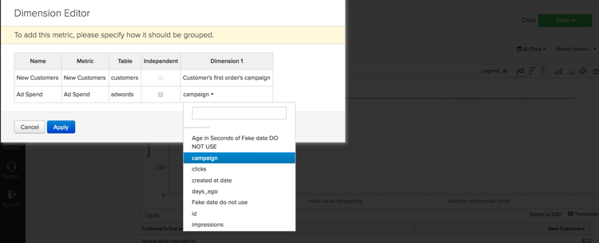

# Analisi di base

Una volta acquisita familiarità con la piattaforma [!DNL Adobe Commerce Intelligence] e acquisita una conoscenza di base dello strumento, si desidera iniziare a creare rapporti. Una delle domande più comuni che potreste avere è &quot;Cosa dovrei guardare?&quot;

Le informazioni seguenti descrivono alcune delle metriche e dei rapporti più comuni che potresti trovare utili. Alcuni di questi rapporti sono presenti nel tuo account, quindi accertati di rivedere le metriche e i rapporti esistenti nel tuo account per evitare la creazione di duplicati.

## Tabelle e colonne da comprendere

Quando crei una metrica, devi conoscere quattro informazioni:

1. La tabella su cui si trovano i dati,
1. L’azione specifica che desideri eseguire,
1. La colonna su cui desideri eseguire l’azione e
1. Il timestamp da utilizzare per il tracciamento di tali dati.

È probabile che i nomi delle tabelle utilizzate in questi esempi siano leggermente diversi da quelli delle colonne e delle tabelle del database, in quanto ogni database è univoco. Se hai bisogno di aiuto per identificare una tabella o una colonna corrispondente nel database, fai riferimento alle definizioni seguenti.

## Tabella Clienti

Questa tabella contiene le informazioni chiave su ciascun cliente, ad esempio un ID cliente univoco, un indirizzo e-mail e così via. Negli esempi seguenti viene utilizzato **[!UICONTROL customer_entity]** come nome di una tabella cliente di esempio.

Se alcuni di questi calcoli non sono attualmente presenti nel database, qualsiasi utente amministratore del tuo account può generarli. Inoltre, assicurati che queste dimensioni siano raggruppabili per tutte le metriche applicabili.

**Dimension**

* **[!UICONTROL Entity_id]**: un identificatore univoco per ciascun cliente. Può trattarsi anche di un numero cliente univoco o di un indirizzo e-mail del cliente, che deve fungere da chiave di riferimento per la tabella dell’ordine.
* **[!UICONTROL Created_at]**: la data di creazione e di aggiunta dell&#39;account del cliente al database.
* **[!UICONTROL Customer's lifetime revenue]**: il totale dei ricavi generati da un cliente nel ciclo di vita.
* **[!UICONTROL Customer's first 30-day revenue]**: l&#39;importo totale dei ricavi generati da un cliente nei primi 30 giorni.
* **[!UICONTROL Customer's lifetime number of orders]**: numero di ordini effettuati da un cliente nel corso della loro durata.
* **[!UICONTROL Customer's lifetime number of coupons]**: numero totale di coupon utilizzati da un cliente nel corso della sua durata.
* **[!UICONTROL Customer's first order date]**: la data del primo ordine di un cliente. Questo valore può essere diverso dalla data created_at se un cliente non ha effettuato un ordine al momento della creazione.

**Accetti gli ordini degli ospiti?**

*In questo caso, è possibile che la tabella non contenga tutti i clienti. Contatta il [team di supporto](https://experienceleague.adobe.com/docs/commerce-knowledge-base/kb/troubleshooting/miscellaneous/mbi-service-policies.html?lang=it) per assicurarti che le analisi dei clienti includano tutti i clienti.*

*Non sei sicuro di accettare gli ordini degli ospiti? Fai riferimento a [questo argomento](../data-warehouse-mgr/guest-orders.md) per ulteriori informazioni!*

## Tabella Ordini

In questa tabella, ogni riga rappresenta un ordine. Le colonne di questa tabella contengono informazioni di base su ciascun ordine, ad esempio l&#39;ID dell&#39;ordine, la data di creazione, lo stato, l&#39;ID del cliente che ha effettuato l&#39;ordine e così via. Negli esempi seguenti viene utilizzato **[!UICONTROL sales_flat_order]** come nome di una tabella ordini di esempio.

**Dimension**

* **[!UICONTROL Customer_id]**: identificatore univoco del cliente che ha effettuato l&#39;ordine. Questa funzione viene spesso utilizzata per spostare le informazioni tra le tabelle cliente e ordini. In questi esempi, si prevede che customer_id nella tabella **[!UICONTROL sales_flat_order]** sia allineato con **[!UICONTROL entitiy_id]** nella tabella **[!UICONTROL customer_entity]**.
* **[!UICONTROL Created_at]**: data di creazione o di inserimento dell&#39;ordine.
* **[!UICONTROL Customer_email]**: indirizzo e-mail del cliente che ha effettuato l&#39;ordine. Può anche essere l’identificatore univoco del cliente.
* **[!UICONTROL Customer's lifetime number of orders]**: copia della colonna con lo stesso nome nella tabella `Customers`.
* **[!UICONTROL Customer's order number]**: numero di ordine sequenziale del cliente associato all&#39;ordine. Ad esempio, se la riga che stai esaminando è il primo ordine di un cliente, questa colonna è &quot;1&quot;; ma, se si tratta del quindicesimo ordine del cliente, questa colonna mostra &quot;15&quot; per questo ordine. Se questa dimensione non esiste nella tabella `Customers`, chiedere al team di supporto [&#128279;](https://experienceleague.adobe.com/docs/commerce-knowledge-base/kb/troubleshooting/miscellaneous/mbi-service-policies.html?lang=it) di aiutarti a generarla.
* **[!UICONTROL Customer's order number (previous-current)]**: concatenazione di due valori nella colonna **[!UICONTROL Customer's order number]**. Viene utilizzato in un report di esempio riportato di seguito per visualizzare il tempo trascorso tra due ordini. Ad esempio, con questo calcolo il tempo tra la data del primo ordine di un cliente e la data del secondo ordine è rappresentato da &quot;1-2&quot;.
* **[!UICONTROL Coupon_code]**: mostra i coupon utilizzati in ogni ordine.
* **[!UICONTROL Seconds since previous order]**: tempo (in secondi) tra gli ordini di un cliente.

## Tabella Articoli ordine

In questa tabella, ogni riga rappresenta un articolo venduto. Questa tabella contiene informazioni sugli articoli venduti in ciascun ordine, ad esempio il numero di riferimento dell&#39;ordine, il numero del prodotto, la quantità e così via. Negli esempi seguenti viene utilizzato `sales_flat_order_item` come nome di una tabella di elementi dell&#39;ordine di esempio.

**Dimension**

* **[!UICONTROL Item_id]**: identificatore univoco per ogni riga della tabella.
* **[!UICONTROL Order_id]**: la chiave di riferimento alla tabella `Orders` che indica gli articoli acquistati nello stesso ordine. Se un ordine contiene più elementi, questo valore viene ripetuto.
* **[!UICONTROL Product_id]**: se si desidera ottenere informazioni sul prodotto specifico acquistato (ad esempio colore, dimensioni e così via), utilizzare questa colonna per richiamare tali informazioni dalla tabella dei prodotti.
* **[!UICONTROL Order's created_at]**: il timestamp dell&#39;ordine, in genere copiato nella tabella `order line items` dalla tabella `Orders`.
* **[!UICONTROL Order's coupon_code]**: simile alla dimensione `Order's created_at`, questa colonna viene copiata dalla tabella ordini.

## Tabella Sottoscrizioni

Questa tabella viene utilizzata per gestire le informazioni sull’abbonamento, ad esempio l’ID, l’indirizzo e-mail dell’abbonato, la data di inizio e così via.

**Dimension**

* **[!UICONTROL Customer_id]**: identificatore univoco del cliente che ha effettuato l&#39;ordine. Si tratta di un metodo comune per creare un percorso tra la tabella Clienti e la tabella Ordini. In questi esempi, si prevede che customer_id nella tabella **sales_flat_order** sia allineato con `entitiy_id` nella tabella `customer_entity`.
* **[!UICONTROL Start date]**: la data di inizio dell&#39;abbonamento di un cliente.

## Tabella delle spese di marketing

Durante l&#39;analisi delle spese di marketing, è possibile includere [!DNL Facebook], [!DNL Google AdWords] o altre origini nelle analisi. Se disponi di più origini di spesa marketing, contatta il [team Managed Services](https://business.adobe.com/products/magento/fully-managed-service.html) per assistenza nella configurazione di una tabella consolidata per le campagne marketing.

**Dimension**

* **[!UICONTROL Spend]**: la spesa totale dell&#39;annuncio. In [!DNL Facebook], questa sarebbe la colonna di spesa nella tabella `facebook_ads_insights_####`. Per [!DNL Google AdWords], questa sarebbe la colonna `adCost` nella tabella `campaigns####`.
* Il `####` che viene aggiunto a ciascuna di queste tabelle è correlato all&#39;ID account specifico per l&#39;account [!DNL Facebook] o [!DNL Google AdWords].
* **[!UICONTROL Clicks]**: numero totale di clic. In [!DNL Facebook], questa sarebbe la colonna dei clic nella tabella `facebook_ads_insights_####`. In [!DNL Google AdWords], questa sarebbe la colonna adClicks nella tabella `campaigns####`.
* **[!UICONTROL Impressions]**: numero totale di impression. In [!DNL Facebook], si tratta delle impression nella tabella `facebook_ads_insights_####`. In [!DNL Google AdWords], questa sarebbe l&#39;impressione della tabella `campaigns####`.
* **[!UICONTROL Campaign]**: numero totale di clic. In [!DNL Facebook], questa sarebbe la colonna campaign_name nella tabella `facebook_ads_insights_####`. In [!DNL Google AdWords], questa sarebbe la colonna della campagna nella tabella `campaigns####`.
* **[!UICONTROL Date]**: ora e data in cui si è verificata l&#39;attività (spesa, clic o impression) per una determinata campagna. In [!DNL Facebook], questa sarebbe la colonna `date_start` nella tabella `facebook_ads_insights_####`. In [!DNL Google AdWords], corrisponde alla colonna data nella tabella `campaigns####`.
* **[!UICONTROL Customer's first order's source]**: origine dell&#39;ordine dal primo ordine di un cliente. Verificare innanzitutto se nell&#39;account è presente una colonna denominata `customer's first order's source`. Se questa colonna non viene visualizzata, puoi crearla seguendo queste istruzioni.
* **[!UICONTROL Customer's first order's medium]**: mezzo dell&#39;ordine dal primo ordine di un cliente. Verificare innanzitutto se nell&#39;account è presente una colonna denominata `customer's first order's source`. Se questa colonna non viene visualizzata, puoi crearla seguendo queste istruzioni.
* **[!UICONTROL Customer's first order's campaign]**: campagna dell&#39;ordine dal primo ordine di un cliente. Verificare innanzitutto se nell&#39;account è presente una colonna denominata `customer's first order's source`. Se questa colonna non viene visualizzata, puoi crearla seguendo queste istruzioni.

## Rapporti e metriche comuni

Di seguito sono riportati alcuni esempi comuni di rapporti e metriche che potrebbero essere utili:

* [Customer Analytics](#customeranalytics)
* [Analisi degli ordini](#orderanalytics)
* [Marketing Spend Analytics](#mktgspendanalytics)

## Analisi dei clienti {#customeranalytics}

### Nuovi utenti

* **Descrizione**: conteggio del numero totale di utenti appena acquisiti in un determinato periodo. `New Users` è diverso da `Unique Customers`, perché `New Users` ha il timestamp che un account è stato creato con il tuo servizio (questo non significa che abbiano necessariamente effettuato un ordine) mentre `Unique Customers` hanno effettuato almeno un ordine.
* **Definizione metrica**: questa metrica esegue **Count** di `entity_id` dalla tabella `customer_entity` ordinata da `created_at`.
* **Esempio di report**: numero di nuovi utenti creati il mese scorso
   * **[!UICONTROL Metric]**: `New Users`
   * **[!UICONTROL Time Range]**: `Last Month`
   * **[!UICONTROL Time Interval]**: `By Day`

<!--{: width="929"}-->

### Clienti univoci

* **Descrizione**: conteggio del numero totale di clienti distinti in un determinato periodo. È diverso da `New Users`, perché tiene traccia solo dei clienti che hanno effettuato almeno un ordine. Un rapporto di un cliente distinto tiene traccia di un cliente solo una volta in un determinato intervallo di tempo. Se si imposta l&#39;intervallo di tempo su `By Day` e un cliente effettua più acquisti in quel giorno, il cliente viene conteggiato una sola volta. Per visualizzare il numero totale di acquisti in generale, vedere `Number of Orders`.
* **Definizione metrica**: questa metrica esegue **Count Distinct** di `customer_id` dalla tabella `sales_flat_order` ordinata da `created_at`.
* **Esempio di report**: clienti distinti per settimana negli ultimi 90 giorni
   * **[!UICONTROL Metric]**: `Distinct Customers`
   * **[!UICONTROL Time Range]**: `Moving range > Last 90 Days`
   * **[!UICONTROL Time Interval]**: `By Day`

<!--{: width="929"}-->

### Nuovi abbonati

* **Descrizione**: conteggio del numero totale di nuovi abbonati acquisiti in un determinato periodo.
* **Definizione metrica**: questa metrica esegue **Count Distinct** di `customer_id` dalla tabella `subscriptions` ordinata da `start_date`.
* **Esempio di report**: nuovi abbonati quest&#39;anno per mese
   * **[!UICONTROL Metric]**: `New Subscribers`
   * **[!UICONTROL Time Range]**: `1 Year Ago to 0 Days Ago`
   * **[!UICONTROL Time Interval]**: `By Month`

<!--{: width="929"}-->

### Clienti ripetuti

* **Descrizione**: numero totale di clienti che hanno effettuato più ordini in un periodo. In un report clienti frequenti, puoi utilizzare la metrica `Distinct Customers` e la dimensione `Customer's Order Number` dalla tabella `orders`.
* **Metrica utilizzata**: `Distinct Customers`
* **Esempio di report**: numero di acquisti effettuati il 2° e il 3° anno
   * **[!UICONTROL Metric]**: `Distinct Customers`
   * **[!UICONTROL Time Range]**: `Moving Range > Last Year`
   * **[!UICONTROL Time Interval]**: `By Month`
   * **[!UICONTROL Group By]**: `Customer's Order Number`, quindi selezionare `2` e `3`

  

* **Esempio di report 2**: numero di clienti frequenti negli ultimi anni
   * **[!UICONTROL Metric]**: `Distinct Customers`
   * **[!UICONTROL Filters]**: `Customer's Order Number Greater Than 1`
   * **[!UICONTROL Time Range]**: `Moving range > Last Year`
   * **[!UICONTROL Time Interval]**: `By Month`

  <!--{: width="929"}-->

### Clienti principali per numero di ordini a vita

* **Descrizione**: elenco dei clienti principali in base al numero totale di ordini. Questo ti fornisce un elenco diretto dei tuoi acquirenti più frequenti.
* **Metrica utilizzata**: `Orders`
* **Esempio di report**: primi 25 clienti per numero di ordini nell&#39;arco della durata
   * **[!UICONTROL Metric]**: `Orders`
   * **[!UICONTROL Time Range]**: `All Time`
   * **[!UICONTROL Time Interval]**: `None`
   * **[!UICONTROL Group By]**: `customer_email`
   * **[!UICONTROL Show Top/Bottom]**: primi 25 ordinati per ordine

  <!--{: width="929"}-->

### Principali clienti per fatturato a vita

* **Descrizione**: elenco dei principali clienti basato sui ricavi relativi al ciclo di vita.
* **Metrica utilizzata**: `Average Lifetime Revenue`
* **Esempio di rapporto**: primi 25 clienti in base ai ricavi nel ciclo di vita
   * **[!UICONTROL Metric]**: `Average Lifetime Revenue`
   * **[!UICONTROL Time Range]**: `All time`
   * **[!UICONTROL Time Interval]**: `None`
   * **[!UICONTROL Group By]**: `customer_email`
   * **[!UICONTROL Show Top Bottom]**: primi 25 in base ai ricavi della durata

  <!--{: width="929"}-->

### Ricavi medi nel ciclo di vita per coorte

* **Descrizione**: tieni traccia dei [ricavi medi generati nel corso della durata di coorti distinte](../dev-reports/lifetime-rev-cohort-analysis.md) di utenti nel tempo per identificare le coorti con prestazioni migliori. Le coorti sono raggruppate per data comune, ad esempio data del primo ordine o data di creazione.
* **Metrica utilizzata**: `Revenue`
* **Esempio di rapporto**: Ricavi medi del ciclo di vita del cliente per coorte
   * **[!UICONTROL Metric]**: `Revenue`
   * **[!UICONTROL Cohort Date]**: `Customer's first order date`
   * **[!UICONTROL Time Interval]**: `Month`
   * **[!UICONTROL Time Period]**: gruppo di coorti in movimento delle otto coorti più recenti con almeno quattro mesi di dati
   * **[!UICONTROL Duration]**: `12 Month(s)`
   * **[!UICONTROL Table]**: `Customer_entity`
   * **[!UICONTROL Perspective]**: Valore Medio Cumulativo Per Membro Coorte

  <!--{: width="929"}-->

### Clienti per utilizzo coupon

* **Descrizione**: conteggio del numero di clienti acquisiti che hanno utilizzato un codice coupon/sconto. Questo può aiutarti a ottenere una visione chiara dei richiedenti di sconti rispetto agli acquirenti a prezzo pieno.
* **Metrica utilizzata**: `New Users`
* **Esempio di report**: clienti coupon e non coupon per mese
   * **[!UICONTROL Metric A]**: `Non coupon customers`
   * **[!UICONTROL Metric]**: `New Users`
   * **[!UICONTROL Filters]**: numero ciclo di vita del cliente maggiore di 0 e numero ciclo di vita del cliente uguale a 0
   * **[!UICONTROL Metric B]**: `Coupon customers`
   * **[!UICONTROL Metric]**: `New Users`
   * **[!UICONTROL Filters]**: numero di ordini con durata superiore a 0 e numero di coupon con durata superiore a 0
   * **[!UICONTROL Time range]**: `All Time`
   * **[!UICONTROL Time interval]**: `By Month`

  <!--{: width="929"}-->

* **Esempio di report 2**: percentuale di clienti coupon e non coupon per mese
   * **[!UICONTROL Metric A]**: `Non coupon customers` (nascondi metrica)
      * **[!UICONTROL Metric]**: `New Users`
      * **[!UICONTROL Filters]**: `Customer's Lifetime Number of Orders Greater Than 0` e `Customer's Lifetime Number of Coupons Equal to 0`
   * **[!UICONTROL Metric B]**: `Coupon customers`
      * **[!UICONTROL Metric]**: `New Users`
      * **[!UICONTROL Filters]**: `Customers Lifetime Number of Orders Greater Than 0` e `Customer's Lifetime Number of Coupons Greater Than 0`
   * **[!UICONTROL Time Range]**: `All Time`
   * **[!UICONTROL Time Interval]**: `By Month`
   * **[!UICONTROL Formula]**: `B/(A+B)`

>[!NOTE]
>
> **Nascondi tutte le metriche**

<!--{: width="929"}-->

### Ricavi medi dei primi 30 giorni

* **Descrizione**: la media dell&#39;importo dei ricavi generati dai clienti nei primi 30 giorni come clienti.
* **Descrizione metrica**: questa metrica esegue una **Media** di `Customer's First 30 Day Revenue` dalla tabella `customer_entity` ordinata da `created_at`.
* **Descrizione report**: media dei primi 30 giorni di ricavi del cliente
* **[!UICONTROL Metric]**: `Average First 30 Day Revenue`
* **[!UICONTROL Time Range]**: `All Time`
* **[!UICONTROL Time Interval]**: `None`

<!--{: width="929"}-->

### Ricavi medi del ciclo di vita del cliente

* **Descrizione**: l&#39;importo medio dei ricavi generati dai clienti nel corso del loro ciclo di vita.
* **Descrizione metrica**: questa metrica esegue una **Media** della colonna `Customer's Lifetime Revenue` nella tabella `customer_entity` in base a `created_at`.
* **Descrizione report**: media di tutti i tempi dei ricavi del cliente nel corso della sua vita
   * **[!UICONTROL Metric]**: `Average Customer Lifetime Revenue`
   * **[!UICONTROL Time Range]**: `All Time`
   * **[!UICONTROL Time Interval]**: `None`

<!--{: width="929"}-->

## Analisi degli ordini {#orderanalytics}

### Ricavi

* **Descrizione**: la metrica Ricavi mostra i ricavi totali ottenuti in un periodo di tempo scelto.
* Questa metrica esegue una **somma** di `grand_total` dalla tabella `sales_flat_order` ordinata da `created_at`.
* **Esempio di report**: ricavi per mese, progressivo anno
   * **[!UICONTROL Metric]**: `Revenue`
   * **[!UICONTROL Time Range]**: `1 Year Ago to 1 Month Ago`
   * **Intervallo di tempo**: `By Month`

>[!TIP]
>
>Assicurati che il calcolo della metrica Ricavo sia coerente con la definizione discussa internamente. È possibile, ad esempio, conteggiare i ricavi derivanti da ordini spediti, convertire le valute di aree diverse o escludere le imposte. Inoltre, puoi utilizzare [Set di filtri](../../data-user/reports/ess-manage-data-filters.md) per garantire la coerenza tra tutte le metriche generate sulla stessa tabella.

<!--{: width="929"}-->

### Ordini

* **Descrizione**: conteggio del numero totale di ordini in un determinato periodo. Un rapporto Ordini tiene traccia delle modifiche nel volume dell’ordine causate da nuove offerte di prodotti, promozioni o qualsiasi altra cosa che possa aumentare (o diminuire) il volume delle transazioni. Spesso potrebbe essere utile segmentare questa metrica in base ad alcune variabili per rispondere a specifiche domande.
* **Definizione metrica**: questa metrica esegue **Count** di `entity_id` dalla tabella `sales_flat_order` ordinata da `created_at`.
* **Esempio di report**: Ordini per mese, progressivo anno
   * **[!UICONTROL Metric]**: `number of orders`
   * **[!UICONTROL Time Range]**: `1 Year Ago to 1 Month Ago`
   * **[!UICONTROL Time Interval]**: `By Month`

>[!TIP]
>
>Proprio come la metrica Ricavi, dovresti disporre di [Set di filtri](../../data-user/reports/ess-manage-data-filters.md) per escludere gli ordini incompleti, di prova o restituiti.

<!--{: width="929"}-->

### Prodotti ordinati

* **Descrizione**: la metrica prodotti ordinati indica la quantità di articoli venduti in un periodo di tempo specifico.
* **Definizione metrica**: questa metrica esegue una **somma** di `qty_ordered` dalla tabella `sales_flat_order_item` ordinata da `created_at`.
* **Esempio di report**: articoli venduti per mese, progressivo anno
   * **[!UICONTROL Metric]**: `Products ordered`
   * **[!UICONTROL Time Range]**: `1 Year Ago to 1 Month Ago`
   * **[!UICONTROL Time Interval]**: `By Month`

  <!--{: width="929"}-->

* Combina questa metrica con la metrica del numero di ordini per calcolare il numero di articoli per ordine. Quindi, aggiungi i codici coupon al rapporto per determinare in che modo le promozioni influiscono sulle dimensioni del carrello o segmentano in base a nuovi ordini o a ordini ripetuti, per comprendere meglio il comportamento dei clienti.
* **Esempio di report**: prodotti per ordine: primo ordine rispetto a ordini ripetuti
   * **[!UICONTROL Metric A]**: prodotti ordinati: primo ordine
      * **[!UICONTROL Metric]**: `Products ordered`
      * **[!UICONTROL Filter]**: `Customer's order number = 1`
   * **[!UICONTROL Metric B]**: Ordini: primo ordine
      * **[!UICONTROL Metric]**: `Orders`
      * **[!UICONTROL Filter]**: `Customer's order number = 1`
   * **[!UICONTROL Metric C]**: prodotti ordinati: ordini ripetuti
      * **[!UICONTROL Metric]**: `Products ordered`
      * **[!UICONTROL Filter]**: `Customer's order number > 1`
   * **[!UICONTROL Metric D]**: Ordini: Ripeti ordini
      * **[!UICONTROL Metric]**: `Orders`
      * **[!UICONTROL Filter]**: `Customer's order number > 1`
   * **[!UICONTROL Time Range]**: `1 Year Ago to 1 Month Ago`
   * **[!UICONTROL Time Interval]**: `By Week`
   * **[!UICONTROL Formula 1]**: `A/B`
   * **[!UICONTROL Formula 2]**: `C/D`

>[!NOTE]
>
>Deseleziona tutte le metriche `Multiple Y-Axes box` e `Hide`

<!--{: width="929"}-->

### Valore medio dell’ordine

* **Descrizione**: tieni traccia del valore medio degli ordini effettuati in un periodo. Utilizza questa metrica per determinare rapidamente in che modo il valore medio dell’ordine (AOV) ha subito fluttuazioni a seguito delle attività di marketing, dell’offerta di prodotti e/o di altre modifiche nell’azienda.
* **Definizione metrica**: questa metrica esegue una **media** di `grand_total` dalla tabella `sales_flat_order` ordinata da `created_at`.
* **Esempio di report**: confronto tra AOV e anno precedente, da inizio anno
   * **[!UICONTROL Metric]**: `Average order value`
   * **[!UICONTROL Time Range]**: `1 Year Ago to 1 Month Ago`
   * **[!UICONTROL Time Interval]**: `By Month`
   * **[!UICONTROL Perspective]**: `Amount Change vs Previous Year`

  <!--{: width="929"}-->

### Prodotti più acquistati con coupon

* **Descrizione**: questo report fornisce informazioni approfondite sui prodotti che vengono venduti quando offri promozioni o coupon.
* **Metrica utilizzata**: prodotti ordinati
* **Esempio di rapporto**: prodotti più acquistati con coupon
   * **[!UICONTROL Metric]**: `Products ordered`
   * **[!UICONTROL Filter]**: `Order's coupon_code Is Not \[NULL\]`
   * **[!UICONTROL Time Range]**: `All-Time`
   * **[!UICONTROL Time Interval]**: `None`
   * **[!UICONTROL Group By**]: `name` (o `SKU`, o qualsiasi altro identificatore di prodotto)
   * **[!UICONTROL Show top/bottom]**: primi 25 ordinati per prodotti ordinati

  <!--{: width="929"}-->

### Tempo tra gli ordini

* **Descrizione**: verifica le ipotesi e le aspettative relative ai cicli di acquisto dei clienti con un&#39;analisi **time between orders** che considera la media (o mediana!) quantità di tempo tra gli acquisti. Il grafico qui sotto mostra che i migliori clienti - quelli che inoltrano più di tre ordini - effettuano il loro secondo acquisto in meno di sei mesi. I clienti che non hanno effettuato un quarto ordine attendono 14 mesi prima di effettuare un secondo acquisto.
* **Definizione metrica**: questa metrica esegue una **media** di `Time since previous order` da `sales_flat_order` ordinata da `created_at`.
* **Esempio di report**:
   * **Metrica 1**: ≤ 3 ordini
      * **[!UICONTROL Metric]**: `Average time between orders`
      * **[!UICONTROL Filter]**: `Customer's lifetime number of orders ≤ 3`
   * **Metrica 2**: > 3 ordini
      * **[!UICONTROL Metric]**: `Average time between orders`
      * **[!UICONTROL Filter]**: `Customer's lifetime number of orders > 3`
   * **[!UICONTROL Time Range]**: `All-Time`
   * **[!UICONTROL Time Interval]**: `None`
   * **[!UICONTROL Group By]**:` Customer's order number (previous-current)`

>[!NOTE]
>
>Deselezionare la casella `Multiple Y-Axes`.

<!--{: width="929"}-->

## Analisi delle spese di marketing {#mktgspendanalytics}

### Spesa annuncio

* **Descrizione**: puoi analizzare le tue spese di marketing in vari periodi di tempo e intervalli, per campagne o set di annunci o altre segmentazioni.
* **Definizione metrica**: questa metrica esegue una somma sulla colonna di spesa nella tabella `Marketing Spend` ordinata in base alla colonna `date`.
* **Esempio di report**: spesa annuncio per campagna
   * **[!UICONTROL Metric]**: `Ad spend`
   * **[!UICONTROL Time Range]**: `All-Time`
   * **[!UICONTROL Time Interval]**: `None`
   * **[!UICONTROL Group By]**: `campaign`

<!--{: width="929"}-->

### Impression e clic degli annunci

* **Descrizione**: oltre ad analizzare la spesa pubblicitaria, puoi analizzare le impression pubblicitarie e i clic sugli annunci.
* **Definizione metrica**: questa metrica esegue una somma sulla colonna delle impression (o dei clic) nella tabella `Marketing Spend` ordinata in base alla colonna della data.
* **Esempio di report**: aggiungi impression e clic sugli annunci per giorno
   * **[!UICONTROL Metric A]**: `Ad impressions`
   * **[!UICONTROL Metric B]**: `Ad clicks`
   * **[!UICONTROL Time Range]**: `1 Year Ago to 3 Months Ago`
   * **[!UICONTROL Time Interval]**: `By Day`

  <!--{: width="929"}-->

### Tasso di click-through (CTR)

* **Descrizione**: utilizzando le metriche Impression annuncio e Clic annuncio create in precedenza, puoi analizzare il tasso di click-through da diverse campagne nel tempo.
* **Esempio di report**: CTR per campagna
   * **[!UICONTROL Metric A]**: `Ad impressions`
   * **[!UICONTROL Metric B]**: `Ad clicks`
   * **[!UICONTROL Time Range]**:`All-Time`
   * **[!UICONTROL Time Interval]**: `None`
   * **[!UICONTROL Formula]**: `B/A`
   * Selezionare l&#39;opzione `%`.
   * **[!UICONTROL Group By]**: `campaign`

>[!NOTE]
>
>Puoi **assegnare il titolo** alla formula come `CTR` e **nascondere** tutte le metriche.

<!--{: width="929"}-->

### Costo per clic (CPC)

* **Descrizione**: utilizzando le metriche di spesa e clic sugli annunci create in precedenza, puoi analizzare il costo per clic con diverse campagne nel tempo.
* **Esempio di report**: CPC per campagna
   * **[!UICONTROL Metric A]**: `Ad spend`
   * **[!UICONTROL Metric B]**: `Ad clicks`
   * **[!UICONTROL Time Range]**: `All-Time`
   * **[!UICONTROL Time Interval]**: `None`
   * **[!UICONTROL Formula]**: `A/B`
   * Seleziona l&#39;opzione `currency`
   * **[!UICONTROL Group By]**: `campaign`

>[!NOTE]
>
>Puoi **assegnare il titolo** alla formula come `CPC` e **nascondere** tutte le metriche.

<!--{: width="929"}-->

### Clienti per origine di acquisizione

* **Descrizione**: se tieni traccia dell&#39;origine, del supporto e della campagna di un ordine utilizzando [!DNL Google eCommerce], puoi analizzare i clienti in base alla loro origine di acquisizione. In questo modo è possibile identificare le origini marketing che acquisiscono i clienti e rispondere a domande quali &quot;la maggior parte dei clienti effettua i primi ordini tramite [!DNL Google], [!DNL Facebook] o un&#39;altra origine?&quot;
* **Esempio di report**: clienti per origine di acquisizione
   * **[!UICONTROL Metric Used]**: `New Customers`
   * **[!UICONTROL Time Range]**: `All-Time`
   * **[!UICONTROL Time Interval]**: `By Month`
   * **[!UICONTROL Group By]**: `Customer's first order's source`

>[!NOTE]
>
>Consulta [questo articolo](../analysis/most-value-source-channel.md) per ulteriori esempi di report che utilizzano l&#39;origine di acquisizione.

<!--{: width="929"}-->

### Clienti per mezzo di acquisizione e campagna di acquisizione

* **Descrizione**: simile all&#39;analisi dei clienti per origine di acquisizione, puoi analizzare i clienti anche in base al supporto e alla campagna del primo ordine. Questo può aiutarti a rispondere a domande come &quot;quali campagne attirano nuovi clienti?&quot;
* **Esempio di report**: clienti per campagna di acquisizione con supporto a pagamento
   * **[!UICONTROL Metric Used]**: `New customers`
   * **[!UICONTROL Filter]**: `Customer's first order's medium IN ppc`
   * **[!UICONTROL Time Range]**: `All-Time`
   * **[!UICONTROL Time Interval]**: `None`
   * **[!UICONTROL Group By]**: `Customer's first order's campaign`

>[!NOTE]
>
>Per il filtro nella metrica `New Customers`, puoi aggiungere qualsiasi altro supporto considerato &quot;a pagamento&quot; per la tua attività, ad esempio cpc o ricerca a pagamento.

<!--{: width="929"}-->

### Costo di acquisizione del cliente (CAC) o costo per acquisizione (CPA)

* **Descrizione**: un modo per analizzare il costo di una campagna consiste nell&#39;attribuire tutti i costi solo ai clienti acquisiti tramite la campagna.
* **Esempio di report**: CAC per campagna
   * **[!UICONTROL Metric A]**: `New customers`
   * **[!UICONTROL Filter]**: `Customer's first order's medium IN ppc`
   * **[!UICONTROL Metric B]**: `Ad Spend`
   * **[!UICONTROL Time Range]**: `All-Time`
   * **[!UICONTROL Time Interval]**: `None`
   * **[!UICONTROL Formula]**: `B/A`
   * Seleziona l&#39;opzione `currency`
   * **[!UICONTROL Group By]**:
      * Per la metrica `A`, selezionare `Customer's first order's campaign`
      * Per la metrica `B`, selezionare `campaign`

  

>[!NOTE]
>
>Puoi **assegnare il titolo** alla formula come `CTR` e **nascondere** tutte le metriche. Per ulteriori informazioni, consulta anche [questo articolo](../analysis/roi-ad-camp.md).

### Valore del ciclo di vita per origine di acquisizione, supporto e campagna

* **Descrizione**: oltre ad analizzare il numero di clienti acquisiti da ogni campagna, puoi analizzare i ricavi medi di questi clienti nel corso della loro vita. Questo consente di identificare:
   * Se alcune campagne attirano un grande volume di clienti, ma questi hanno un valore ridotto nel ciclo di vita.
   * Se alcune campagne attirano un basso volume di clienti, ma tali clienti hanno un elevato valore nel ciclo di vita.
* **Esempio di report**: aggiungere prima la metrica `New customers`. Quindi, aggiungi la metrica `Average lifetime revenue`. Selezionare l&#39;intervallo di tempo desiderato e scegliere `interval` come `None`. Infine, selezionare l&#39;opzione `group by` come`Customer's first order's campaign`.
   * **[!UICONTROL Metric A]**: `New Customers`
   * **[!UICONTROL Filter A]**: `Customer's first order's source` LIKE &#39;%google%&#39;
   * **[!UICONTROL Filter B]**: `Customer's first order's medium IN ppc`
   * **[!UICONTROL Metric B]**: `Average lifetime revenue`
   * **[!UICONTROL Filter A]**: `Customer's first order's source` LIKE &#39;%google%&#39;
   * **[!UICONTROL Filter B]**: `Customer's first order's medium IN ppc`
   * **[!UICONTROL Time Range]**: `All-Time`
   * **[!UICONTROL Time Interval]**: `None`
   * **[!UICONTROL Group By]**: `Customer's first order's campaign`

>[!NOTE]
>
>Per i due filtri, puoi aggiungere qualsiasi altro supporto considerato &quot;a pagamento&quot; per la tua attività (ad esempio cpc o ricerca a pagamento). Puoi anche aggiungere altre sorgenti che desideri analizzare, ad esempio Facebook. Consulta [questo articolo](../analysis/roi-ad-camp.md) per ulteriori dettagli su CAC, LTV e ROI.

<!--{: width="929"}-->

### Ritorno sull&#39;investimento (ROI)

* **Descrizione**: un modo per calcolare il ROI per campagna consiste nell&#39;analizzare tutti gli ordini inoltrati tramite la campagna. Tuttavia, un metodo alternativo sta analizzando il valore del ciclo di vita dei clienti acquisiti tramite una campagna. Per analizzare il ROI, è importante che i nomi delle campagne siano coerenti tra i dati di spesa e i dati transazionali. Se crei il seguente rapporto e non sono presenti valori di ROI a causa di nomi di campagna non corrispondenti, potrebbe essere necessario esaminare l&#39;[assegnazione tag UTM](../../best-practices/utm-tagging-google.md) implementata.
* **Esempio di report**: ROI per campagna
   * **[!UICONTROL Metric A]**: `New Customers`
   * **[!UICONTROL Filter A]**: `Customer's first order's source` LIKE &#39;%google%&#39;
   * **[!UICONTROL Filter B]**: `Customer's first order's medium IN ppc`
   * **[!UICONTROL Metric B]**: `Average lifetime revenue`
   * **[!UICONTROL Filter A]**: `Customer's first order's source` LIKE &#39;%google%&#39;
   * **[!UICONTROL Filter B]**: `Customer's first order's medium IN ppc`
   * **[!UICONTROL Metric C]**: `Ad spend`
   * **[!UICONTROL Time Range]**: `All-Time`
   * **[!UICONTROL Time Interval]**: `None`
   * **[!UICONTROL Formula]**: `(B-(C/A))/(C/A)`
   * Seleziona l&#39;opzione `% `
   * **[!UICONTROL Group By]**:
      * Per le metriche `A` e `B`, selezionare `Customer's first order's campaign`
      * Per la metrica `C`, selezionare `campaign`

>[!NOTE]
>
>Puoi denominare la formula &quot;ROI&quot; e nascondere tutte le metriche. Inoltre, puoi regolare i filtri nelle metriche per analizzare sorgenti e media alternativi. Per ulteriori informazioni su CAC, LTV e ROI, consultare [questo argomento](../analysis/roi-ad-camp.md).

<!--{: width="929"}-->

<!--{: width="929"}-->
