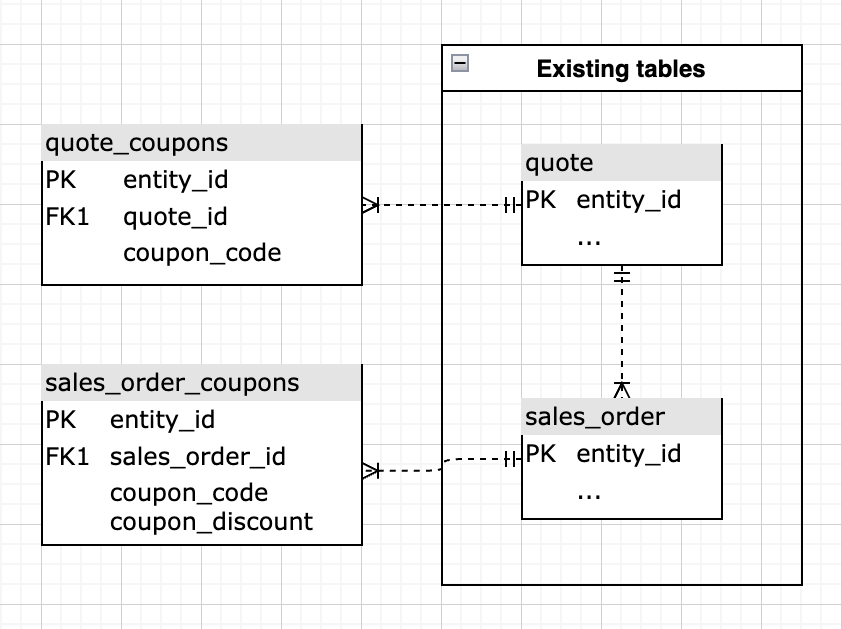

# Analisi avanzata del codice coupon

Comprendere le prestazioni dei coupon della vostra azienda è un modo interessante per segmentare gli ordini e anche meglio comprendere i vostri clienti. Questo argomento illustra i passaggi necessari per creare analisi che consentano di individuare i clienti acquisiti utilizzando i coupon, le relative prestazioni e tenere traccia dell’utilizzo generale dei coupon.

<!--{: width="800" height="375"}-->

Questa analisi contiene [colonne calcolate avanzate](../data-warehouse-mgr/adv-calc-columns.md).

## Guida introduttiva

Come primo passo, devi assicurarti che le seguenti colonne siano sincronizzate con il tuo Data Warehouse. In caso contrario, continuare a tenerne traccia passando a `Manage Data` > `Data Warehouse` e sincronizzando quanto segue:

* Tabella **sales\_flat\_order**
* **coupon\_code**
* **base\_sconto\_importo**

## Colonne calcolate

Colonne da creare indipendentemente dai criteri per gli ordini degli ospiti:

* Tabella `sales\_flat\_order`
* **L&#39;ordine ha un coupon applicato?**
   * [!UICONTROL Column type]: `Same Table => CALCULATION`
   * [!UICONTROL Inputs]:
      * `A`: `coupon\_code`

   * &#x200B;
     [!UICONTROL Datatype]: `String`
   * [!UICONTROL Calculation]: caso in cui `A` è nullo allora `No coupon` altro `Coupon` fine

* **\[INPUT\] cliente\_id - codice coupon**
   * [!UICONTROL Column type]: `Same Table => CALCULATION`
   * [!UICONTROL Inputs]:
      * `A`: `customer\_id`
      * `B`: `coupon\_code`

   * Stringa [!UICONTROL Datatype]
   * [!UICONTROL Calculation]: `concat(A,' - ',B)`

* **Numero di ordini con questo coupon**
   * [!UICONTROL Column type]: `Same Table => EVENT\_NUMBER`
   * Proprietario evento:`INPUT customer_id - coupon code`
   * Classificazione evento: `created\_at`
   * [!UICONTROL Filters]: `Orders we count` set di filtri

Colonne aggiuntive da creare se gli ordini degli ospiti NON sono supportati:

* Tabella `customer\_entity`
   * Il primo ordine del cliente **include un coupon? (Coupon/Nessun coupon)**
   * [!UICONTROL Column type]: `Many to One => MAX`
   * [!UICONTROL Path]: `sales\_flat\_order.customer\_id = customer\_entity.entity\_id`
   * Seleziona [!UICONTROL column]: `Order has coupon applied? (Coupon/No coupon)`
   * [!UICONTROL Filters]:
      * `A`: `Orders we count`
      * `B`: `Customer's order number = 1`

   * **Coupon del primo ordine del cliente**
      * [!UICONTROL Column type]: `Many to One => MAX`
      * [!UICONTROL Path]: `sales\_flat\_order.customer\_id = customer\_entity.entity\_id`
      * Seleziona [!UICONTROL column]: `coupon\_code`
      * [!UICONTROL Filter]:
         * `A`: `Orders we count`
         * `B`: `Customer's order number = 1`

   * **Numero di coupon utilizzati nel ciclo di vita del cliente**
      * [!UICONTROL Column type]: `Many to One => COUNT`
      * [!UICONTROL Path]: `sales\_flat\_order.customer\_id = customer\_entity.entity\_id`
      * [!UICONTROL Filter]:
         * `A`: `Orders we count`
         * `B`: `Order has coupon applied? (Coupon/No coupon) = Coupon`

   * **Cliente acquisizione coupon o Cliente acquisizione non coupon**
      * [!UICONTROL Column type]: `Same Table => CALCULATION`
      * [!UICONTROL Inputs]:
         * `A`: `Customer's first order included a coupon? (Coupon/No coupon)`

      * &#x200B;
        [!UICONTROL Datatype]: `String`
      * [!UICONTROL Calculation]: **caso in cui A=&#39;Coupon&#39; allora &#39;Coupon acquisizione cliente&#39; altro &#39;Non-coupon acquisizione cliente&#39; fine**

   * **Percentuale di ordini cliente con coupon**
      * [!UICONTROL Column type]: `Same Table => CALCULATION`
      * [!UICONTROL Inputs]:
         * `A`: `User's lifetime number of coupons used`
         * `B`: `User's lifetime number of orders`

      * &#x200B;
        [!UICONTROL Datatype]: `Decimal`
      * [!UICONTROL Calculation]: **caso in cui A è null o B è null o B=0 allora null altro A/B fine**

   * **Utilizzo coupon del cliente**
      * [!UICONTROL Column type]: `Same Table => Calculation`
      * [!UICONTROL Inputs]:
         * `A`: `Percent of customer's orders with coupon`

      * &#x200B;
        [!UICONTROL Datatype]: `String`
      * [!UICONTROL Calculation]: **caso in cui A è nullo e quindi nullo quando A=0 quindi &quot;buono non utilizzato&quot; quando A&lt;0.5 quindi &quot;prezzo per lo più pieno&quot; quando A=0.5 quindi &quot;50/50&quot; quando A=1 quindi &quot;solo coupon&quot; quando A>0.5 quindi &quot;buono per lo più&quot; altro &quot;non definito&quot; fine**

* Tabella `sales\_flat\_order`
   * **Coupon incluso nel primo ordine del cliente? (Coupon/Nessun coupon)**
      * [!UICONTROL Column type]: `One to Many => JOINED\_COLUMN`
      * [!UICONTROL Path]: `sales\_flat\_order.customer\_id = customer\_entity.entity\_id`
      * Seleziona [!UICONTROL column]: `Customer's first order included a coupon? (Coupon/No coupon)`
^

   * **Coupon del primo ordine del cliente**
      * [!UICONTROL Column type]: `One to Many => JOINED\_COLUMN`
      * [!UICONTROL Path]: `sales\_flat\_order.customer\_id = customer\_entity.entity\_id`
      * Seleziona [!UICONTROL column]: `Customer's first order coupon?`

Colonne aggiuntive da creare se gli ordini degli ospiti NON sono supportati:

* Tabella `sales\_flat\_order`
   * Il primo ordine del cliente **include un coupon? (Coupon/Nessun coupon)** **-** creato dall&#39;analista come parte del ticket \[COUPON ANALYSIS\]
   * **Buono sconto del primo ordine del cliente &#x200B;**{::}**-** creato dall&#39;analista come parte del ticket \[COUPON ANALYSIS\]

* **Il numero di coupon utilizzati nel ciclo di vita del cliente &#x200B;**{::}**-** è stato creato dall&#39;analista come parte del ticket \[COUPON ANALYSIS\]
* **Cliente acquisizione coupon o Cliente acquisizione non coupon**
   * [!UICONTROL Column type]: `Same Table => CALCULATION`
   * [!UICONTROL Inputs]:
      * `A`: `Customer's first order included a coupon? (Coupon/No coupon)`

   * &#x200B;
     [!UICONTROL Datatype]: `String`
   * [!UICONTROL Calculation]: **caso in cui A=&#39;Coupon&#39; allora &#39;Coupon acquisizione cliente&#39; altro &#39;Non-coupon acquisizione cliente&#39; fine**

* **Percentuale di ordini cliente con coupon**
   * [!UICONTROL Column type]: `Same Table => CALCULATION`
   * [!UICONTROL Inputs]:
      * `A`: `User's lifetime number of coupons used`
      * `B`: `User's lifetime number of orders`

   * &#x200B;
     [!UICONTROL Datatype]: `Decimal`
   * [!UICONTROL Calculation]: **caso in cui A è null o B è null o B=0 allora null altro A/B fine**

* **Utilizzo coupon del cliente**
   * [!UICONTROL Column type]: `Same Table => Calculation`
   * [!UICONTROL Inputs]:
      * `A`: `Percent of customer's orders with coupon`

   * &#x200B;
     [!UICONTROL Datatype]: `String`
   * [!UICONTROL Calculation]: **caso in cui A è nullo e quindi nullo quando A=0 quindi &quot;buono non utilizzato&quot; quando A&lt;0.5 quindi &quot;prezzo per lo più pieno&quot; quando A=0.5 quindi &quot;50/50&quot; quando A=1 quindi &quot;solo coupon&quot; quando A>0.5 quindi &quot;buono per lo più&quot; altro &quot;non definito&quot; fine**

## Metriche

* **Importo sconto coupon**
   * `Orders we count`
   * `Order has coupon applied? (Coupon/No coupon)= Coupon`

* Nella tabella `sales\_flat\_order`
* Questa metrica esegue una **somma**
* Nella colonna `discount\_amount`
* Ordinato per la marca temporale `created\_at`
* [!UICONTROL Filter]:

* **Numero di coupon utilizzati**
   * `Orders we count`
   * `Order has coupon applied? (Coupon/No coupon)= Coupon`

* Nella tabella `sales\_flat\_order`
* Questa metrica esegue **Count**
* Nella colonna `entity\_id`
* Ordinato per la marca temporale `created\_at`
* [!UICONTROL Filter]:

>[!NOTE]
>
>Assicurati di [aggiungere tutte le nuove colonne come dimensioni alle metriche](../data-warehouse-mgr/manage-data-dimensions-metrics.md) prima di creare nuovi rapporti.

## Rapporti

* **% dei clienti con e senza cedola**
   * [!UICONTROL Metric]: `New customers`

* Metrica `A`: `Coupon acquisitions`
* [!UICONTROL Time period]: `All time`
* &#x200B;
  [!UICONTROL Interval]: `None`
* [!UICONTROL Group by]: `Coupon acquisitions customer` o `Non coupon acquisition customer`
* &#x200B;
  [!UICONTROL Tipo di grafico]: `Pie`

* **Numero di clienti con e senza cedola**
   * [!UICONTROL Metric]: `New customers`

* Metrica A: `Coupon acquisitions`
* [!UICONTROL Time period]: `All time`
* [!UICONTROL Interval]: `By Month`
* [!UICONTROL Group by]: `Coupon acquisitions customer` o `Non coupon acquisition customer`
* [!UICONTROL Chart type]: `Stacked column`

* **Ricavi medi vita: Acq coupon. (oltre 90 giorni di età)**
   * [!UICONTROL Metric]: `Average lifetime revenue`
   * [!UICONTROL Filter]:
      * Il primo ordine del cliente includeva un coupon (Coupon/No Coupon) = Coupon

* Metrica `A`: `Average lifetime revenue (at least 3 months age)`
* [!UICONTROL Time period]: `X years ago to 90 days ago`
* &#x200B;
  [!UICONTROL Interval]: `None`
* &#x200B;
  [!UICONTROL Tipo di grafico]: `Scalar`

* **Ricavi medi ciclo di vita: acq non coupon. (oltre 90 giorni di età)**
   * [!UICONTROL Metric]: Ricavi medi nel ciclo di vita
   * [!UICONTROL Filter]:
      * Il primo ordine del cliente includeva una cedola (Coupon/No Coupon) = Nessuna cedola

* Metrica `A`: `Average lifetime revenue (at least 3 months age)`
* [!UICONTROL Time period]: `X years ago to 90 days ago`
* &#x200B;
  [!UICONTROL Interval]: `None`
* &#x200B;
  [!UICONTROL Tipo di grafico]: `Scalar`

* **Ricavi medi vita per coupon primo ordine**
   * [!UICONTROL Metric]: `Average lifetime revenue`

* Metrica `A`: `Average lifetime revenue`
* [!UICONTROL Time period]: `All time`
* &#x200B;
  [!UICONTROL Interval]: `None`
* [!UICONTROL Group by]: `Customer's first order's coupon`
* &#x200B;
  [!UICONTROL Tipo di grafico]: `Column`

>[!NOTE]
>
>Se disponi di molti codici coupon, come fanno molti clienti, desideri applicare un Inizio/Fine, ad esempio Primi 10, in base ai ricavi medi della durata

* **Probabilità di ripetizione ordine: acquisizioni coupon**
   * [!UICONTROL Metric]: `Number of orders`
   * [!UICONTROL Filter]:
      * Il primo ordine del cliente includeva un coupon (Coupon/No Coupon) = Coupon

   * [!UICONTROL Metric]: `Number of orders`
   * [!UICONTROL Filter]:
      * Il primo ordine del cliente includeva un coupon (Coupon/No Coupon) = Coupon
      * L&#39;ultimo ordine del cliente è? = No
   * &#x200B;
     [!UICONTROL Formula]: `B/A`
   * [!UICONTROL Format]: `Percentage %`

   * Selezionare un numero statisticamente significativo dal grafico `Customer's by lifetime orders`. Quando si osserva il grafico, come regola è necessario cercare numeri di ordine con 30 o più clienti nel periodo fisso. A seconda del set di dati, potrebbe trattarsi di un numero elevato, pertanto puoi aggiungerne 1-10.

* Metrica `A`: `Number of orders`
* Metrica `B`: `Number of non last orders`
* [!UICONTROL Formula]: `Repeat order probability`
* [!UICONTROL Time period]: `All time`
* &#x200B;
  [!UICONTROL Interval]: `None`
* [!UICONTROL Group by]: `Customer's order number`
* [!UICONTROL Chart type]: `Bar chart`

* **Probabilità di ripetizione ordine: acquisizioni non coupon**
   * [!UICONTROL Metric]: `Number of orders`
   * [!UICONTROL Filter]:
      * Il primo ordine del cliente includeva un coupon (Coupon/No Coupon) = Nessun coupon

   * [!UICONTROL Metric]: `Number of orders`
   * [!UICONTROL Filter]:
      * Il primo ordine del cliente includeva un coupon (Coupon/No Coupon) = Nessun coupon
      * L&#39;ultimo ordine del cliente è? = No

   * &#x200B;
     [!UICONTROL Formula]: `B/A`
   * [!UICONTROL Format]: `Percentage %`

   * Selezionare un numero statisticamente significativo dal grafico `Customer's by lifetime orders` o da 1 a 5.

* Metrica `A`: `Number of orders`
* Metrica `B`: `Number of non last orders`
* [!UICONTROL Formula]: `Repeat order probability`
* [!UICONTROL Time period]: `All time`
* &#x200B;
  [!UICONTROL Interval]: `None`
* [!UICONTROL Group by]: `Customer's order number`
* [!UICONTROL Chart type]: `Bar chart`

* **Tasso di utilizzo coupon dei clienti acquisiti tramite coupon (ordini ripetuti)**
   * [!UICONTROL Metric]: `New customers`
   * [!UICONTROL Filter]:
      * Cliente acquisizione coupon o Cliente acquisizione non coupon = Acquisizione coupon

   * [!UICONTROL Metric]: `Number of orders`
   * [!UICONTROL Filter]:
      * Numero ordine cliente > 1
      * Il primo ordine del cliente includeva un coupon? (Coupon/No coupon) = Coupon

   * [!UICONTROL Metric]:`Number of orders`
   * [!UICONTROL Filter]:
      * Numero ordine cliente > 1
      * Il primo ordine del cliente includeva un coupon? (Coupon/No coupon) = Coupon
      * L’ordine ha un coupon applicato? (Coupon/No coupon) = Coupon

   * &#x200B;
     [!UICONTROL Formula]: `C/B`
   * [!UICONTROL Format]: `Percentage %`

* Metrica `A`: `Coupon-acquired customers`
* Metrica `B`: `Number of repeat orders`
* Metrica `C`: `Number of repeat orders with coupon`
* [!UICONTROL Formula]: `% of repeat orders with coupon`
* [!UICONTROL Time period]: `All time`
* &#x200B;
  [!UICONTROL Interval]: `None`
* &#x200B;
  [!UICONTROL Tipo di grafico]: `Table` (può trasporre questa tabella per una migliore visualizzazione)

* **Tasso di utilizzo coupon dei clienti non acquisiti con coupon (ordini ripetuti)**
   * [!UICONTROL Metric]: `New customers`
   * [!UICONTROL Filter]:
      * Cliente acquisizione cedola o Cliente acquisizione non cedola = Acquisizione non cedola

   * [!UICONTROL Metric]: `Number of orders`
   * [!UICONTROL Filter]:
      * Numero ordine cliente > 1
      * Il primo ordine del cliente includeva un coupon? (Coupon/No coupon) = Nessuna cedola

   * [!UICONTROL Metric]: `Number of orders`
   * [!UICONTROL Filter]:
      * Numero ordine cliente > 1
      * Il primo ordine del cliente includeva un coupon? (Coupon/No coupon) = No Coupon
      * L’ordine ha un coupon applicato? (Coupon/No coupon) = Coupon

   * &#x200B;
     [!UICONTROL Formula]: `C/B`
   * [!UICONTROL Format]: `Percentage %`

* Metrica `A`: `Non-coupon-acquired customers`
* Metrica `B`: `Number of repeat orders`
* Metrica `C`: `Number of repeat orders with coupon`
* [!UICONTROL Formula]: `% of repeat orders with coupon`
* [!UICONTROL Time period]: `All time`
* &#x200B;
  [!UICONTROL Interval]: `None`
* &#x200B;
  [!UICONTROL Tipo di grafico]: `Table` (può trasporre questa tabella per una migliore visualizzazione)

* **Dettagli sull&#39;utilizzo del coupon (nuovi ordini)**
   * [!UICONTROL Metric]: `Number of orders`
   * [!UICONTROL Filter]:
      * Numero ordine cliente = 1
      * Numero di ordini con questo coupon > 10

   * &#x200B;
     [!UICONTROL Metric]: `Revenue`
   * [!UICONTROL Filter]:
      * Numero ordine cliente = 1
      * Numero di ordini con questo coupon > 10

   * [!UICONTROL Metric]: `Coupon discount amount`
   * [!UICONTROL Filter]:
      * Numero ordine cliente = 1
      * Numero di ordini con questo coupon > 10

   * [!UICONTROL Formula]: `B-C` (se C è negativo); B+C (se C è positivo)
   * &#x200B;
     [!UICONTROL Format]: `Currency`

   * [!UICONTROL Metric]: `Average order value`
   * [!UICONTROL Filter]:
      * Numero ordine cliente = 1
      * Numero di ordini con questo coupon > 10

* Metrica `A`: `First time orders (FTO)`
* Metrica `B`: `Revenue from FTO`
* Metrica `C`: `Discounts applied to FTO`
* [!UICONTROL Formula]: `Gross revenue from FTO`
* Metrica `E`: `Average order value for FTO`
* [!UICONTROL Time period]: `All time`
* &#x200B;
  [!UICONTROL Interval]: `None`
* [!UICONTROL Group by]: `coupon code`
* &#x200B;
  [!UICONTROL Tipo di grafico]: `Table`
>[!NOTE]
>
>La quantità di 10 per &quot;Numero di ordini con questo coupon&quot; è arbitraria. Puoi utilizzare la quantità più appropriata per questo filtro.

* **Numero di ordini con coupon (tutti i tempi)**
   * [!UICONTROL Metric]: `Number of coupons used`

* Metrica `A`: `Number or orders with coupon`
* [!UICONTROL Time period]: `All time`
* &#x200B;
  [!UICONTROL Interval]: `None`
* &#x200B;
  [!UICONTROL Tipo di grafico]: `Scalar`

* **Ricavi netti da ordini con coupon (in qualsiasi momento)**
   * &#x200B;
     [!UICONTROL Metric]: `Revenue`
   * [!UICONTROL Filter]:
      * L’ordine ha un coupon applicato? (Coupon/No coupon) = Coupon

* Metrica `A`: `Net revenue from orders with coupons`
* [!UICONTROL Time period]: `All time`
* &#x200B;
  [!UICONTROL Interval]: `None`
* &#x200B;
  [!UICONTROL Tipo di grafico]: `Scalar`

* **Sconti dai coupon (in qualsiasi momento)**
   * [!UICONTROL Metric]: `Number of coupons used`

* Metrica `A`: `Coupon discount amount`
* [!UICONTROL Time period]: `All time`
* &#x200B;
  [!UICONTROL Interval]: `None`
* &#x200B;
  [!UICONTROL Tipo di grafico]: `Scalar`

* **Numero di ordini con e senza coupon**
   * [!UICONTROL Metric]: `Number of orders`

* Metrica `A`: `Number of orders`
* [!UICONTROL Time period]: `Last 24 months`
* &#x200B;
  [!UICONTROL Interval]: `None`
* [!UICONTROL Group by]: `Order has coupon applied? (Coupon/No coupon)`
* [!UICONTROL Chart type]: `Stacked column`

* **Utilizzo coupon tra utenti frequenti**
   * [!UICONTROL Metric]: `New customers`
   * [!UICONTROL Filter]:
      * Numero di ordini > 1 nel ciclo di vita del cliente

* Metrica `A`: `New customers`
* [!UICONTROL Time period]: `All time`
* &#x200B;
  [!UICONTROL Interval]: `None`
* [!UICONTROL Group by]: `Customer's coupon usage`
* &#x200B;
  [!UICONTROL Tipo di grafico]: `Pie`

* **Dettagli sull&#39;utilizzo del coupon**
   * [!UICONTROL Metric]: `Number of orders with coupon`
   * [!UICONTROL Filter]:
      * Numero di ordini con questo coupon > 10

   * &#x200B;
     [!UICONTROL Metric]: `Revenue`
   * [!UICONTROL Filter]:
      * Numero di ordini con questo coupon > 10

   * [!UICONTROL Metric]: `Coupon discount amount`
   * [!UICONTROL Filter]:
      * Numero di ordini con questo coupon > 10

   * [!UICONTROL Formula]: `B-C` (se `C` è negativo); `B+C` (se `C` è positivo)
   * &#x200B;
     [!UICONTROL Format]: `Currency`

   * [!UICONTROL Formula]: `C/(B-C)` (se `C` è negativo); `C/(B+C)` (se `C` è positivo)
   * &#x200B;
     [!UICONTROL Format]: `Percentage`

   * [!UICONTROL Metric]: `Average order value`
   * [!UICONTROL Filter]:
      * Numero di ordini con questo coupon > 10

   * &#x200B;
     [!UICONTROL Formula]: `C/A`
   * &#x200B;
     [!UICONTROL Format]: `Currency`

   * [!UICONTROL Metric]: `Distinct buyers`
   * [!UICONTROL Filter]:
      * Numero di ordini con questo coupon > 10

* Metrica `A`: `Number of orders`
* Metrica `B`: `Net revenue from orders`
* Metrica `C`: `Total discounts applied`
* [!UICONTROL Formula]: `Gross revenue`
* [!UICONTROL Formula]: `% discounted`
* Metrica `F`: `Average net order value`
* [!UICONTROL Formula]: `Average order discount`
* Metrica `H`: `Distinct buyers`
* [!UICONTROL Time period]: `All time`
* &#x200B;
  [!UICONTROL Interval]: `None`
* [!UICONTROL Group by]: `coupon code`
* &#x200B;
  [!UICONTROL Tipo di grafico]: `Table`

>[!NOTE]
>
>La quantità di 10 per &quot;Numero di ordini con questo coupon&quot; è arbitraria. Puoi utilizzare la quantità più appropriata per questo filtro.

Dopo aver compilato tutti i rapporti, puoi organizzarli nel dashboard come desideri. Il risultato potrebbe essere simile all’immagine nella parte superiore della pagina.

Per qualsiasi domanda durante la creazione di questa analisi, o semplicemente per coinvolgere il team Professional Services, [contatta il supporto](https://experienceleague.adobe.com/docs/commerce-knowledge-base/kb/troubleshooting/miscellaneous/mbi-service-policies.html).

>[!NOTE]
>
>A partire dalla versione 2.4.7 di Adobe Commerce, i clienti possono utilizzare le tabelle **quote_cedole** e **sales_order_cedole** per ottenere informazioni su come il cliente utilizza più cedole.

