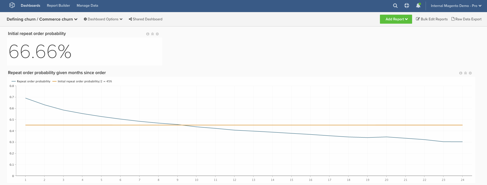

# Abbandono dei clienti transazionali

Questo argomento illustra come impostare una dashboard che ti aiuti a definire l’abbandono per i clienti transazionali.

Questa analisi contiene [colonne calcolate avanzate](../data-warehouse-mgr/adv-calc-columns.md).

## Colonne calcolate

Colonne da creare

* `customer_entity` tabella
* `Customer's lifetime number of orders`
* Seleziona una definizione: `Count`
* Seleziona un [!UICONTROL table]: `sales_flat_order`
* Seleziona un [!UICONTROL column]: **`entity_id`**
* [!UICONTROL Path]: sales_flat_order.customer_id = customer_entity.entity_id
* [!UICONTROL Filter]:
* Ordini conteggiati

* `sales_flat_order` tabella
* `Customer's lifetime number of orders`
* Seleziona una definizione: colonna unita
* Seleziona un [!UICONTROL table]: `customer_entity`
* Seleziona un [!UICONTROL column]: `Customer's lifetime number of orders`
* [!UICONTROL Path]: `sales_flat_order.customer_id = customer_entity.entity_id`
* [!UICONTROL Filter]: `Orders we count`

* `Seconds since created_at`
* Seleziona una definizione: `Age`
* Seleziona un [!UICONTROL column]: `created_at`

* **`Customer's order number`** viene creato da un analista come parte del **[DEFINIZIONE DELL’ABBANDONO]** ticket
* **`Is customer's last order`** viene creato da un analista come parte del **[DEFINIZIONE DELL’ABBANDONO]** ticket
* **`Seconds since previous order`** viene creato da un analista come parte del **[DEFINIZIONE DELL’ABBANDONO]** ticket
* **`Months since order`** viene creato da un analista come parte del **[DEFINIZIONE DELL’ABBANDONO]** ticket
* **`Months since previous order`** viene creato da un analista come parte del **[DEFINIZIONE DELL’ABBANDONO]** ticket

## Metriche

Nessuna nuova metrica.

>[!NOTE]
>
>Assicurati di [aggiungere tutte le nuove colonne come dimensioni alle metriche](../data-warehouse-mgr/manage-data-dimensions-metrics.md) prima di creare nuovi rapporti.

## Rapporti

* **Probabilità ordine di ripetizione iniziale**
* Metrica A: Ordini ripetuti in qualsiasi momento
* [!UICONTROL Metric]: `Number of orders`
* [!UICONTROL Filter]: `Customer's order number greater than 1`

* Metrica B: Ordini di tutti i tempi
* [!UICONTROL Metric]: numero di ordini

* [!UICONTROL Formula]: probabilità ordine di ripetizione iniziale
* 
  [!UICONTROL Formula]: `A/B`
* 
  [!UICONTROL Format]: `Percent`

* [!UICONTROL Time period]: `All time`
* 
  [!UICONTROL Interval]: `None`
* 
  [!UICONTROL Chart type]: `Scalar`

* **Probabilità di ripetizione ordine specificata mesi dopo l&#39;ordine**
* Metrica A: ripetere gli ordini per mesi dall’ordine precedente (nascondere)
* [!UICONTROL Metric]: `Number of orders`
* 
  [!UICONTROL Perspective]: `Cumulative`
* [!UICONTROL Filter]: `Customer's order number greater than 1`

* Metrica B: Ultimi ordini per mesi dall’ordine (nascondi)
* [!UICONTROL Metric]: `Number of orders`
* 
  [!UICONTROL Perspective]: `Cumulative`
* [!UICONTROL Filter]: `Is customer's last order? (Yes/No) = Yes`

* Metrica C: Ordini ripetuti in qualsiasi momento (nascondi)
* [!UICONTROL Metric]: `Number of orders`
* [!UICONTROL Filter]: `Customer's order number greater than 1`

* 
  [!UICONTROL Raggruppa per]: `Independent`

* Metrica D: Ultimi ordini in qualsiasi momento (nascondi)
* [!UICONTROL Metric]: `Number of orders`
* [!UICONTROL Filter]: `Is customer's last order? (Yes/No) = Yes`

* 
  [!UICONTROL Raggruppa per]: `Independent`

* [!UICONTROL Formula]: probabilità ordine di ripetizione iniziale
* 
  [!UICONTROL Formula]: `(C-A)/(C+D-A-B)`
* 
  [!UICONTROL Format]: `Percent`

* [!UICONTROL Time period]: `All time`
* 
  [!UICONTROL Interval]: `None`
* [!UICONTROL Group by]: `Months since previous order`
* Mostra top.bottom: prime 24 categorie, ordinate per nome di categoria

* 
  [!UICONTROL Chart type]: `Line`

Il rapporto probabilità ordine ripetuto iniziale rappresenta il totale ordini ripetuti / totale ordini. Ogni ordine è un&#39;opportunità per fare un ordine ripetuto; il numero di ordini ripetuti è il sottoinsieme di quelli che effettivamente lo fanno.

La formula utilizzata è semplificata in (Totale ordini ripetuti dopo X mesi)/ (Totale ordini che hanno almeno X mesi). Ci mostra che storicamente, dato che sono passati X mesi da un ordine, c&#39;è una probabilità Y% che l&#39;utente faccia un altro ordine.

Una volta creato il dashboard, la domanda più comune è: come si utilizza questo valore per determinare una soglia di abbandono?

**Non c&#39;è &quot;una risposta giusta&quot; a questo.** Tuttavia, l’Adobe consiglia di trovare il punto in cui la linea interseca il valore che è la metà del tasso di probabilità di ripetizione iniziale. Questo è il punto in cui si può dire &quot;Se un utente sta per fare un ordine di ripetizione, probabilmente lo avrebbe già fatto a questo punto.&quot; In ultima analisi, l’obiettivo è quello di selezionare la soglia in cui ha senso passare dagli sforzi di &quot;conservazione&quot; a quelli di &quot;riattivazione&quot;.

Dopo aver compilato tutti i rapporti, puoi organizzarli nel dashboard come desideri. Il risultato potrebbe essere simile all’immagine nella parte superiore della pagina

In caso di domande durante la creazione di questa analisi, o se desideri semplicemente coinvolgere il team Professional Services, [contatta l’assistenza](https://experienceleague.adobe.com/docs/commerce-knowledge-base/kb/troubleshooting/miscellaneous/mbi-service-policies.html).
