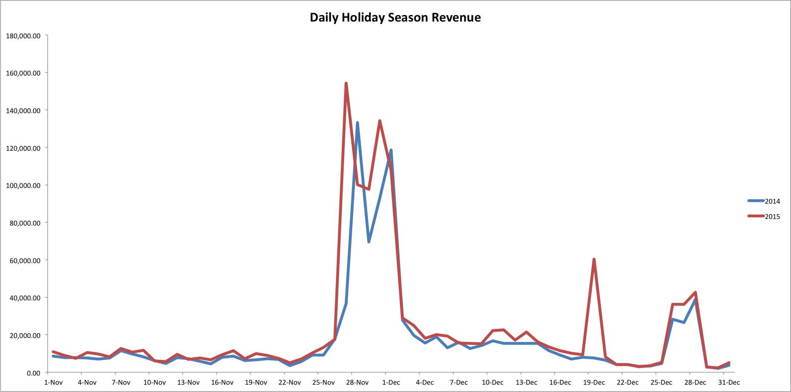

# Analisi acquisti per festività

Per la tua azienda, le vacanze potrebbero essere uno dei momenti più impegnativi dell&#39;anno. Per i rivenditori con un&#39;ampia base di clienti americani, la stagione delle vacanze di solito si estende nei mesi tra il Ringraziamento e il Capodanno.

Le precipitazioni possono essere vissute in qualsiasi momento dell&#39;anno; ad esempio, se la tua azienda vende pantaloncini o forniture per la piscina, potresti riscontrare una corsa durante l&#39;estate. In questo argomento vengono analizzate le analisi che consentono di confrontare le stagioni più elevate in diversi anni.

## Metriche consigliate

Quando analizzi le prestazioni della stagione delle festività, prendi in considerazione l’analisi ([o edificio](../../data-user/reports/ess-manage-data-metrics.md)) le metriche seguenti:

### Numero di nuovi clienti, Numero di ordini, Ricavi

Per aiutarti a capire il confronto tra il modello di crescita di quest&#39;anno e quello degli anni precedenti, prendi in considerazione l&#39;analisi di queste misure. Il numero di nuovi clienti, il numero di nuovi ordini e l&#39;importo dei ricavi mostrano le prestazioni dell&#39;azienda giorno per giorno per l&#39;intervallo di tempo (stagione festiva) specificato. Puoi anche analizzare queste misure utilizzando una prospettiva cumulativa per vedere come cambia la metrica nel tempo.

### Valore medio dell’ordine

Questa misura visualizza il valore medio complessivo dell’ordine durante le feste.

## Esempio: ricavi per le feste giornaliere

Ora che sai quali metriche analizzare, puoi esaminare alcuni dati di esempio sui ricavi durante i mesi festivi di novembre e dicembre per entrambi gli anni 2014 e 2015.

In questo esempio, ci sono due forti picchi di ricavi per il 2014 e il 2015: questi aumenti coincidono con il Black Friday e il Cyber Monday. Nota come i picchi non si verificano nello stesso giorno per il 2014 e il 2015. Questo perché il Black Friday è caduto il 27 novembre per il 2014 e il 28 novembre per il 2015. Allo stesso modo, il Cyber Monday è stato il 30 novembre per il 2014 e il 1 dicembre per il 2015.

Inoltre, il 19 dicembre si registra un picco delle entrate per il 2015 che non si verifica nel 2014. È possibile che in questo particolare sabato sia stata offerta una vendita che non era disponibile l&#39;anno precedente.

A parte le poche date di cui sopra, le entrate di questi due anni si registrano insieme.

## Quali domande dovrei considerare?

Per aiutarti a comprendere le tendenze stagionali per la tua azienda, ecco alcune domande da tenere a mente quando esplori i tuoi dati:

* Si prevedono tendenze di anno in anno?
* Le tendenze riflettono le tue aspettative per le variazioni tra le stagioni?
* Ci sono delle differenze da un anno all&#39;altro? Queste differenze possono essere spiegate?
* Le promozioni sono state offerte durante un anno specifico?
* I prezzi sono stati aumentati durante un anno specifico?
* La spesa pubblicitaria è stata aumentata per un anno specifico?

## Che altro devo analizzare?

Un&#39;opzione consiste nell&#39;analizzare il comportamento d&#39;acquisto dei clienti durante le feste. I clienti acquisiti durante le festività spendono o acquistano più spesso rispetto ai clienti acquisiti al di fuori delle festività?

Un’altra opzione consiste nell’analizzare il ROI per campagna durante le stagioni festive. Il tuo ROI è superiore per particolari campagne che vengono eseguite durante le feste? Dovresti aumentare la spesa per le campagne con ROI elevato durante queste stagioni?

Inoltre, è possibile analizzare il numero di ordini scontati rispetto a ordini a prezzo pieno. [La maggior parte dei clienti è in attesa di una vendita su ordini di acquisto?](../analysis/coupon-usage.md) durante le vacanze o acquistano articoli a prezzo pieno?

### Correlato

* [Analisi dell’impatto dei coupon sull’acquisizione e sulla fidelizzazione dei clienti](../analysis/coupon-impact.md)
* [Analisi del comportamento di riacquisto dei clienti](../analysis/repurchase-behavior.md)
