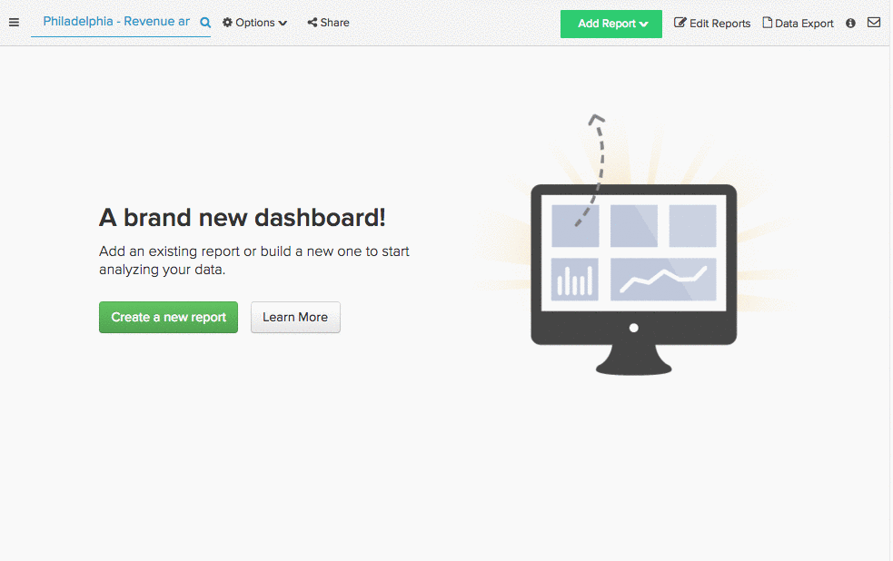

# Identificare le origini di marketing corrette

Hai ricercato il tuo pubblico, creato la tua campagna, investito in alcuni canali di marketing. Ora che è passato un po&#39; di tempo, come stanno andando quei canali? Quale canale ha attirato il maggior numero di nuovi utenti? Qual è la fonte che ha contribuito maggiormente al fatturato totale?

Con [!DNL Adobe Commerce Intelligence], puoi segmentare facilmente i ricavi e gli utenti per origine di riferimento, a seconda che corrisponda a [!DNL [Google Analytics' UTM fields]](https://support.google.com/analytics/answer/1191184?hl=en) o campi dati personalizzati. Questa segmentazione ti consente di trovare i canali con le prestazioni migliori e di investire meglio nel budget di marketing.

Questo argomento esplora alcuni rapporti che puoi utilizzare per scoprire i tuoi canali di marketing più importanti:

* [Nuovi utenti per origini](#newusersbysource)
* [Ricavi medi nel ciclo di vita per origine utente](#avglifetimerev)
* [Valore medio ordine per origine utente](#avgorderval)
* [Ricavi per data di registrazione utente e origini](#revbyregdateandsource)
* [Ripeti ordini per origine utente](#repeatordersbysource)

## Prerequisiti {#prereqs}

Per generare le analisi in questo argomento, devi accedere ai dati di origine di acquisizione marketing/riferimento. Se non lo stai già tracciando, devi portare [ordina dati origine riferimento da [!DNL Google ECommerce]](../importing-data/integrations/google-ecommerce.md) in [!DNL Adobe Commerce Intelligence] prima di continuare. Inoltre, l’aggiunta di informazioni sul dispositivo utente alle analisi ti consente di vedere quale tecnologia vengono utilizzati i tuoi riferimenti.

## Nuovi utenti per origine {#newusersbysource}

La valutazione delle prestazioni delle origini di riferimento è fondamentale per determinare i canali più importanti. Questo rapporto mostra il numero di utenti appena registrati, per origine di acquisizione, nel tempo, consentendo in tal modo di tenere traccia delle prestazioni delle origini di riferimento nell’acquisizione di nuovi utenti registrati.

Per creare questo report in [Report Builder](../../tutorials/using-visual-report-builder.md), aggiungi **Nuovi utenti** metrica (o una metrica equivalente che conta il numero di nuovi utenti nel tempo) per il rapporto. Quindi, effettua le seguenti operazioni:

1. Imposta il [!UICONTROL Time Period] al periodo di registrazione che desideri analizzare.
1. Imposta il [!UICONTROL Interval] a mensile.
1. Imposta [!UICONTROL Group By] all&#39;origine di acquisizione (o riferimento) e selezionare le origini che si desidera includere.
1. In questo esempio viene utilizzato `stacked columns` [!UICONTROL chart type].

Di seguito è riportata una procedura dettagliata:

## Ricavi medi nel ciclo di vita per origine utente {#avglifetimerev}

Individuare i canali che portano nuovi utenti è importante, ma quanto sono importanti in generale queste referenze? Questo rapporto mostra i ricavi medi nel corso della vita degli utenti da fonti di acquisizione specifiche nel tempo. In altre parole, questo consente di vedere se gli utenti acquisiti da una particolare origine spendono di più con te nel corso della loro vita rispetto a un gruppo di utenti acquisiti da un’origine diversa.

Per creare questo rapporto nel Report Builder, aggiungi **Ricavi medi nel ciclo di vita** metrica al rapporto. Quindi, effettua le seguenti operazioni:

1. Imposta il [!UICONTROL Time Period] al periodo di tempo che si desidera analizzare.
1. Imposta il [!UICONTROL Interval] a mensile.
   [!UICONTROL Group By] all&#39;origine di acquisizione (o riferimento) e selezionare le origini che si desidera includere.
1. In questo esempio viene utilizzato `line chart` tipo.

Di seguito è riportata una procedura dettagliata:

.

Questo esempio considera solo i ricavi relativi al ciclo di vita, ma puoi anche replicare questa analisi per esaminare [!UICONTROL Number of orders] o [!UICONTROL Distinct buyers] per origine di riferimento.

## Valore medio ordine per origine utente {#avgorderval}

Per avere un’idea migliore di quanto denaro spendono gli utenti da una specifica origine di acquisizione, puoi creare un rapporto che considera il loro valore medio dell’ordine. Questo consente di monitorare se gli utenti acquisiti da una particolare origine spendono di più per ordine rispetto agli utenti di un’altra origine.

Per creare questo rapporto nel Report Builder, aggiungi **Valore medio dell’ordine** ed effettuare le seguenti operazioni:

1. Imposta il [!UICONTROL Time Period] al periodo di registrazione che desideri analizzare.
1. Imposta il [!UICONTROL Time Interval] a mensile.
1. Imposta [!UICONTROL Group By] all&#39;origine di acquisizione (o riferimento) e selezionare le origini che si desidera includere.
1. In questo esempio viene utilizzato **colonne sovrapposte** tipo di grafico.

Di seguito è riportata una procedura dettagliata:

## Ricavi totali per data e origine di registrazione utente {#revbyregdateandsource}

L’analisi dei ricavi nel ciclo di vita che è stata trattata in precedenza consente di esaminare i ricavi medi nel ciclo di vita degli utenti acquisiti da origini diverse. Ma cosa succede per i ricavi totali nel ciclo di vita? Questo rapporto ti consente di identificare la quantità complessiva di ricavi generati dagli utenti registrati durante un periodo di tempo specifico e da un’origine specifica.

Per creare questo rapporto nel Report Builder, aggiungi `Revenue by user registration date` metrica. Se non è stato [ha creato questa metrica](../../data-user/reports/ess-manage-data-metrics.md) già, è possibile farlo replicando il `Revenue` metrica e modifica della `time stamp` a dell&#39;utente `creation date`. Dopo aver aggiunto la metrica, effettua le seguenti operazioni:

1. Imposta il [!UICONTROL Time Period] al periodo di registrazione che desideri analizzare.
1. Imposta il [!UICONTROL Time Interval] a mensile.
1. Imposta [!UICONTROL Group By] all&#39;origine di acquisizione (o riferimento) e selezionare le origini che si desidera includere.
1. In questo esempio viene utilizzato `stacked columns` tipo di grafico.

Di seguito è riportata una procedura dettagliata:

## Ripeti ordini per origine utente {#repeatordersbysource}

Il rapporto Valore medio ordine mostra, in media, quanti utenti acquisiti da una determinata origine spendono quando si effettua un ordine. Questo rapporto, tuttavia, non mostra se gli stessi utenti sono clienti frequenti. Tuttavia, con la funzione Ripeti ordini da parte delle origini utenti, è possibile verificare se gli utenti di una determinata origine effettuano acquisti più o meno ripetuti.

Per creare questo report in [Report Builder](../../tutorials/using-visual-report-builder.md), aggiungi **Numero di ordini** ed effettuare le seguenti operazioni:

1. Imposta il [!UICONTROL Time Period] al periodo di registrazione che desideri analizzare.
1. Imposta il [!UICONTROL Time Interval] a mensile.
1. Aggiungi un [!UICONTROL filter] in modo che siano inclusi solo gli utenti con ordini ripetuti:

   Numero ordine utente maggiore di 1

1. Imposta [!UICONTROL Group By] all&#39;origine di acquisizione (o riferimento) e selezionare le origini che si desidera includere.
1. In questo esempio viene utilizzato `stacked columns` tipo di grafico.

Di seguito è riportata una procedura dettagliata:

## Ritorno a capo {#wrapup}

Questo argomento ha toccato solo alcune analisi che puoi utilizzare per analizzare il valore dei tuoi canali di acquisizione e marketing, ma questa è solo la punta dell&#39;iceberg.

## Correlato {#related}

* [Tracciamento dell’origine di riferimento dell’ordine tramite [!DNL Google ECommerce]](../importing-data/integrations/google-ecommerce.md)
* [Collegamento [!DNL Google Adwords] account](../importing-data/integrations/google-adwords.md)
* [Generazione [!DNL Google ECommerce] dimensioni con ordini e dati cliente](../data-warehouse-mgr/bldg-google-ecomm-dim.md)
* [Best practice per l’assegnazione di tag UTM in [!DNL Google Analytics]](../../best-practices/utm-tagging-google.md)
