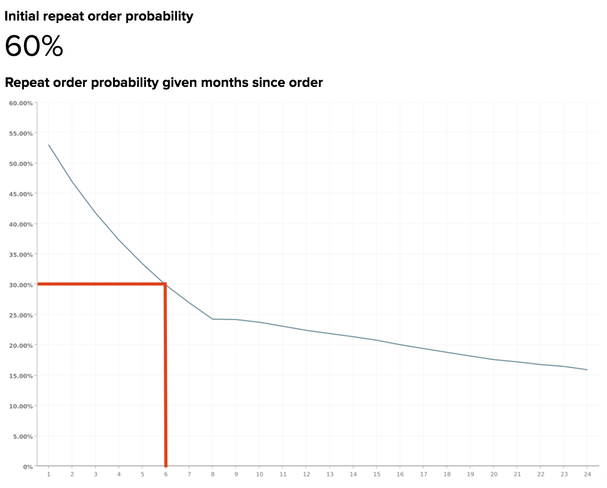

# Decadimento e abbandono della probabilità di ripetizione

Se una parte dei ricavi proviene da acquisti ripetuti, probabilmente sei a conoscenza dell&#39;enorme valore di una base clienti fedele. A tal fine, è fondamentale comprendere in che modo si interrompe il tempo tra un ordine e l’altro e quando si prevede che i clienti abbandonino l’attività.

Questo argomento illustra le analisi che possono aiutarti a rispondere alle seguenti domande:

* Qual è la probabilità che un cliente effettui un altro acquisto?
* In che modo la probabilità di ripetizione dell’ordine varia con il tempo dall’acquisto più recente del cliente?
* Quando un cliente deve essere considerato abbandonato? E quindi, quando dovrebbe iniziare una campagna di riattivazione?

## Metriche consigliate

Quando si analizza il decadimento e l&#39;abbandono della probabilità di ripetizione, è consigliabile utilizzare ([o la compilazione](../../data-user/reports/ess-manage-data-metrics.md)) delle metriche seguenti:

### Probabilità ordine di ripetizione iniziale

Questa misura è definita come il numero totale di ordini ripetuti, espresso come percentuale del totale degli ordini. Formulata in un altro modo, questa è la probabilità che un ordine sia seguito da un altro ordine. Quando questa probabilità è superiore al 50%, implica che più della metà di tutti gli ordini è seguita da un ordine successivo.

### Probabilità di ripetizione ordine specificata mesi dopo l&#39;ordine

Questa misura dimostra la probabilità che un utente ordini nuovamente, dato il numero di mesi trascorsi dall’ultimo ordine. La formula utilizzata per generare questa metrica semplifica le operazioni seguenti:

A seconda del modello di business, la probabilità di ripetizione dell’ordine può calare immediatamente dopo che un cliente ha effettuato un ordine e continuare a diminuire nei mesi successivi, oppure può dimostrare variazioni stagionali e picchi.

Comprendere la percentuale di clienti che si prevede effettueranno acquisti ripetuti (e come questa tendenza nel tempo) consente di eseguire il targeting dei clienti a intervalli per massimizzare la probabilità di un acquisto ripetuto. Pertanto, quando la probabilità di acquisto ripetuto diminuisce, puoi scegliere un momento per identificare un cliente come abbandonato e passare dalla conservazione alla riattivazione.

## L&#39;esempio di oggi

Osserva il decadimento della probabilità di ripetizione per una tipica attività di e-commerce.

### Probabilità ordine di ripetizione iniziale

In questo esempio, la probabilità di ordine ripetuto iniziale, o la probabilità che un cliente effettui un acquisto ripetuto, è del 60%. Ciò significa che il 60% di tutti gli ordini effettuati con questa attività sono seguiti da un ordine successivo.

### Probabilità di ripetizione ordine specificata mesi dopo l&#39;ordine

Questo rapporto mostra la probabilità che un cliente ordini nuovamente, dato che sono trascorsi alcuni mesi dall’ultimo ordine. Anche se non esiste una definizione unica per la soglia di abbandono data questa relazione, Adobe consiglia di definire abbandono come il punto in cui la probabilità di decadimento attraversa il valore che è la metà del tasso di probabilità di ripetizione iniziale.

Poiché il tasso di probabilità di ripetizione iniziale per questo esempio è del 60%, la data di abbandono corrisponderebbe al momento in cui la probabilità di ordine di ripetizione scende al di sotto del 60%/2 = 30%, o a circa 6 mesi. Nel 60% dei casi, la metà degli ordini è stata inoltrata entro i primi sei mesi.

Formulata in un altro modo, se un cliente stava per effettuare un ordine di follow-up, è più probabile che lo abbia fatto entro sei mesi dall&#39;ultimo ordine che dopo il periodo di sei mesi. Se un cliente non ha effettuato il riacquisto dopo sei mesi, è necessario avviare una campagna di riattivazione per richiamare il cliente.

A seconda del modello di business, puoi invece scegliere una soglia diversa, come il punto in cui la probabilità di ordine ripetuto scende sotto il 50% o il 10%. Se le tue conoscenze interne suggeriscono un numero diverso, dovrai comunque usarlo!

In ultima analisi, l’obiettivo è quello di selezionare la soglia in cui ha senso passare dalle attività di conservazione a quelle di riattivazione. Gli sforzi di conservazione possono includere e-mail per coinvolgere di nuovo i clienti esistenti con acquisti di follow-up consigliati da effettuare, mentre gli sforzi di riattivazione possono includere e-mail a clienti inattivi con coupon e offerte.

## Quali domande dovrei considerare?

Per aiutarti a comprendere la probabilità di ordine ripetuto applicata alla tua azienda, l’Adobe suggerisce di considerare queste domande quando esplori i tuoi dati:

* È prevista la probabilità di ordine di ripetizione iniziale? In caso negativo, perché pensa che dovrebbe essere superiore o inferiore?
* Vi sono forti diminuzioni nella probabilità di ordine ripetuto per mesi specifici dall&#39;ultimo ordine? In caso affermativo, sono previste tali modifiche?
* Qual è la soglia di abbandono corrente?
* La soglia di abbandono corrente è allineata a uno dei valori nella probabilità di ordine ripetuto dati mesi dall’ultimo rapporto dell’ordine?
* La soglia corrente riflette gli sforzi pubblicitari per passare dalla conservazione alla riattivazione?
* Ha senso per la tua azienda cambiare la soglia al mese in cui il decadimento della probabilità attraversa il valore che è la metà del tasso di probabilità di ripetizione iniziale?

## Che altro devo analizzare?

Dopo aver creato l’analisi di cui sopra e aver determinato una soglia di abbandono, puoi generare più analisi per identificare le tendenze comuni negli utenti abbandonati. Ad esempio, i clienti che sono abbandonati vengono acquisiti nello stesso periodo di tempo o hanno acquistato prodotti simili nell’ultimo ordine? Una volta impostata una soglia di abbandono, puoi immergerti ulteriormente in caratteristiche specifiche di questi clienti abbandonati.

Se offri più di un prodotto, probabilmente ti chiedi in che modo i clienti che acquistano un prodotto specifico si comportano in modo diverso nel tempo rispetto ad altri clienti. Vuoi saperne di più? Consulta questa esercitazione per esplorare il comportamento di acquisto nel corso del ciclo di vita delle coorti di clienti in base a prodotti specifici acquistati.

Questa best practice è fornita da [!DNL Adobe Commerce Intelligence] Data Analysis Services (DAS). [Contatta il supporto](https://experienceleague.adobe.com/docs/commerce-knowledge-base/kb/troubleshooting/miscellaneous/mbi-service-policies.html?lang=it) per ulteriori informazioni.

### Correlato

* [Analisi dell’impatto dei coupon sull’acquisizione e sulla fidelizzazione dei clienti](../analysis/coupon-impact.md)
* [Analisi del comportamento di riacquisto dei clienti](../analysis/repurchase-behavior.md)
