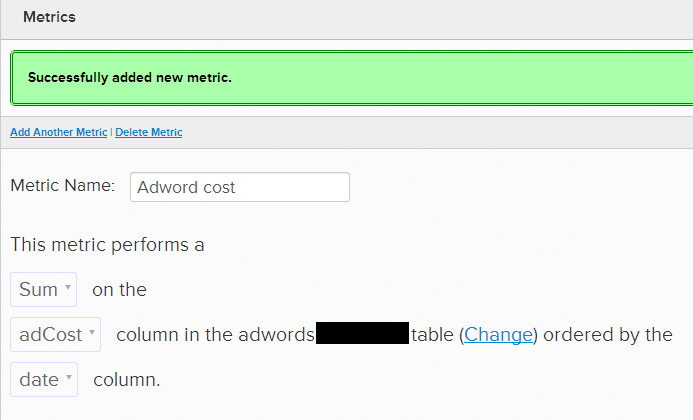

# Campagne pubblicitarie e ROI

[!DNL Adobe Commerce Intelligence] consente di [combinare i dati relativi ai costi pubblicitari e ai ricavi](../../data-analyst/importing-data/integrations/google-adwords.md) dal database. Questo consente di identificare quali campagne hanno il maggiore ritorno sull’investimento (ROI). In questo argomento vengono illustrati alcuni metodi diversi per valutare le prestazioni della campagna.

## Prerequisiti

* Importa i dati sui costi pubblicitari:
   * [Connetti [!DNL Google AdWords] a [!DNL Commerce Intelligence]](../importing-data/integrations/google-adwords.md): questo sincronizza il tuo [!DNL Adwords] spendere in [!DNL Commerce Intelligence]
   * [Carica altri dati sui costi della pubblicità](../importing-data/connecting-data/import-offline-ad-data.md): consigliato per i canali senza connettore diretto a [!DNL Commerce Intelligence]
   * Se si importano dati sui costi da più origini, è possibile [consolidare](../../best-practices/consolidating-your-tables.md) i dati in [!DNL Commerce Intelligence]. Semplicemente [invia un ticket di supporto](../../guide-overview.md#Submitting-a-Support-Ticket).
* [Tracciare i dati del canale di acquisizione dell&#39;utente](../analysis/google-track-user-acq.md)

## Campagne di acquisizione utente

Le campagne mirate all’acquisizione di utenti possono essere misurate da molti punti di vista, tra cui:

1. Numero di nuovi utenti acquisiti delle campagne
1. Tasso di conversione dalla registrazione all’acquisto di campagne
1. Il ROI delle campagne in base al valore medio del ciclo di vita dell’utente (LTV)

Le analisi (1) e (2) di cui sopra sono esaminate in un tutorial separato su [identificazione dei canali di marketing principali](../analysis/most-value-source-channel.md). Qui puoi esplorare l’analisi (3) per misurare il ROI delle campagne nel tempo. Questo risponde al quesito se gli utenti acquisiti da una particolare campagna hanno generato ricavi sufficienti per coprire i costi di acquisizione.

>[!NOTE]
>
>Questo esempio presuppone che tutti i costi della campagna siano stati utilizzati esclusivamente per acquisire nuovi utenti. In realtà, il costo della campagna viene condiviso anche con l’acquisizione di visite non convertite, acquirenti ripetuti e così via. Supponendo che tutti i costi vengano utilizzati per acquisire nuovi utenti registrati, il ROI risultante rappresenta lo scenario peggiore (costo per acquisizione più alto). Puoi essere sicuro che il ROI effettivo sia superiore ai calcoli.
>
>Esempio: supponendo di aver speso 20 $ per una campagna che ha generato 10 nuovi utenti e 10 acquirenti ripetuti, il costo effettivo per nuovo utente è di 1 $. Ma, partendo dal presupposto che tutti i costi sono andati ad acquisire nuovi utenti, il costo per acquisizione è di 2 dollari.

**1. Per iniziare, crea un grafico che segmenta il costo dell’annuncio in base alle campagne:**

1. Creare un [!UICONTROL Metric] somma delle spese nel tempo
1. Vai a [!UICONTROL Data > Metrics]
1. Seleziona `Add New Metric` e seleziona la [!DNL `Adwords...`] tabella che sta registrando [!DNL AdWords] dati sui costi.
1. Nell’editor delle metriche, assegna un nome alla metrica (ad esempio, [!UICONTROL AdWord Cost])
1. Utilizzando i menu a discesa, esegui una **Somma** il `adCost` colonna nella [!DNL Adwords...] tabella (Modifica) ordinata da `date` colonna.
   <!--="500" height="303"}-->
1. Clic `Back to Metric List` nella parte superiore e passare a qualsiasi dashboard.

1. Creare un rapporto che segmenta la spesa per campagne
1. In qualsiasi dashboard, fai clic su [!UICONTROL Add Report > Create report]
1. Seleziona la [!UICONTROL Adword Cost] metrica appena creata
1. Imposta il [!UICONTROL Time period] a `All-time`, e [!UICONTROL Interval] a `None`
1. Sotto `Group by` , aggiungi `campaign` as [!UICONTROL grouping field]e fai clic su `Add All` nella scatola.
1. Questo rapporto mostra i tuoi [!DNL AdWords] costo per campagne

**2. Crea un rapporto che conta i nuovi utenti per campagne:**

1. In qualsiasi dashboard, fai clic su **[!UICONTROL Add Report > Create report]**
1. Seleziona la `New users` metrica che conta il numero di nuovi utenti registrati nel tempo
1. Imposta il [!UICONTROL Time period] a `All-time`, e [!UICONTROL Interval] a `None`
1. Sotto `Group by` , aggiungi `campaign` as `grouping field`e fai clic su **`Add All`** nella scatola
1. Questo rapporto mostra i tuoi utenti registrati sempre per campagne

**3. Crea un rapporto che segmenta l’LTV dell’utente medio per campagna:**

1. In qualsiasi dashboard, fai clic su **[!UICONTROL Add Report > Create report]**
1. Seleziona la `Average lifetime revenue` metrica che calcola i ricavi medi dell’intero ciclo di vita di un utente
1. Imposta il [!UICONTROL Time period] a `All-time`, e [!UICONTROL Interval] a `None`
1. Sotto `Group by` , aggiungi `campaign` o `utm\_campaign` as [!UICONTROL grouping field]e fai clic su `Add All` nella scatola
1. Questo rapporto mostra i ricavi medi del ciclo di vita dell’utente per campagna

**Infine, calcola il ROI della campagna riunendo queste tre analisi in un unico rapporto:**

1. In qualsiasi dashboard, fai clic su **[!UICONTROL Add Report > Create new report]**
1. Aggiungi come input, utilizza le tre metriche utilizzate in precedenza. A ciascuno viene assegnata una lettera (ad esempio,\[`A`\], \[`B`\] e \[`C`\])
1. [!UICONTROL Cost]: aggiungi la metrica Costo AdWords - questa è la variabile \[A\]. In questo modo viene restituito il costo per campagne.
1. [!UICONTROL Users]: aggiungi la metrica Nuovi utenti. Si tratta della variabile \[B\]. Restituisce il numero di utenti per campagne.
1. [!UICONTROL LTV]: aggiungi la metrica Ricavi medi ciclo di vita. Questa è la variabile \[`C`\]. In questo modo viene restituito LTV per campagne.

1. Fare clic sull&#39;icona Nascondi accanto alla parola Grafico per spostare l&#39;attenzione sulla tabella
1. Ora utilizza `Add Formula` per combinare queste metriche, procedi come segue:
1. [!UICONTROL ROI]: inserisci la formula `(\[C\]-\[A\]/\[B\])/(\[A\]/\[B\])`, se \[`A`\] rappresenta `Ad Cost by Campaigns`, \[`B`\] rappresenta `New users by campaigns`, e \[`C`\] `LTV by campaigns`. Questo restituisce il rapporto tra (costo medio per acquisizione dell’LTV utente) / (costo medio per acquisizione)
1. [!UICONTROL Avg Return per User]: inserisci la formula **\[`C`\]-(\[`A`\]/\[`B`\])**. In questo modo viene restituito il margine medio realizzato da un utente calcolando (LTV utente medio) - (costo medio per acquisizione).
1. [!UICONTROL CPA]: inserisci la formula **`\[A\]/\[B\]`**. Restituisce il costo effettivo della campagna per acquisizione.
1. Altre metriche potenziali da includere [!DNL AdWords] i dati includono le somme di  `Impressions` e `adClicks` (da [!DNL AdWords] dati), insieme al totale `number of orders` effettuate tramite una determinata campagna.
1. Può anche essere interessante calcolare il ROI in base a LTV 30 giorni e 90 giorni dopo che un utente si è registrato o ha effettuato un primo acquisto.

1. Puoi fare clic e trascinare le metriche e le formule per riordinare le colonne del rapporto
1. Assegna un nome al rapporto e assicurati di salvarlo come tabella.

## Campagne sui prodotti

Stai eseguendo annunci pubblicitari specifici per il prodotto? In tal caso, puoi misurare il ROI di tali campagne calcolando i ricavi/costi per prodotti specifici.

>[!NOTE]
>
>Questo esempio presuppone che tutti i costi della campagna siano stati utilizzati esclusivamente per generare acquisti di prodotti specifici. Supponendo che tutti i costi siano stati spesi per la generazione di acquisti, il ROI risultante rappresenta lo scenario peggiore (costo più alto per acquisto). Puoi essere sicuro che il ROI effettivo sia superiore a questo calcolo. Esempio: supponendo di aver speso 20 $ per una campagna che ha generato 10 nuovi utenti e 10 acquisti, il costo effettivo per acquisto è di 1 $. Presumendo che tutti i costi siano andati ad acquisire nuovi utenti, il costo per acquisto è di 2 $.

Prima di iniziare, [invia un ticket di supporto](https://experienceleague.adobe.com/docs/commerce-knowledge-base/kb/troubleshooting/miscellaneous/mbi-service-policies.html) per unire le dimensioni seguenti alla tabella degli elementi di riga (`sales\_flat\_order\_item, order\_item`):

* Origine dell’ordine (se tieni traccia solo dell’origine di riferimento a livello di utente, quindi unisci all’origine dell’utente)
* Campagna dell’ordine (se tieni traccia solo dell’origine di riferimento a livello di utente, quindi partecipa alla campagna dell’utente)
* Canale dell&#39;ordine (se tieni traccia solo dell&#39;origine di riferimento a livello di utente, poi unisciti al canale dell&#39;utente)

**1. Per iniziare, crea un grafico che restituisce i ricavi per campagna per prodotti specifici:**

1. In qualsiasi dashboard, fai clic su **[!UICONTROL Add Report > Create new report]**
1. Seleziona la `Revenue by items` metrica che calcola i ricavi a livello di elementi riga
1. Imposta il [!UICONTROL Time period] a `All-time`, e [!UICONTROL Interval] a `None`
1. Sotto `Filter by` , aggiungi `product name 'IN'` Prodotto `A`, Prodotto `B`, Prodotto `C`, ...&quot; e includere tutti i nomi di prodotto target della campagna separati da una virgola (ad esempio, `product name 'IN' yellow t-shirt`, `red t-shirt, blue t-shirt`)
1. Sotto `Group by` , aggiungi `order's campaign` o `order's utm\_campaign` as `grouping` e fai clic su **[!UICONTROL Add All]** nella scatola
1. Questo rapporto mostra i ricavi per prodotti specifici per campagne

**2. Per calcolare il ROI, combini nuovamente le metriche in un unico rapporto:**

1. In qualsiasi dashboard, fai clic su **[!UICONTROL Add Report > Create new report]**
1. Aggiungi il `Revenue by items` metrica, seguendo il filtro e raggruppa per istruzioni della campagna per specifici prodotti, report qui sopra e fai clic su **[!UICONTROL Hide]** sotto il valore scalare della metrica
1. Ora aggiungi [!DNL AdWords Cost] metrica, seguendo il filtro e raggruppando per direzioni dalla `Ad cost by campaigns` rapporto che hai esplorato in `User acquisition campaigns` sopra; quindi fai clic su **[!UICONTROL Hide]** sotto il valore scalare della metrica
1. Dopo aver impostato queste metriche, aggiungi le seguenti formule:
1. [!UICONTROL ROI]: inserisci la formula `\[A\]/\[B\]`, se `\[A\]` rappresenta `Revenue per campaign for specific product(s)` e `\[B\]` rappresenta `Ad cost by campaigns`. Restituisce il rapporto tra (Ricavi per prodotti specifici) e (Costo campagna)
1. [!UICONTROL Return]: inserisci la formula `\[A\]-\[B\]`. Restituisce il margine medio realizzato da un utente calcolando (LTV utente medio) - (costo medio per acquisizione)
1. (Facoltativo) [!UICONTROL Revenue]: scopri `Revenue by items` metrica per visualizzare i ricavi per prodotti specifici per campagne
1. (Facoltativo) [!UICONTROL Cost]: scopri `AdWords Cost` metrica per visualizzare il costo delle campagne

1. Assegna un nome al report e assicurati di salvarlo come tabella

**3. Ripeti i passaggi 1 e 2 sopra per ciascuno dei prodotti o gruppi di prodotti annunciati.**

## Documentazione correlata

* [Tracciare l’origine di riferimento dell’ordine tramite [!DNL Google Analytics] E-commerce](../importing-data/integrations/google-ecommerce.md)
* [Tracciare l&#39;origine di riferimento dell&#39;utente nel database](../analysis/google-track-user-acq.md)
* [Tenere traccia dei dati relativi a dispositivi utente, browser e sistema operativo nel database](../analysis/track-usr-dev-browser.md)
* [Scopri le fonti e i canali di acquisizione più importanti](../analysis/most-value-source-channel.md)
* [Connetti [!DNL Google Adwords] account](../importing-data/integrations/google-adwords.md)
* [In che modo [!DNL Google Analytics] Lavoro di attribuzione UTM?](../analysis/utm-attributes.md)
* [Cinque best practice per l’assegnazione di tag UTM in [!DNL Google Analytics]](../../best-practices/utm-tagging-google.md)
