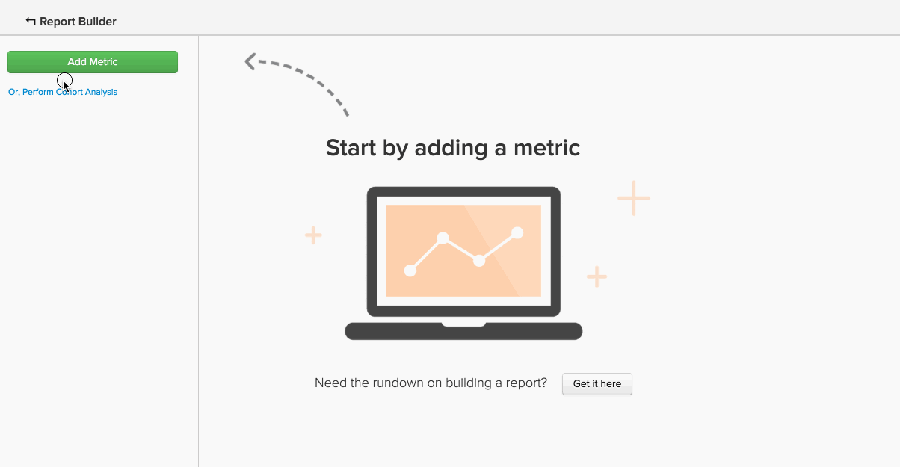

# Tipi di colonne calcolate avanzate

Molte analisi che potresti tentare di creare, implicano l&#39;utilizzo di un **nuova colonna** che vuoi `group by` o `filter by`. La [Creazione di colonne calcolate](../data-warehouse-mgr/creating-calculated-columns.md) Questa esercitazione descrive le nozioni di base per la maggior parte dei casi d’uso, ma potrebbe essere utile utilizzare una colonna calcolata un po’ più complessa di quella che Data Warehouse Manager può creare.
{: #top}

Questi tipi di colonne possono essere creati dal nostro team di analisti di Data Warehouse. Per definire una nuova colonna calcolata, fornisci le seguenti informazioni:

1. La **`definition`** di questa colonna (compresi input, formule o formattazione)
1. La **`table`** su cui desideri creare la colonna
1. Qualsiasi **`example data points`** che descrivono il contenuto della colonna

Di seguito sono riportati alcuni esempi comuni di colonne calcolate avanzate che gli utenti spesso trovano utili:

* [Ordina (o classifica) l’evento in sequenza](#compareevents)
* [Trova l&#39;intervallo di tempo tra due eventi](#twoevents)
* [Confrontare i valori degli eventi sequenziali](#sequence)
* [Converti valuta](#currency)
* [Converti timezoni](#timezone)
* [Altro](#else)

## Sto cercando di ordinare gli eventi in sequenza {#compareevents}

Lo chiamiamo un **numero evento** colonna calcolata. Stiamo quindi cercando di trovare la sequenza in cui si sono verificati gli eventi per un particolare proprietario dell’evento, come un cliente o un utente.

Ecco un esempio:

| **`event\_id`** | **`owner\_id`** | **`timestamp`** | **`Owner's event number`** |
|-----|-----|-----|-----|
| 1 | `A` | 01/01/2015:00:00 | 1 |
| 2 | `B` | 01/01/2015:30:00 | 1 |
| 3 | `A` | 01/01/2015:00:00 | 2 |
| 4 | `A` | 01/01/2015:00:00 | 3 |
| 5 | `B` | 01/03/2015:00:00 | 2 |

{style=&quot;table-layout:auto&quot;}

Una colonna calcolata con un numero di evento può essere utilizzata per osservare le differenze di comportamento tra eventi di prima occorrenza, eventi di ripetizione o nth nei dati.

Vuoi visualizzare la colonna numero ordine del cliente in azione? Fai clic sull’immagine per visualizzarla utilizzata come dimensione Raggruppa per in un rapporto.

<!--{: style="max-width: 500px;"}-->

Per creare questo tipo di colonna calcolata, è necessario conoscere:

* Tabella in cui creare la colonna
* Il campo che identifica il proprietario degli eventi (`owner\_id` in questo esempio)
* Il campo in base al quale si desidera ordinare gli eventi (`timestamp` in questo esempio)

[torna all&#39;inizio](#top)

## Sto cercando di trovare il tempo tra due eventi. {#twoevents}

Lo chiamiamo un `date difference` colonna calcolata. Ciò significa che stiamo cercando di trovare il tempo tra due eventi appartenenti a un singolo record, in base alle marche temporali dell’evento.

Ecco un esempio:

| `id` | `timestamp\_1` | `timestamp\_2` | `Seconds between timestamp\_2 and timestamp\_1` |
|-----|-----|-----|-----|
| `A` | 01/01/2015:00:00 | 01/01/2015:30:00 | 45000 |
| `B` | 01/01/2015:00:00 | 01/01/2015:00:00 | 7200 |

{style=&quot;table-layout:auto&quot;}

Una colonna calcolata a differenza di data può essere utilizzata per creare una metrica che calcola l’intervallo medio o medio tra due eventi. Fai clic sull’immagine seguente per controllare come `Average time to first order` viene utilizzato in un rapporto.

<!--{: style="max-width: 500px;"}-->

Per creare questo tipo di colonna calcolata, è necessario conoscere:

* Tabella in cui creare la colonna
* Due marche temporali tra le quali si desidera conoscere la differenza

[torna all&#39;inizio](#top)

## Sto cercando di confrontare valori di evento sequenziali. {#sequence}

Lo chiamiamo un **confronto sequenziale degli eventi**. Stiamo quindi cercando di trovare il delta tra un valore (valuta, numero, timestamp) e il valore corrispondente per l’evento precedente del proprietario.

Ecco un esempio:

| **`event\_id`** | **`owner\_id`** | **`timestamp`** | **`Seconds since owner's previous event`** |
|-----|-----|-----|-----|
| 1 | `A` | 01/01/2015:00:00 | NULL |
| 2 | `B` | 01/01/2015:30:00 | NULL |
| 3 | `A` | 01/01/2015:00:00 | 7720 |
| 4 | `A` | 01/01/2015:00:00 | 126000 |
| 5 | `B` | 01/03/2015:00:00 | 217800 |

{style=&quot;table-layout:auto&quot;}

Un confronto sequenziale degli eventi può essere utilizzato per trovare il tempo medio o mediano tra ciascun evento sequenziale. Fai clic sull’immagine seguente per visualizzare il **Tempo medio e medio tra gli ordini** metriche in azione.

=<!--{: style="max-width: 500px;"}-->

Per creare questo tipo di colonna calcolata, è necessario conoscere:

* Tabella in cui creare la colonna
* Il campo che identifica il proprietario degli eventi (`owner\_id` nell&#39;esempio)
* Il campo del valore che desideri visualizzare la differenza tra per ogni evento sequenziale (`timestamp` in questo esempio)

[torna all&#39;inizio](#top)

## Sto cercando di convertire la valuta. {#currency}

A **conversione valutaria** la colonna calcolata converte gli importi delle transazioni da una valuta registrata in una divisa di dichiarazione, in base al tasso di cambio al momento dell&#39;evento.

Ecco un esempio:

| **`id`** | **`timestamp`** | **`transaction\_value\_EUR`** | **`transaction\_value\_USD`** |
|-----|-----|-----|-----|
| `1` | 01/01/2015:00:00 | 30 | 33,57 |
| `2` | 01/02/2015:00:00 | 50 | 55,93 |

{style=&quot;table-layout:auto&quot;}

Per creare questo tipo di colonna calcolata, è necessario conoscere:

* Tabella in cui creare la colonna
* Colonna dell&#39;importo della transazione che si desidera convertire
* Colonna che indica la valuta in cui sono stati registrati i dati (in genere un codice ISO)
* La valuta preferita per le segnalazioni

[torna all&#39;inizio](#top)

## Sto cercando di convertire i fusi orari. {#timezone}

A **conversione del fuso orario** la colonna calcolata converte le marche temporali per una particolare origine dati dal relativo fuso orario registrato in un fuso orario per la generazione di rapporti.

Ecco un esempio:

| **`id`** | **`timestamp\_UTC`** | **`timestamp\_ET`** |
|-----|-----|-----|
| `1` | 01/01/2015:00:00 | 19/12/2014:00:00 |
| `2` | 01/01/2015:00:00 | 01/01/2015:00:00 |

{style=&quot;table-layout:auto&quot;}

Per creare questo tipo di colonna calcolata, è necessario conoscere:

* Tabella in cui creare la colonna
* La colonna timestamp che si desidera convertire
* Fuso orario in cui sono stati registrati i dati
* Fuso orario di reporting preferito

[torna all&#39;inizio](#top)

## Sto cercando di fare qualcosa che non è elencato qui. {#else}

Non ti preoccupare. Solo perché non è presente in questa lista non significa che non sia possibile. Il nostro team di analisti della Data Warehouse ti ha coperto.

Per definire una nuova colonna calcolata, procedere come segue. [inviare un ticket di supporto](../../guide-overview.md) con dettagli su cosa desideri creare.

## Documentazione correlata

* [Creazione di colonne calcolate](../data-warehouse-mgr/creating-calculated-columns.md)
* [Tipi di colonne calcolate](../data-warehouse-mgr/calc-column-types.md)
* [Costruzione [!DNL Google ECommerce] dimensioni con i dati relativi all’ordine e al cliente](../data-warehouse-mgr/bldg-google-ecomm-dim.md)
