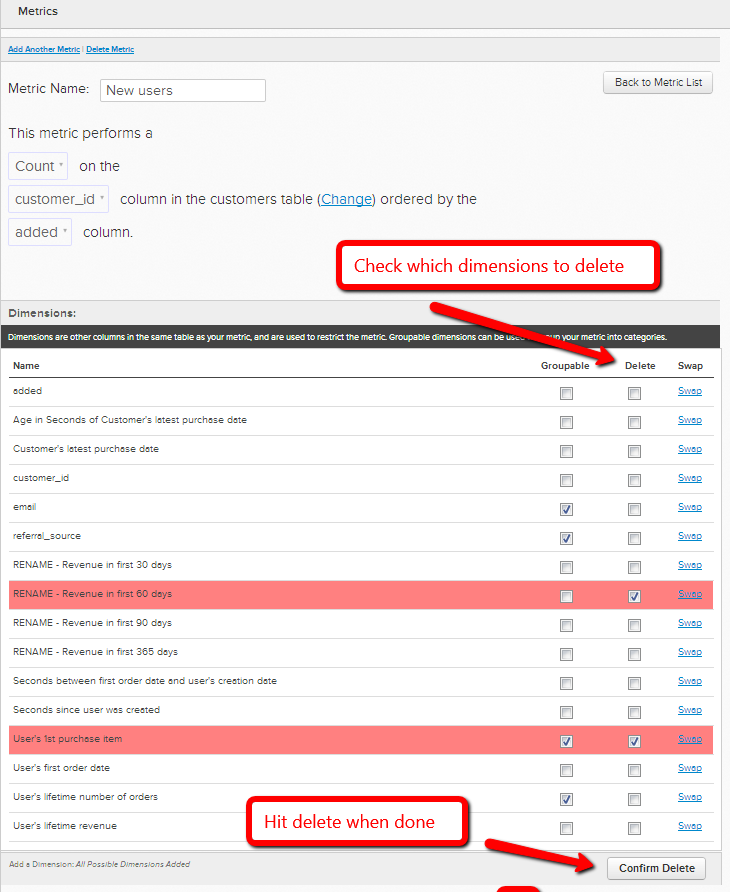

# Modificare la tabella operativa di una metrica

In alcuni casi, puoi decidere di modificare la tabella di dati utilizzata da una metrica per eseguire la sua operazione. Ad esempio, se si dispone di una nuova tabella utenti, si desidera migrare le metriche relative all&#39;utente dalla tabella `Users\_Old` per utilizzare la tabella `Users\_New`.

1. Vai a **[!UICONTROL Data]** > **[!UICONTROL Metrics]**
1. Fare clic su **[!UICONTROL Edit]** accanto alla metrica per la quale si desidera cambiare la tabella `operational`.
1. Nell&#39;editor, fare clic su **[!UICONTROL Change]**.

   
1. Seleziona la nuova tabella su cui desideri basare questa metrica.
1. Abbina le dimensioni dati esistenti a quelle corrispondenti nella nuova tabella. Se ad esempio si dispone di una colonna denominata `User's registration date`, è sufficiente selezionare la colonna nella nuova tabella che registra gli stessi dati di data. (Se nella nuova tabella non sono presenti colonne corrispondenti, vedere il passaggio successivo)

   

1. Se nella nuova tabella non è presente una colonna corrispondente, è possibile **crearla nella tabella dati** o [contattare il supporto tecnico](https://experienceleague.adobe.com/docs/commerce-knowledge-base/kb/troubleshooting/miscellaneous/mbi-service-policies.html) se si tratta di una colonna di calcolo o di una dimensione creata da [!DNL Commerce Intelligence]. Puoi anche **eliminare la dimensione dalla metrica**. Per eliminare una dimensione non più necessaria, tornare all&#39;editor della metrica e selezionare le dimensioni da eliminare in `Dimensions`.

   
