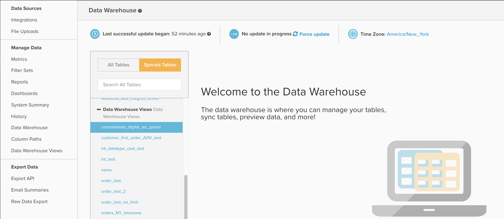

# Utilizzo delle visualizzazioni Data Warehouse

Questo documento illustra lo scopo e gli utilizzi di `Data Warehouse Views` accessibile da **[!UICONTROL Manage Data]** > **[!UICONTROL Data Warehouse Views]**. Di seguito viene fornita una spiegazione delle operazioni eseguite e della modalità di creazione delle viste, nonché un esempio di come utilizzare `Data Warehouse Views` per consolidare [!DNL Facebook] e [!DNL AdWords] spendere i dati.

## Scopo generale

Il `Data Warehouse Views` funzionalità è un metodo che consente di creare nuove tabelle warehouse modificando una tabella esistente oppure unendo o consolidando più tabelle mediante SQL. Una volta al `Data Warehouse View` è stato creato ed elaborato da un ciclo di aggiornamento, si popola nella Data Warehouse come una nuova tabella sotto `Data Warehouse Views` a discesa, come illustrato di seguito:



Da qui, la nuova vista funziona come qualsiasi altra tabella, consentendoti di creare nuove colonne calcolate o di creare metriche e rapporti al suo interno.

`Data Warehouse Views` vengono utilizzati principalmente per consolidare più tabelle simili ma diverse tra loro, in modo che tutti i rapporti possano essere basati su un’unica nuova tabella. Alcuni esempi comuni includono il consolidamento delle tabelle da un database legacy e da un database live per combinare dati storici e correnti, oppure la combinazione di più origini di annunci come Facebook e AdWords in un unico `Consolidated ad spend` tabella.

Se si ha familiarità con SQL, entrambi questi esempi di consolidamento utilizzano `UNION` ma è possibile utilizzare qualsiasi sintassi e funzione PostgreSQL durante la creazione di una nuova visualizzazione.

## Creazione e gestione delle viste Data Warehouse

Nuovo `Data Warehouse Views` possono essere create ed è possibile eliminare le viste esistenti passando a **[!UICONTROL Manage Data]** > **[!UICONTROL Data Warehouse Views]**, come illustrato di seguito:


Da qui è possibile creare una visualizzazione seguendo le istruzioni di esempio riportate di seguito:

1. Se si osserva una vista esistente, fare clic su **[!UICONTROL New Data Warehouse View]** per aprire una finestra di query vuota. Se è già aperta una finestra di query vuota, procedere al passaggio successivo.
1. Assegnare un nome alla visualizzazione digitando nella `View Name` campo. Il nome fornito determina il nome visualizzato per la visualizzazione nella Data Warehouse. `View names` sono limitati a lettere minuscole, numeri e trattini bassi (_). Tutti gli altri caratteri sono vietati.
1. Inserire la query nella finestra con titolo `Select Query`, utilizzando la sintassi PostgreSQL standard.
   >[!NOTE]
   >
   >La query deve fare riferimento a nomi di colonna specifici. L&#39;uso del `*`non è consentito selezionare tutte le colonne.

1. Al termine, fai clic su **[!UICONTROL Save]** per salvare la vista. La visualizzazione presenta temporaneamente un `Pending` fino a quando non viene elaborato dal successivo ciclo di aggiornamento completo, al quale lo stato cambia in `Active`. Dopo essere stata elaborata da un aggiornamento, la vista è pronta per essere utilizzata nei rapporti.

È importante ricordare che, dopo il salvataggio, la query sottostante utilizzata per generare un `Data Warehouse View` non può essere modificato. Se è necessario modificare la struttura di un `Data Warehouse View`, è necessario creare una visualizzazione e migrare manualmente tutte le colonne, le metriche o i rapporti calcolati dalla visualizzazione originale a quella nuova. Una volta completata la migrazione, puoi eliminare in tutta sicurezza la visualizzazione originale. Perché `Data Warehouse Views` Adobe non sono modificabili, si consiglia di verificare l’output della query utilizzando `SQL Report Builder` prima di salvare la query come visualizzazione Data Warehouse.

## Esempio: [!DNL Facebook] e [!DNL Google AdWords] dati

Esaminiamo più da vicino uno degli esempi citati in precedenza in questo articolo: il consolidamento [!DNL Facebook] e [!DNL AdWords] spendi i dati in una nuova tabella di annunci consolidata. Nella maggior parte dei casi ciò comporta il consolidamento di due tabelle, con i set di dati di esempio riportati di seguito:

`Ad source: Google AdWords`

`Table name: campaigns67890`

`Sample data:`

| **`_id`** | **`campaign`** | **`adClicks`** | **`date`** | **`impressions`** | **`adCost`** |
|--- |--- |--- |--- |--- |--- |
| 1 | eee | 60 | 2017-05-05 00:00:00 | 2000 | 10.2 |
| 2 | ggg | 40 | 2017-05-23 00:00:00 | 900 | 4.6 |
| 3 | aaa | 22 | 2017-06-12 00:00:00 | 400 | 2.5 |
| 4 | eee | 350 | 2017-06-30 00:00:00 | 14500 | 35 |
| 5 | fff | 280 | 2017-07-10 00:00:00 | 10200 | 28.5 |

`Ad source: Facebook`

`Table name: facebook_ads_insights_12345`

`Sample data:`

| **`_id`** | **`campaign`** | **`adClicks`** | **`date`** | **`impressions`** | **`adCost`** |
|--- |--- |--- |--- |--- |--- |
| 1 | aaa | 25 | 2017-05-01 00:00:00 | 1200 | 5 |
| 2 | ddd | 12 | 2017-05-15 00:00:00 | 800 | 2.5 |
| 3 | aaa | 40 | 2017-05-22 00:00:00 | 2000 | 7 |
| 4 | aaa | 110 | 2017-06-08 00:00:00 | 6000 | 10 |
| 5 | ccc | 5 | 2017-07-06 00:00:00 | 300 | 1.2 |

Per creare una singola tabella di spesa pubblicitaria contenente entrambi [!DNL Facebook] e [!DNL AdWords] campagne, è necessario scrivere una query SQL e utilizzare `UNION ALL` funzione. A `UNION ALL` L&#39;istruzione viene spesso utilizzata per combinare più query SQL distinte aggiungendo i risultati di ogni query a un unico output.

Esistono alcuni requisiti di un `UNION` istruzione da citare, come descritto in PostgreSQL [documentazione](https://www.postgresql.org/docs/8.3/queries-union.html):

* Tutte le query devono restituire lo stesso numero di colonne
* Le colonne corrispondenti devono avere tipi di dati identici

Durante l’esecuzione di una `UNION` o `UNION ALL` , i nomi delle colonne nell&#39;output finale riflettono la denominazione delle colonne nella prima query.

In genere, il consolidamento [!DNL Facebook] e [!DNL Google AdWords] spendere i dati in una `Data Warehouse View` richiede la creazione di una tabella con sette colonne, con una query simile alla seguente:

```sql
    SELECT
        "_id" as id,
        'AdWords' as ad_source,
        "date",
        "campaign",
        "adCost" as spend,
        "impressions",
        "adClicks" as clicks
    FROM campaigns67890
    UNION
    SELECT
        "_id" as id,
        'Facebook' as ad_source,
        "date_start" as date,
        "campaign_name" as campaign,
        "spend",
        "impressions",
        "clicks"
    FROM facebook_ads_insights_12345
```

Un paio di punti importanti su quanto sopra:

* Per motivi di chiarezza, sopra tutte le colonne viene visualizzato un alias in modo che i nomi corrispondano in tutte le query. Tuttavia, questo non è un requisito. L&#39;ordine in cui le colonne vengono chiamate nelle query SELECT determina il modo in cui sono allineate.
* Una nuova colonna denominata `ad_source` è stato creato per semplificare la filtrazione [!DNL AdWords] o [!DNL Facebook] dati. Questa query combina tutti i dati di entrambe le tabelle. Se non crei una colonna come `ad_source`, non esiste un modo semplice per identificare la spesa da una particolare fonte.

Salvataggio della query in alto come `Data Warehouse View` crea una tabella con entrambi [!DNL Facebook] e [!DNL AdWords] Spesa, simile a quella riportata di seguito:

| **`id`** | **`ad_source`** | **`date`** | **`campaign`** | **`spend`** | **`impressions`** | **`clicks`** |
|--- |--- |--- |--- |--- |--- |--- |
| **1** | [!DNL Facebook] | 2017-05-01 00:00:00 | aaa | 5 | 1200 | 25 |
| **1** | [!DNL Google AdWords] | 2017-05-05 00:00:00 | eee | 10.2 | 2000 | 60 |
| **2** | [!DNL Facebook] | 2017-05-15 00:00:00 | ddd | 2.5 | 800 | 12 |
| **2** | [!DNL Google AdWords] | 2017-05-23 00:00:00 | ggg | 4.6 | 900 | 40 |
| **3** | [!DNL Facebook] | 2017-05-22 00:00:00 | aaa | 7 | 2000 | 40 |
| **3** | [!DNL Google AdWords] | 2017-06-12 00:00:00 | aaa | 2.5 | 400 | 22 |
| **4** | [!DNL Facebook] | 2017-06-08 00:00:00 | aaa | 10 | 6000 | 110 |
| **4** | [!DNL Google AdWords] | 2017-06-30 00:00:00 | eee | 35 | 14500 | 350 |
| **5** | [!DNL Facebook] | 2017-07-06 00:00:00 | ccc | 1.2 | 300 | 5 |
| **5** | [!DNL Google AdWords] | 2017-07-10 00:00:00 | fff | 28.5 | 10200 | 280 |

Invece di creare un set separato di metriche di marketing per ogni origine di annuncio, ora puoi creare un singolo set di metriche utilizzando la tabella precedente per acquisire tutti gli annunci.

**Cerchi ulteriori informazioni?**

Scrittura di istruzioni SQL e creazione `Data Warehouse Views` non è incluso nel supporto tecnico. Tuttavia, il team Servizi offre assistenza nella creazione di visualizzazioni. Il team di supporto può fornire assistenza in tutti gli aspetti, dalla migrazione di un database legacy con un nuovo database alla creazione di una singola visualizzazione Data Warehouse ai fini di un’analisi specifica.

Di solito, la creazione di un nuovo `Data Warehouse View` ai fini del consolidamento di 2-3 tabelle strutturate in modo simile, sono necessarie cinque ore di tempo di servizio, il che si traduce in circa $ 1.250 di lavoro. Tuttavia, di seguito sono riportati alcuni fattori comuni che possono aumentare gli investimenti previsti necessari:

* Consolidamento di più di tre tabelle in un&#39;unica visualizzazione
* Creazione di più di una vista Data Warehouse
* Logica di unione complessa o condizioni di filtro
* Consolidamento di due o più tabelle con strutture di dati dissimili
