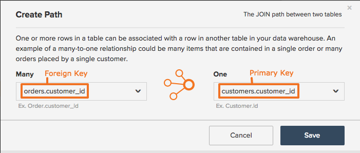

# Creare o eliminare percorsi per colonne calcolate

## Aggiornamento colonne calcolate

Quando [crei colonne calcolate](../data-warehouse-mgr/creating-calculated-columns.md) nel Data Warehouse, ti viene chiesto di definire un percorso che descriva il modo in cui la tabella su cui stai creando una colonna è correlata alla tabella da cui stai richiamando le informazioni. Per creare correttamente un percorso, è necessario conoscere due cose:

1. Correlazione tra le tabelle dei database
1. Chiavi primarie ed esterne che definiscono questa relazione

Se si conoscono queste informazioni, è possibile creare facilmente un percorso seguendo le istruzioni riportate in questo argomento. Potresti chiedere a un esperto tecnico della tua organizzazione o contattare il [team Servizi professionali](https://experienceleague.adobe.com/docs/commerce-knowledge-base/kb/troubleshooting/miscellaneous/mbi-service-policies.html).

## Aggiornamenti relativi alle relazioni tra tabelle e ai tipi di chiave {#refresher}

### Relazioni tra tabelle {#relationships}

Questo concetto è trattato nell&#39;articolo [Comprendere e valutare le relazioni tra tabelle](../../data-analyst/data-warehouse-mgr/table-relationships.md), ma un riepilogo rapido non ha mai causato danni a nessuno, giusto?

Le tabelle possono essere correlate tra loro in uno dei tre modi seguenti:

| **`Relationship Type`** | **`Example`** |
|-----|-----|
| **`one-to-one`** | Relazione tra persone e numeri di patente. Una persona può avere un solo numero di patente di guida e il numero di patente di guida appartiene a una sola persona. |
| **`one-to-many`** | Relazione tra ordini e articoli: un ordine può contenere più articoli, ma un articolo appartiene a un singolo ordine. In questo caso, la tabella ordini è il lato uno e la tabella articoli è il lato molti. |
| **`many-to-many`** | La relazione tra prodotti e categorie: un prodotto può appartenere a più categorie e una categoria può contenere più prodotti. |

{style="table-layout:auto"}

Una relazione tra due tabelle può essere utilizzata per determinare il percorso da creare per trasferire le informazioni da una tabella all&#39;altra. Per questo passaggio successivo è necessario conoscere le chiavi primarie ed esterne che facilitano una relazione tra tabelle.

### Chiavi primarie ed esterne {#keys}

`Primary Key` è una colonna o un insieme di colonne che non cambia e produce valori univoci all&#39;interno di una tabella. Ad esempio, quando un cliente effettua un ordine su un sito Web, viene aggiunta una nuova riga alla tabella `orders` nel carrello, con un nuovo `order_id`. `order_id` consente sia al cliente che all&#39;azienda di tenere traccia dell&#39;avanzamento di quell&#39;ordine specifico. Poiché l&#39;ID ordine è univoco, in genere corrisponde a `Primary Key` di una tabella `orders`.

Una colonna `Foreign Key` è una colonna creata all&#39;interno di una tabella collegata alla colonna `Primary Key` di un&#39;altra tabella. Le chiavi esterne creano riferimenti tra tabelle, consentendo agli analisti di cercare e collegare facilmente i record. Dì che volevi sapere quali ordini appartenevano a ciascuno dei tuoi clienti. La colonna `customer id` (`Primary Key` della tabella `customers`) e la colonna `order_id` (`Foreign Key` della tabella `customers`, che fa riferimento a `Primary Key` della tabella `orders`) ci consentono di collegare e analizzare queste informazioni. Durante la creazione di un percorso, ti viene richiesto di definire sia `Primary Key` che `Foreign Key`.

## Creazione di un percorso {#createpath}

Quando crei una colonna nel Data Warehouse, devi definire il percorso che porta le informazioni da una tabella a un’altra. A volte i percorsi vengono precompilati perché esiste un percorso tra le tabelle, ma se ciò non accade, è necessario crearne uno.

Utilizza la relazione tra **clienti** e **ordini** per mostrarti come viene eseguita. Suddiviso:

* La relazione è `one-to-many`: un cliente può avere molti ordini, ma un ordine può avere un solo cliente. Questo indica la direzione della relazione o il punto in cui creare la colonna calcolata. In questo caso, le informazioni della tabella `orders` possono essere inserite nella tabella `customers`.
* Il `primary key` che si desidera utilizzare è `customers.customerid` o la colonna `customer ID` nella tabella `customers`.
* Il `foreign key` che si desidera utilizzare è `orders.customerid` o la colonna `customer ID` nella tabella `orders`.

Ora puoi creare il percorso.

1. Fare clic su **[!UICONTROL Data > Data Warehouse]**.
1. Nell&#39;elenco della tabella fare clic sulla tabella in cui si desidera creare la colonna. In questo esempio è la tabella `customers`.
1. Viene visualizzato lo schema della tabella. Fare clic su **[!UICONTROL Create New Column]**.
1. Assegnare un nome alla colonna, ad esempio `Customer's orders`.
1. Selezionare la definizione della colonna. Consulta la [Guida alla colonna calcolata](../data-warehouse-mgr/creating-calculated-columns.md) per una guida pratica.
1. Nel menu a discesa [!UICONTROL Select table and column], fare clic sull&#39;opzione **[!UICONTROL Create new path]**.

   

1. Utilizzando i menu a discesa, seleziona le chiavi primarie ed esterne per ciascuna tabella.

   Sul lato `Many`, selezionare `orders.customerid`. Ricordare che i clienti possono avere molti ordini.

   Sul lato `One`, selezionare `customers.customerid` - un ordine può avere un solo cliente.

1. Fare clic su **[!UICONTROL Save]** per salvare il percorso e completare la creazione della colonna.

### Limitazioni della creazione di percorsi {#limits}

* **[!DNL Commerce Intelligence]non riesce a indovinare le relazioni chiave primaria/esterna**. Non desideri introdurre dati errati nell’account, pertanto la creazione dei percorsi deve essere eseguita manualmente.

* **Al momento è possibile specificare percorsi solo tra due tabelle diverse**. La logica che si sta tentando di ricreare coinvolge più di due tabelle? Potrebbe quindi essere utile (1) unire le colonne prima a una tabella intermedia, quindi alla tabella &quot;destinazione finale&quot;, oppure (2) consultare il [team Professional Services](https://experienceleague.adobe.com/docs/commerce-knowledge-base/kb/troubleshooting/miscellaneous/mbi-service-policies.html) per trovare il miglior approccio ai tuoi obiettivi.

* **Una colonna può essere solo il riferimento di chiave esterna per UN percorso alla volta**. Ad esempio, se `order_items.order_id` punta a `orders.id`, `order_items.order_id` non può puntare ad altro.

* Tecnicamente è possibile creare **`Many-to-many`percorsi, ma spesso producono dati non validi perché nessuno dei due lati è una vera `one-to-many` chiave esterna**. Il modo migliore per approcciare questi percorsi dipende sempre dall’analisi specifica desiderata. Consulta il team di analisti di RJ per scoprire la soluzione migliore.

Se non riesci a creare una colonna calcolata a causa di una o più delle limitazioni di cui sopra, contatta il supporto tecnico fornendo una descrizione della colonna che stai utilizzando

## Eliminare un percorso di colonna calcolato {#delete}

Hai creato un percorso errato nel Data Warehouse? O forse stai facendo una piccola pulizia di primavera e vuoi riordinare? Se devi eliminare un percorso dal tuo account, puoi [inviare un ticket agli analisti del supporto Adobe](../../guide-overview.md#Submitting-a-Support-Ticket). **Assicurarsi di includere il nome del percorso!**

## Ritorno a capo {#wrapup}

Ora che hai familiarità con la creazione di percorsi per le colonne calcolate nel Data Warehouse. Se non sei ancora sicuro di un percorso particolare, ricorda che puoi sempre fare clic su **[!UICONTROL Support]** nel tuo account [!DNL Commerce Intelligence] per ottenere assistenza.

## Correlato

* [Informazioni e valutazione delle relazioni tra tabelle](../data-warehouse-mgr/table-relationships.md)
* [Creazione di percorsi per colonne calcolate](../data-warehouse-mgr/create-paths-calc-columns.md)
* [Tipi di colonna calcolati](../data-warehouse-mgr/calc-column-types.md) tentativo di creazione in corso.
