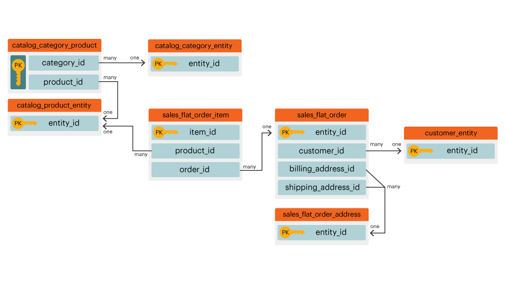
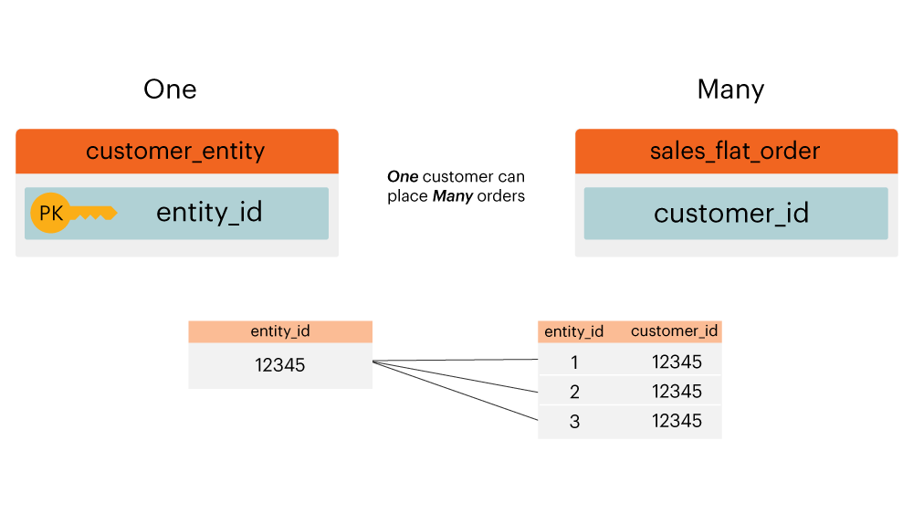

# Diagramma relazione entità

Cos&#39;è un **[!UICONTROL entity relationship (ER) diagram]**? Un diagramma [!UICONTROL ER] è una visualizzazione delle tabelle all&#39;interno di un database e del modo in cui si relazionano tra loro. Questo argomento contiene alcuni diagrammi di [!UICONTROL ER] che consentono di visualizzare la relazione tra alcune tabelle di database Adobe Commerce comuni.

>[!NOTE]
>
>In questo argomento vengono visualizzate le parole **join**, **relationship** e **path**. Queste parole vengono utilizzate per descrivere la connessione tra due tabelle.

## Diagramma core [!UICONTROL ER] di Commerce

Questo diagramma `ER` rappresenta le relazioni tra le tabelle principali di un database Commerce. Visualizzando più relazioni contemporaneamente, è possibile vedere in che modo i dati si relazionano tra più tabelle.

Le sezioni seguenti contengono `ER` diagrammi specifici per due tabelle alla volta. Per visualizzare un diagramma e la relativa descrizione, fare clic sull&#39;intestazione di tale sezione.

## `customer\_entity & sales\_flat\_order`

Un cliente può effettuare molti ordini. La relazione tra queste due tabelle è `customer\_entity.entity\_id = sales\_flat\_order.customer\_id`

>[!IMPORTANT]
>
>`customer\_entity.entity\_id` non è uguale a `sales\_flat\_order.entity\_id`. Il primo può essere considerato come `customer\_id` e il secondo come `order\_id.`

All&#39;interno di [!DNL Commerce Intelligence], se il percorso tra queste due tabelle non esiste, è possibile [creare il percorso](../data-warehouse-mgr/create-paths-calc-columns.md) nella scheda Data Warehouse. Quando siete pronti a creare il percorso, questo viene definito come segue:

## `sales\_flat\_order & sales\_flat\_order\_item`

Un ordine può contenere molti elementi. La relazione tra queste due tabelle è `sales\_flat\_order.entity\_id = sales\_flat\_order\_item.order\_id`.

All&#39;interno di [!DNL Commerce Intelligence], se il percorso tra queste due tabelle non esiste, è possibile [creare il percorso](../data-warehouse-mgr/create-paths-calc-columns.md) nella scheda Data Warehouse. Quando siete pronti a creare il percorso, definite il percorso come mostrato di seguito.

## `catalog\_product\_entity & sales\_flat\_order\_item`

Un prodotto può essere acquistato in molti articoli. La relazione tra queste due tabelle è `catalog\_product\_entity.entity\_id = sales\_flat\_order\_item.product`.

All&#39;interno di [!DNL Commerce Intelligence], se il percorso tra queste due tabelle non esiste, è possibile [creare il percorso](../data-warehouse-mgr/create-paths-calc-columns.md) nella scheda Data Warehouse. Quando siete pronti a creare il percorso, definite il percorso come mostrato di seguito.

