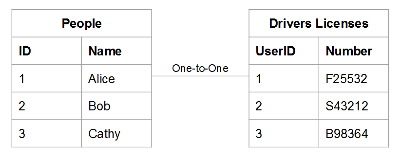
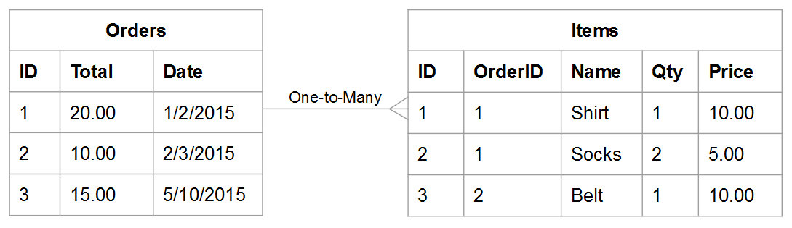
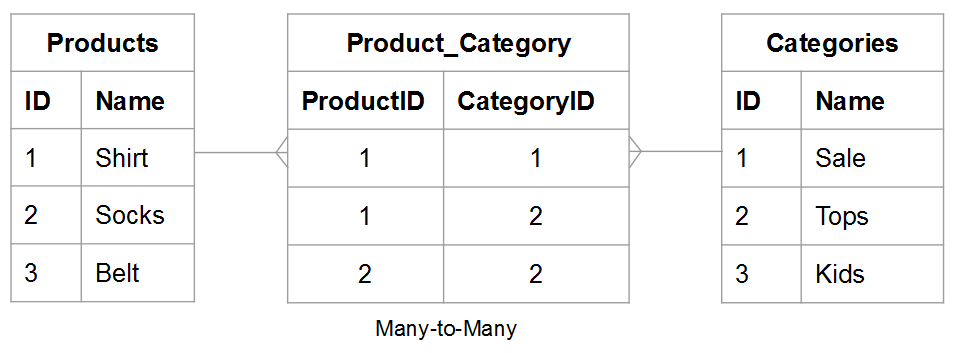
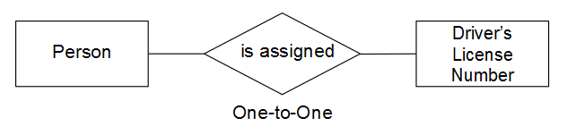
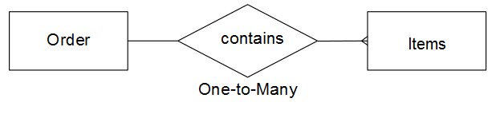
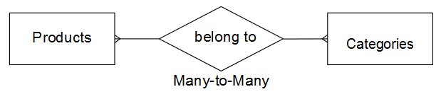
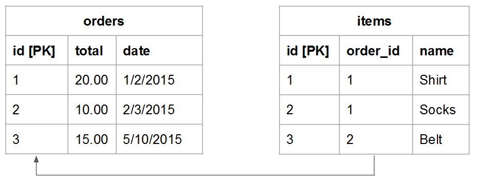
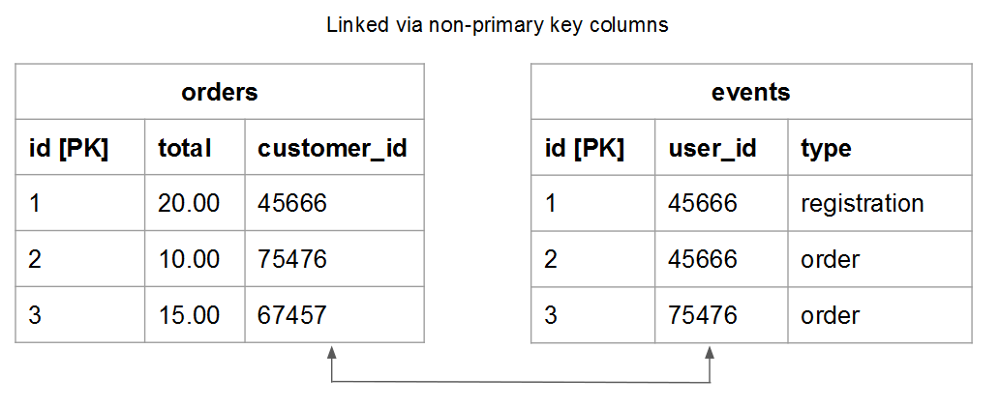

# Comprendere e valutare le relazioni tra tabelle

Quando si valuta la relazione tra due determinate tabelle, è necessario comprendere il numero di occorrenze possibili in una tabella che potrebbero appartenere a un&#39;entità in un&#39;altra e viceversa. Utilizzare ad esempio una tabella `users` e una tabella `orders`. In questo caso, vuoi sapere quanti **ordini** ha effettuato un dato **utente** e quanti possibili **utenti** e **ordine** possono appartenere a.

Comprendere le relazioni è fondamentale per mantenere l&#39;integrità dei dati, in quanto influisce sulla precisione delle [colonne calcolate](../data-warehouse-mgr/creating-calculated-columns.md) e delle [dimensioni](../data-warehouse-mgr/manage-data-dimensions-metrics.md). Per ulteriori informazioni, vedere [tipi di relazione](#types) e [come valutare le tabelle nel Data Warehouse.](#eval)

## Tipi di relazione {#types}

Esistono tre tipi di relazioni tra due tabelle:

1. [&quot;one-to-one&quot;](#onetoone)
1. [&quot;one-to-many&quot;](#onetomany)
1. [&quot;many-to-many&quot;](#manytomany)

### `One-to-One` {#onetoone}

In una relazione `one-to-one`, un record nella tabella `B` appartiene a un solo record nella tabella `A`. Un record nella tabella `A` appartiene a un solo record nella tabella `B`.

Ad esempio, nella relazione tra persone e numeri di patente, una persona può avere un solo numero di patente e il numero di patente appartiene a una sola persona.

### `One-to-Many` {#onetomany}

In una relazione `one-to-many`, un record nella tabella `A` può potenzialmente appartenere a più record nella tabella `B`. Considerare la relazione tra `orders` e `items`: un ordine può contenere molti elementi, ma un elemento appartiene a un singolo ordine. In questo caso, la tabella `orders` è il lato uno e la tabella `items` è il lato molti.

### `Many-to-Many` {#manytomany}

In una relazione `many-to-many`, un record nella tabella `B` può potenzialmente appartenere a più record nella tabella `A`. E viceversa, un record nella tabella `A` può potenzialmente appartenere a più record nella tabella `B`.

Pensa alla relazione tra **prodotti** e **categorie**: un prodotto può appartenere a molte categorie e una categoria può contenere molti prodotti.

## Valutazione delle tabelle {#eval}

Dati i tipi di relazioni esistenti tra le tabelle, è possibile apprendere come valutare le tabelle nel Data Warehouse. Poiché queste relazioni determinano il modo in cui vengono definite le colonne calcolate di più tabelle, è importante comprendere come identificare le relazioni tra tabelle e quale lato - `one` o `many` - appartiene alla tabella.

Esistono due metodi per valutare le relazioni di una determinata coppia di tabelle all’interno del Data Warehouse. Il primo metodo utilizza un [framework concettuale](#concept) che considera il modo in cui le entità della tabella interagiscono tra loro. Il secondo metodo utilizza lo schema della [tabella](#schema).

### Utilizzo del framework concettuale {#concept}

Questo metodo utilizza un framework concettuale per descrivere il modo in cui le entità delle due tabelle possono interagire tra loro. È importante comprendere che questo quadro valuta ciò che è possibile, data la relazione.

Ad esempio, quando pensi a utenti e ordini, considera tutto ciò che è possibile nella relazione. Un utente registrato non può effettuare ordini, ma solo un ordine o più ordini nell’arco della loro durata. Se hai avviato la tua attività e non è stato effettuato alcun ordine, è possibile che un dato utente possa effettuare molti ordini nel corso della sua vita. Le tabelle sono create per soddisfare questo requisito.

Per utilizzare questo metodo:

1. Identifica l’entità descritta in ciascuna tabella. **Suggerimento: in genere è un sostantivo**. Ad esempio, le tabelle `user` e `orders` descrivono in modo esplicito utenti e ordini.

1. Identifica uno o più verbi che descrivono il modo in cui queste entità interagiscono. Ad esempio, quando si confrontano gli utenti con gli ordini, gli utenti &quot;inseriscono&quot; gli ordini. Nell&#39;altra direzione, gli ordini &quot;appartengono&quot; agli utenti.

Questo tipo di framework può essere applicato a qualsiasi coppia di tabelle nel Data Warehouse. Questo consente di identificare facilmente il tipo di relazione, la tabella che rappresenta un lato e la tabella che rappresenta un lato molti.

Una volta identificata la terminologia che descrive il modo in cui le due tabelle interagiscono, inquadrare l’interazione in entrambe le direzioni considerando come una determinata istanza della prima entità si relaziona alla seconda. Di seguito sono riportati alcuni esempi di ciascuna relazione:

### `One-to-One`

Una persona può avere un solo numero di patente di guida. Un dato numero di patente di guida appartiene a una sola persona.

Questa è una relazione `one-to-one` in cui ogni tabella è un lato uno.

### `One-to-Many`

Un dato ordine può contenere molti elementi. Un dato articolo appartiene a un solo ordine.

Si tratta di una relazione `one-to-many` in cui la tabella ordini è il lato uno e la tabella articoli è il lato molti.

### `Many-to-Many`

Un dato prodotto può appartenere a molte categorie. Una determinata categoria può contenere molti prodotti.

Questa è una relazione `many-to-many` in cui ogni tabella è un lato molti.

### Utilizzo dello schema della tabella {#schema}

Il secondo metodo utilizza lo schema di tabella. Lo schema definisce quali colonne sono le chiavi [`Primary`](https://en.wikipedia.org/wiki/Unique_key) e [`Foreign`](https://en.wikipedia.org/wiki/Foreign_key). È possibile utilizzare queste chiavi per collegare tra loro le tabelle e determinare i tipi di relazione.

Una volta identificate le colonne che collegano due tabelle, utilizzare i tipi di colonna per valutare la relazione tra tabelle. Di seguito sono riportati alcuni esempi:

### `One-to-one`

Se le tabelle sono collegate utilizzando `primary key` di entrambe le tabelle, la stessa entità univoca viene descritta in ogni tabella e la relazione è `one-to-one`.

Ad esempio, una tabella `users` può acquisire la maggior parte degli attributi utente (come il nome), mentre una tabella supplementare `user_source` acquisisce le origini di registrazione utente. In ogni tabella, una riga rappresenta un utente.

### `One-to-many`

>[!NOTE]
>
>Accetti gli ordini degli ospiti? Consulta [Ordini ospiti](../data-warehouse-mgr/guest-orders.md) per scoprire come gli ordini ospiti possono influire sulle relazioni tra tabelle.

Quando le tabelle sono collegate utilizzando un `Foreign key` che punta a un `primary key`, questa configurazione descrive una relazione `one-to-many`. Il lato uno è la tabella contenente `primary key` e il lato molti è la tabella contenente `foreign key`.

### `Many-to-many`

Se si verifica una delle condizioni seguenti, la relazione è `many-to-many`:

* `Non-primary key` colonne vengono utilizzate per collegare due tabelle
  
* Parte di un `primary key` composito utilizzata per collegare due tabelle

## Passaggi successivi

Valutare correttamente le relazioni tra tabelle è fondamentale per modellare accuratamente i dati. Dopo aver compreso le relazioni tra le tabelle, vedere [le operazioni possibili con Data Warehouse Manager](../data-warehouse-mgr/tour-dwm.md).
