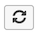

# Filtro a livello di dashboard

Con il filtro a livello di dashboard, puoi apportare modifiche in blocco a tutti i rapporti su un dashboard specifico. Puoi visualizzare rapidamente la stessa analisi per diversi periodi di tempo o per diversi store. Puoi confrontare facilmente le prestazioni di un anno, mese o settimana precedente per negozio. Puoi aggiornare un’intera dashboard per adattarla a una nuova campagna avviata.

## Filtri per data

Per modificare l&#39;intervallo di date o l&#39;intervallo di rapporti in un dashboard, fare clic sull&#39;icona del calendario nell&#39;angolo superiore destro ().

È possibile scegliere di visualizzare i dati utilizzando `Fixed Date Range` o vari `Moving Date Ranges` precalcolati:

Le opzioni dell&#39;intervallo di spostamento `Last Full...` rappresentano l&#39;intervallo completato più di recente, mentre `This...` è l&#39;intervallo corrente in corso. Ad esempio, se è giugno, `Last Full Month` è _1 maggio - 31 maggio_, mentre `This Month` è _1 giugno - Ora_.

Oppure crea `Custom Moving Range`\:

Scegli di modificare anche l’intervallo. Se si seleziona il pulsante predefinito (), verrà modificato solo l&#39;intervallo di date:

Per ripristinare l&#39;intervallo e l&#39;intervallo di date iniziali di tutti i report, fare clic su **[!UICONTROL Restore Defaults]** o su **[!UICONTROL Cancel]**.

Quando si specifica un filtro data per un dashboard, tale filtro viene applicato solo a tale dashboard. Non viene applicato quando si passa ad altre dashboard.

>[!NOTE]
>
>Attualmente, `Cohort Reports` e `SQL Reports` non sono inclusi quando si applicano modifiche a livello di dashboard.

## Filtri store

Per analizzare le prestazioni di un archivio specifico, fare clic sull&#39;icona relativa agli archivi nell&#39;angolo superiore destro (). Per impostazione predefinita, `Store Filter` è impostato su `All Stores`, che visualizza i dati di tutte le [visualizzazioni store](https://experienceleague.adobe.com/docs/commerce-admin/stores-sales/site-store/store-views.html?lang=it) disponibili nel sito Commerce.

>[!NOTE]
>
>Un filtro dell&#39;archivio è abilitato o disabilitato per un intero account [!DNL Commerce Intelligence]. Se un dashboard contiene report non interessati dal filtro, ad esempio report non generati su alcun dato [!DNL Adobe Commerce], tali report non vengono aggiornati quando viene applicato il filtro dell&#39;archivio. Puoi [contattare il supporto](https://experienceleague.adobe.com/docs/commerce-knowledge-base/kb/troubleshooting/miscellaneous/mbi-service-policies.html?lang=it) se ritieni che un report debba essere aggiornato in base alla selezione dello store o se ritieni che il filtro dello store dell&#39;account sia disabilitato per errore.

Quando si seleziona un archivio da `Store Filter`, il filtro mantiene la selezione quando si passa da un dashboard all&#39;altro. Mantenere la selezione consente di visualizzare i dati per l&#39;archivio selezionato ovunque fino a quando non si seleziona `All Stores`.

## Filtri per dashboard condivisi

Per le dashboard condivise, se un utente configura il filtro data, gli altri utenti con accesso al dashboard visualizzano lo stesso filtro applicato. Tuttavia, il filtro store non si applica in questo caso. Se il proprietario del dashboard configura il filtro store e condivide il dashboard, il filtro store configurato non persiste per un altro utente. Un utente deve disporre dell&#39;accesso [edit](../../data-user/dashboards/share-dashboard-with-users.md) a un dashboard per poter regolare i filtri del dashboard.
