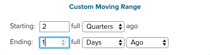

# Filtro ampio dashboard

Grazie al filtro a livello di dashboard, puoi apportare modifiche in blocco a tutti i report su un dashboard specifico. Puoi visualizzare rapidamente la stessa analisi per diversi periodi di tempo o per diversi store. Puoi confrontare facilmente le prestazioni di un anno, mese o settimana precedenti per negozio. Inoltre, è possibile aggiornare un intero dashboard per accogliere una campagna appena avviata.

## Filtri data

Per modificare l’intervallo di date o l’intervallo dei rapporti in un dashboard, fai clic sull’icona del calendario nell’angolo in alto a destra ().

Puoi scegliere di visualizzare i dati utilizzando un `Fixed Date Range` o una varietà di `Moving Date Ranges`:

La `Last Full...` le opzioni della gamma mobile rappresentano l&#39;intervallo completato più di recente, mentre `This...` sarà l&#39;intervallo corrente in corso. Ad esempio, se è al momento di giugno, la `Last Full Month` è _1 maggio - 31 maggio_, mentre `This Month` è _1° giugno - Ora_.

Oppure crea il tuo `Custom Moving Range`\:

Scegliere di modificare anche l&#39;intervallo. Selezione del pulsante predefinito () indica che verrà modificato solo l’intervallo di date:

Per ripristinare tutti i rapporti nel loro intervallo di date e intervallo iniziale, fai clic su **[!UICONTROL Restore Defaults]** o fai clic su **[!UICONTROL Cancel]**.

Quando specifichi un filtro data per un dashboard, questo viene applicato solo a quel dashboard. Non viene applicata quando si passa ad altre dashboard.

>[!NOTE]
>
>Al momento, `Cohort Reports` e `SQL Reports` non sono inclusi quando si applicano modifiche a livello di dashboard.

## Filtri per archivio

Per analizzare le prestazioni di uno specifico archivio, fai clic sull&#39;icona Store nell&#39;angolo in alto a destra (). Per impostazione predefinita, `Store Filter` è impostato su `All Stores`, che visualizza i dati di tutti [viste store](https://experienceleague.adobe.com/docs/commerce-admin/stores-sales/site-store/store-views.html) disponibile nel sito Commerce.

>[!NOTE]
>
>Un filtro store è abilitato o disabilitato per un intero [!DNL MBI] conto. Se un dashboard contiene rapporti non interessati dal filtro, ad esempio rapporti non generati su dati Commerce, tali rapporti non vengono aggiornati quando viene applicato il filtro store. È possibile [contattare il supporto](../../guide-overview.md) se ritieni che un rapporto debba essere aggiornato in base alla selezione dell&#39;archivio o se ritieni che il filtro dell&#39;archivio account sia disabilitato erroneamente.

Quando si seleziona un archivio dal `Store Filter`, il filtro mantiene la selezione quando ci si sposta tra le dashboard. Mantenere la selezione consente di visualizzare i dati per l&#39;archivio selezionato ovunque fino a quando non si seleziona `All Stores`.

## Filtri per le dashboard condivise

Per le dashboard condivise, se un utente configura il filtro data, gli altri utenti con accesso al dashboard vedranno applicato lo stesso filtro. Tuttavia, il filtro store non si applica in questo caso. Se il proprietario del dashboard configura il filtro store e condivide il dashboard, il filtro store configurato non persisterà per un altro utente. Un utente deve avere [modifica accesso](../../data-user/dashboards/share-dashboard-with-users.md) su un dashboard per regolare i filtri del dashboard.
