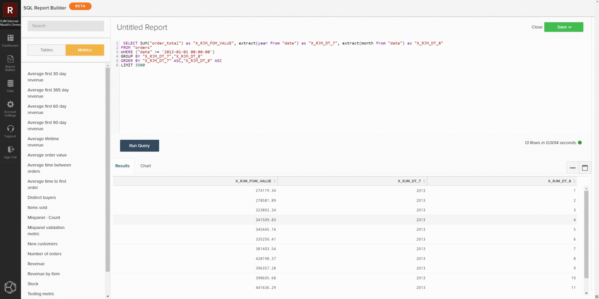

# `SQL Report Builder`

La `SQL Report Builder` viene utilizzato principalmente per generare nuovi report e per eseguire iterazioni sulle analisi, ma può anche essere utilizzato per controllare efficacemente dati e metriche. Le informazioni seguenti spiegano come verificare dati e metriche utilizzando `SQL Report Builder` in modo da poter confrontare i risultati con i dati del database locale.

## Query di una metrica

Per iniziare, apri le `SQL Report Builder` passando a **[!UICONTROL Report Builder > SQL Report Builder > Create Report]**. È possibile utilizzare la barra laterale nell&#39;editor SQL per inserire una metrica direttamente nella query passando con il puntatore del mouse sulla metrica e facendo clic su **[!UICONTROL Insert]**. Questo aggiungerà la definizione di query di quella metrica all’editor. La definizione includerà i seguenti componenti:

- La **operazione metrica** viene eseguito, indicato da SUM() nell’esempio seguente.
- La **tabella** che la metrica viene creata, indicata dalla clausola FROM.
- Qualsiasi **filtri (e set di filtri)** che sono stati aggiunti alla metrica, indicata dalla clausola WHERE nell’esempio seguente.
- Il componente del **timestamp** (anno, mese) in cui i dati devono essere ordinati, indicato dalla clausola ORDER BY nell&#39;esempio seguente.

Se desideri ottenere una visualizzazione più chiara della query, puoi riformattare la modalità di visualizzazione nel campo di query. Quando sei pronto, seleziona `Run Query`. I risultati verranno compilati come tabella nel pannello del report sotto la query.

## Limitazione della query

Se si sta tentando di individuare una discrepanza specifica o un insieme di dati, è necessario limitare la query a un campione specifico per verificare il database locale. Per eseguire questa operazione, modifica la query per rispettare le restrizioni desiderate. Nell’esempio seguente, stiamo limitando la query per includere solo i ricavi dal 1° gennaio 2013 o versioni successive. Dopo aver aggiornato la query, seleziona **[!UICONTROL Run Query]** per aggiornare di nuovo i risultati.

## Salvataggio ed esportazione

Quando il rapporto soddisfa le tue esigenze, salvalo in un dashboard assegnando un nome distinto al rapporto, facendo clic su **[!UICONTROL Save]** e selezionando il tipo di rapporto da salvare e il dashboard. Durante il controllo delle metriche, è consigliabile salvare il rapporto come `Table` e salvarlo in un dashboard di test.

Dopo aver salvato il rapporto, accedi a tale dashboard selezionando `Go to Dashboard`. Da qui, puoi esportare i dati trovando il rapporto e selezionando **[!UICONTROL Options gear > Full `.csv`Esporta]** o **[!UICONTROL Full Excel Export]**.

## Query personalizzate

È inoltre possibile scrivere query personalizzate ed esportare i risultati da confrontare con il database locale. Seguendo [linee guida per l’ottimizzazione delle query](../../best-practices/optimizing-your-sql-queries.md), scrivere una query nell&#39;editor SQL. Puoi utilizzare i pulsanti nella parte superiore della barra laterale per alternare tra elenchi di tabelle e metriche disponibili per l’utilizzo in `SQL Report Builder` e aggiungili alla query. Quando la query personalizzata si adatta alle tue esigenze, puoi salvare il rapporto ed esportare i dati dal dashboard.

### Sei ancora inciampato?

Se trovi una discrepanza dopo aver verificato i tuoi dati, consulta la sezione [Contatta il supporto: Discrepanze dei dati](https://experienceleague.adobe.com/docs/commerce-knowledge-base/kb/troubleshooting/miscellaneous/mbi-data-discrepancies.html?lang=en) articolo di supporto per ulteriori informazioni sulle operazioni da eseguire successivamente.
