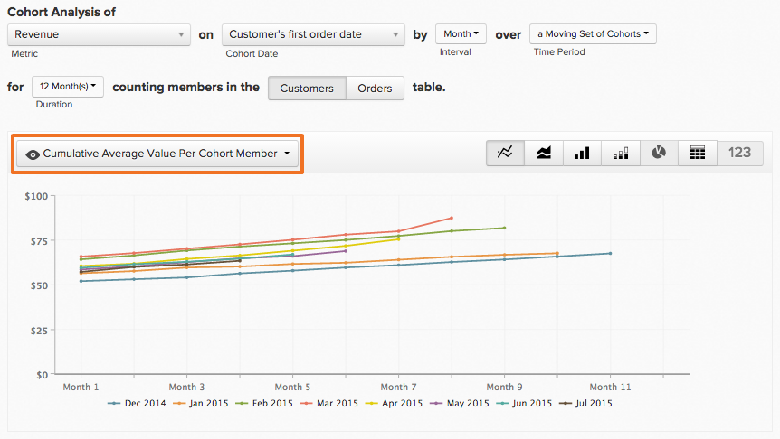

# Report Builder coorte

Hai mai voluto studiare come si comportano nel tempo diversi sottoinsiemi degli utenti? Ad esempio, si è mai chiesto se gli utenti che si registrano durante un periodo promozionale hanno un fatturato medio a vita più alto rispetto a quelli che non lo hanno? Se la risposta è `Yes`, quindi `Cohort Report Builder` è lo strumento perfetto per te. [!DNL MBI] è ottimizzata in modo specifico per eseguire questa analisi e renderla pertinente alla tua attività.

## Cos’è un’analisi per coorte? {#what}

`Cohort` L&#39;analisi può essere definita in senso ampio come l&#39;analisi dei gruppi di utenti che condividono caratteristiche simili nel corso del loro ciclo di vita. Ti consente di identificare le tendenze comportamentali tra diversi gruppi di utenti.

Per un primer più approfondito su `cohort` analisi, [dai un&#39;occhiata qui](https://www.cohortanalysis.com/) - ci abbiamo scritto il sito!

Nel tuo [!DNL MBI] dashboard, è facile creare l&#39;utente `cohorts` basato su `cohort` data e metrica nel tuo account.

## Perché l&#39;analisi per coorte è importante? {#important}

Come indicato sopra, `cohort` l’analisi ti consente di identificare le tendenze comportamentali tra diversi gruppi di utenti. Con una solida comprensione del comportamento di alcuni gruppi, è possibile adattare le proprie decisioni e le proprie spese per massimizzare le vendite. Prendiamo, ad esempio, un fatturato a vita `cohort` analisi - anche se questo tipo di analisi è utile per molti motivi, quella immediata è una migliore acquisizione delle decisioni dei clienti.

## Come creo il mio `cohort` analisi?

### Nuova architettura

Queste sono le istruzioni per l&#39;utilizzo del `Cohort Report Builder` sulla [Nuova architettura](../../administrator/account-management/new-architecture.md).

1. Fai clic su **[!UICONTROL Report Builder]** nella scheda a sinistra o **[!UICONTROL Add Report** > **Create Report]** in qualsiasi dashboard.

1. In `Report Builder` schermata di selezione, fai clic su **[!UICONTROL Create Report]** accanto al `Visual Report Builder` opzione .

**Aggiunta di una metrica**

Ora che siamo nel `Report Builder`, aggiungiamo la metrica su cui desideri eseguire l’analisi (ad esempio: `Revenue` o `Orders`).

>[!NOTE]
>
>Nativo [!DNL Google Analytics] le metriche non sono compatibili con `Cohort Report Builder`.

**Attiva/disattiva la visualizzazione metrica in`Cohort`**

Viene visualizzata una nuova finestra in cui è possibile configurare i dettagli `Cohort` Rapporto.

### Sono necessarie cinque specifiche per costruire un `Cohort` rapporto:

1. Raggruppare i `cohorts`
1. La `cohort` periodo
1. Numero di `cohorts` per visualizzare
1. Quantità minima di dati per ciascuna `cohort` deve contenere
1. Intervallo di tempo dopo `cohort` occorrenza

#### 1. Raggruppamento `cohorts`

`Cohorts` sono raggruppati per una marca temporale, come **data di registrazione** o **data del primo ordine**.

>[!NOTE]
>
>Non puoi utilizzare la stessa marca temporale su cui è basata la metrica per `cohort` data. Per un’analisi che richiede questa operazione, puoi utilizzare la funzione `Standard report builder` invece.

#### 2. `Cohort` periodo

Scegliere il periodo di tempo da raggruppare `cohorts` di. In altre parole, quale parte della marca temporale selezionata sopra è più importante; la `week`, `month`, `quarter`oppure `year`?  Il report mostrerà i dati in qualsiasi intervallo selezionato qui

#### 3. e 4. Imposta il numero di `cohorts` per visualizzare e quanti dati ciascuno `cohort` devono

Questi parametri consentono di visualizzare solo i `cohorts` che ti interessa, e la comodità `Preview` nella casella in fondo alla finestra è indicato esattamente quali coorti verranno visualizzati nel rapporto.

Per impostazione predefinita, la `cohort` non saranno inclusi a meno che non si modifichi la quantità minima di dati richiesta per ogni `cohort` a `0`. In questo caso, il `cohort` per il periodo di tempo corrente includeranno solo dati parziali.

#### 5. Intervallo di tempo dopo `Cohort` Occorrenza

Questa funzione consente di impostare l’intervallo di tempo dei dati visualizzati per il `cohorts`. Ad esempio, se desideri visualizzare 24 mesi `cohorts` basato su `customer's first order date`, ma sei interessato solo ai primi 3 mesi di dati per ciascuno `cohort`, puoi impostare la `number of cohorts to view` a `24` e `time range after cohort occurrence` a `3`.

L&#39;intervallo per questo valore cambia con ciò che hai selezionato nel `cohort time period` e il valore è impostato su `12` per impostazione predefinita; il valore non viene modificato a meno che non si faccia clic sull&#39;icona del calendario per modificarlo.

#### Altre note

* [!UICONTROL Filters]: applicati alle metriche rimangono intatti quando si passa da `Standard` e `Cohort` visualizzazioni.

* Vedi [`Perspectives`](#perspectives).

#### Esempio

Ecco un esempio per mettere tutto insieme. In questo esempio, desidero verificare il comportamento dell’ordine dopo un `cohort`Il suo primo acquisto per verificare se la coorte ritorna per effettuare acquisti ripetuti nei prossimi 6 mesi.

### Architettura legacy

#### Architettura legacy {#personalinfo}

Di seguito sono riportate le istruzioni specifiche per la versione precedente di `Cohort Report Builder`. Se ti interessa utilizzare la nuova versione, consulta [Nuova architettura](../../administrator/account-management/new-architecture.md) per ulteriori informazioni sulla migrazione a un [!DNL MBI] Nuovo account di architettura.

#### Come creo il mio `cohort` analisi? {#create}

`Cohort` analisi in azione! In questo caso, i ricavi aumentano nel tempo cumulativamente e per utente.

In questa sezione ti guidiamo attraverso la creazione di un tuo `cohort` analisi. Per esempi (e GIF animati che dimostrano il processo), consulta la sezione [Sezione Esempi](#examples) del presente articolo.

1. Fai clic su **[!UICONTROL Report Builder]** nella scheda a sinistra o **[!UICONTROL Add Report** > **Create Report]** in qualsiasi dashboard.

1. In `Report Builder Selection` schermata, fai clic su **[!UICONTROL Create Report]** accanto al `Cohort Analysis` opzione .

#### Aggiunta di una metrica

Ora che siamo nel `Cohort Report Builder`Aggiungiamo la metrica (ad esempio: `Revenue` o `Number of orders`) su cui desideri eseguire l’analisi.

>[!NOTE]
>
>Nativo [!DNL Google Analytics] le metriche non sono compatibili con `Cohort Report Builder`.

#### Selezione della data della coorte {#date}

Il passaggio successivo consiste nel specificare il `cohort date`. È la data in cui gli utenti verranno raggruppati. Ad esempio, potrebbe essere `User's first order date` o `User's registration date`.

>[!NOTE]
>
>Non puoi utilizzare la stessa data in cui viene creata la metrica (ad esempio: `created at`) come `cohort date`.

#### Impostazione dell’intervallo e del periodo di tempo

Quindi, impostiamo il `Interval` e `Time Period`.

`Interval`
La `Interval` consente di impostare `length` del tuo `cohorts`. Ad esempio, se è impostato su `Month`, il rapporto verrà misurato in mesi.

È possibile modificare la modalità di visualizzazione di questi intervalli sull&#39;asse x utilizzando **Durata** menu.

`Time Period`
Utilizza la `Time Period` menu per scegliere l&#39;utente specifico `cohorts` da analizzare. Puoi mostrare ogni `cohort`, scegli da un elenco, specifica un intervallo di tempo o definisci un intervallo di tempo continuo di `cohorts` da includere. Ad esempio, se abbiamo utilizzato il `Specific Cohorts` è possibile selezionare mesi specifici da includere nell’analisi:

Se stavamo raggruppando il nostro `cohorts` per data di registrazione e quindi selezionato aprile, maggio e giugno `Specific Cohorts` elenco, tutti gli utenti che si sono registrati in questi mesi saranno inclusi.

#### Definizione dell’asse X

Sotto `duration`, puoi definire le impostazioni dell’asse X del grafico. Cioè, quanti periodi di tempo ogni punto dati rappresenta e quanti punti dati includere nell’analisi.

#### Selezione della `counting members` tabella

Se hai scelto di raggruppare gli utenti in base a un `cohort date` è stato unito da un&#39;altra tabella, è possibile che venga visualizzata una `counting members in the … table` opzione .

Vediamo un esempio per comprendere questa impostazione. Supponi di creare una coorte di rapporti `Revenue` metrica per `Customer's registration date`. Desideri anche utilizzare la prospettiva `Average value per cohort member` per visualizzare i ricavi per acquirente nel tempo. Per trovare il valore medio per acquirente, dobbiamo decidere il numero di acquirenti per cui dividere. È il numero di clienti registrati nel tuo `customers` o è il numero di acquirenti distinti nel tuo `orders table` per lo stesso periodo di tempo?

Questa impostazione risponde a quella domanda. Conteggio dei membri nel `customers` La tabella include tutti i clienti (che abbiano effettuato o meno un acquisto) nella media. Conteggio dei membri nel `orders` La tabella include solo i clienti che hanno effettuato un acquisto.

#### Selezione di una prospettiva {#perspective}

Dopo aver definito la metrica e come desideri analizzarla, puoi selezionare la `perspective` volete usare.

Appena sopra la visualizzazione del rapporto è presente un elenco a discesa di `perspective` impostazioni.

Vedi [Prospettive](#perspectives).

## Esempi di analisi per coorte {#examples}

Ora che abbiamo capito come creare un `cohort` analizziamo alcuni esempi.

### Voglio sapere come funziona il mio utente `cohorts` stanno crescendo nel tempo.

In questo esempio, abbiamo analizzato il `Revenue` metrica, raggruppate le coorti per `customer's first order date`, e ha selezionato gli 8 ultimi `cohorts` (definito in `Time Period` da includere nell’analisi. Per vedere come le coorti sono cresciute nel tempo, abbiamo usato il `Cumulative Average Value per Cohort Member` `perspective`.

### Voglio sapere, in media, quanti ordini effettua un utente in momenti diversi della sua vita.

!

Per questo esempio, abbiamo analizzato il `Number of orders` metrica, raggruppate le coorti per `customer's first order date`, e includeva le 8 coorti più recenti (definite nel `Time Period` ) nell&#39;analisi. Per visualizzare il numero medio di ordini per ogni coorte, abbiamo modificato il `perspective` a `Average Value per Cohort Member`.

### Voglio capire in che modo le future attività di acquisto di un utente si confrontano con l&#39;attività del primo mese con l&#39;azienda.

## `Perspectives` {#perspectives}

`Standard`
Questo mostra il contributo incrementale di un determinato gruppo di coorti in qualsiasi momento del loro ciclo di vita. (esempio: Il punto &quot;Settimana 6&quot; mostra tutti i punti dati effettuati dagli utenti nella loro sesta settimana.)

`Average Value per Cohort Member`
Questo divide il `Standard cohort` analisi in (1) per il numero di utenti in ogni `cohort` gruppo. Questo può essere utile per confrontare le prestazioni della coorte su base &quot;dalle mele alle mele&quot;, in quanto non tutti i gruppi di coorti possono includere lo stesso numero di utenti. Ad esempio, la media dei ricavi della settimana 6 per utente da un determinato `cohort`.

`Cumulative`
Questo `perspective` mostra il tradizionale `cohort` analisi su `cumulative` base. In altre parole, mostra il contributo totale di una determinata coorte fino ad oggi in qualsiasi momento del loro ciclo di vita. Ad esempio, i ricavi cumulativi dopo 6 settimane di utenti da una determinata coorte.

`Cumulative Average Value per Cohort Member`
Questo divide il `Cumulative` analisi in (3) per il numero di utenti in ciascun `cohort` gruppo. Mostra il contributo medio del ciclo di vita (spesso ricavi medi del ciclo di vita) per `cohort` membro per ogni periodo `cohort's` la vita. Ad esempio, il ricavo medio del ciclo di vita dopo 6 mesi di utenti che hanno aderito a giugno.

`Percent of First Value (show first value)`
Questo analizza l’aggregato `cohort` contributo in un momento specifico `cohort's` ciclo di vita in percentuale del loro contributo nel primo periodo. Ad esempio, i ricavi del mese 6 suddivisi per i ricavi del mese 1 degli utenti che hanno aderito a giugno.

`Percent of First Value (hide first value)`
È lo stesso del `perspective` precedente, con la differenza che il valore del primo periodo di tempo pari al 100% è nascosto.

## Ritorno a capo {#finish}

La `Cohort Report Builder` è attualmente ottimizzato per raggruppare gli utenti in base a una comune `cohort date`. Potresti essere interessato a raggruppare gli utenti con un’attività o un attributo simile - se questo è il caso, ci piacerebbe aiutare! Consigliamo di effettuare il check-out [questa esercitazione sulle coorti qualitative](../dev-reports/create-qual-cohort-analysis.md) per iniziare.
