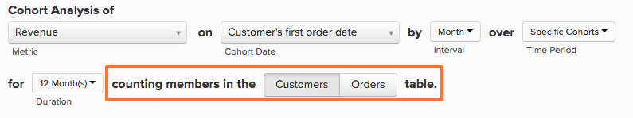

# Report Builder coorte

Hai mai desiderato studiare il comportamento nel tempo di diversi sottoinsiemi di utenti? Ad esempio, ti sei mai chiesto se gli utenti che si registrano durante un periodo promozionale hanno un ricavo medio sulla vita più alto rispetto a quelli che non lo fanno? Se la risposta è `Yes`, quindi `Cohort Report Builder` è lo strumento perfetto per te. [!DNL Adobe Commerce Intelligence] è ottimizzato per eseguire questa analisi e renderla rilevante per la tua azienda.

## L’analisi per coorte {#what}

`Cohort` l’analisi può essere definita in senso lato come l’analisi di gruppi di utenti che condividono caratteristiche simili nel corso dei loro cicli di vita. Consente di identificare le tendenze comportamentali tra diversi gruppi di utenti.

Per un primer approfondito su `cohort` analisi, revisione [questa pagina](https://www.cohortanalysis.com/).

Nel tuo [!DNL Commerce Intelligence] dashboard, è facile creare un utente `cohorts` in base a `cohort` data e una metrica nel tuo account.

## Perché è importante l&#39;analisi per coorte? {#important}

Come indicato in precedenza, `cohort` L’analisi ti consente di identificare le tendenze comportamentali tra diversi gruppi di utenti. Grazie alla solida conoscenza del comportamento di alcuni gruppi, puoi adattare le tue decisioni di acquisto per massimizzare le vendite. Ad esempio, considera i ricavi relativi al ciclo di vita `cohort` analisi: anche se questo tipo di analisi è utile per molte ragioni, quella più immediata è quella di prendere decisioni migliori in materia di acquisizione di clienti.

## Come posso creare il mio `cohort` analisi?

### Nuova architettura

Queste sono le istruzioni per l&#39;utilizzo di `Cohort Report Builder` il [Nuova architettura](../../administrator/account-management/new-architecture.md).

1. Clic **[!UICONTROL Report Builder]** nella scheda sinistra o **[!UICONTROL Add Report** > **Create Report]** in qualsiasi dashboard.

1. In `Report Builder` selezione, fare clic su **[!UICONTROL Create Report]** accanto al `Visual Report Builder` opzione.

**Aggiunta di una metrica**

Ora che sei nel `Report Builder`, aggiungi la metrica su cui desideri eseguire l’analisi (ad esempio: `Revenue` o `Orders`).

>[!NOTE]
>
>Nativa [!DNL Google Analytics] le metriche non sono compatibili con `Cohort Report Builder`.

**Attiva/disattiva la visualizzazione della metrica su`Cohort`**

Viene visualizzata una nuova finestra per configurare i dettagli della `Cohort` Rapporto.

### Per realizzare un’ `Cohort` rapporto:

1. Come raggruppare i `cohorts`
1. Il `cohort` periodo temporale
1. Il numero di `cohorts` per visualizzare
1. Quantità minima di dati per ogni `cohort` deve contenere
1. Intervallo di tempo dopo `cohort` occorrenza

#### 1. Raggruppamento `cohorts`

`Cohorts` sono raggruppati per marca temporale, come **data di registrazione** o **data primo ordine**.

>[!NOTE]
>
>Non puoi utilizzare la stessa marca temporale su cui è basata la metrica per `cohort` data. Per un’analisi che lo richieda, puoi utilizzare `Standard report builder` invece.

#### 2. `Cohort` periodo temporale

Scegli il periodo di tempo da raggruppare `cohorts` di. In altre parole, quale parte della marca temporale selezionata in precedenza è più importante; la `week`, `month`, `quarter`, o `year`? Il rapporto visualizza i dati in qualsiasi intervallo selezionato qui

#### 3. e 4. Imposta il numero di `cohorts` per visualizzare e quanti dati ciascuno `cohort` deve avere

Questi parametri consentono di visualizzare solo `cohorts` che ti interessa e la praticità `Preview` nella parte inferiore della finestra mostra esattamente le coorti visualizzate nel rapporto.

Per impostazione predefinita, l&#39;attuale `cohort` non è incluso a meno che non si modifichi la quantità minima di dati richiesti per `cohort` a `0`. In questo caso, il `cohort` per il periodo di tempo corrente include solo dati parziali.

#### 5. Intervallo di tempo dopo `Cohort` Occorrenza

Questa funzione ti consente di impostare l’intervallo di tempo dei dati visualizzati per il `cohorts`. Ad esempio, per visualizzare 24 pagine al mese `cohorts` in base a `customer's first order date`, ma sei interessato solo ai primi 3 mesi di dati per ogni `cohort`, è possibile impostare `number of cohorts to view` a `24` e `time range after cohort occurrence` a `3`.

L&#39;intervallo per questo valore cambia con qualsiasi elemento selezionato nella `cohort time period` e il valore è impostato su `12` per impostazione predefinita, il valore non cambia a meno che non fai clic sull’icona del calendario per modificarlo.

#### Altre note

* [!UICONTROL Filters]: applicato alle metriche, rimane intatto quando passi da una metrica all’altra `Standard` e `Cohort` visualizzazioni.

* Consulta [`Perspectives`](#perspectives).

#### Esempio

Ecco un esempio per mettere tutto insieme. In questo esempio, desidero estrarre il comportamento dell&#39;ordine dopo un `cohort`Il primo acquisto per verificare se la coorte torna a effettuare acquisti ripetuti nei prossimi sei mesi.

### Architettura legacy

#### Architettura legacy {#personalinfo}

Di seguito sono riportate le istruzioni specifiche della versione legacy di `Cohort Report Builder`. Se ti interessa utilizzare la nuova versione, consulta [Nuova architettura](../../administrator/account-management/new-architecture.md) per ulteriori informazioni sulla migrazione a [!DNL Commerce Intelligence] Nuovo account dell’architettura.

#### Come posso creare il mio `cohort` analisi? {#create}

`Cohort` analisi in azione! In questo caso, puoi vedere i ricavi crescere nel tempo sia cumulativamente che per utente.

Questa sezione illustra come creare `cohort` analisi. Per esempi (e GIF animati che illustrano il processo), osservate [Sezione Esempi](#examples) di questo argomento.

1. Clic **[!UICONTROL Report Builder]** nella scheda sinistra o **[!UICONTROL Add Report** > **Create Report]** in qualsiasi dashboard.

1. In `Report Builder Selection` schermata, fai clic su **[!UICONTROL Create Report]** accanto al `Cohort Analysis` opzione.

#### Aggiunta di una metrica

Ora che sei nel `Cohort Report Builder`, aggiungi la metrica (esempio: `Revenue` o `Number of orders`) su cui si desidera eseguire l&#39;analisi.

>[!NOTE]
>
>Nativa [!DNL Google Analytics] le metriche non sono compatibili con `Cohort Report Builder`.

#### Selezione della data della coorte {#date}

Il passaggio successivo consiste nello specificare `cohort date`. Questa è la data entro la quale gli utenti sono raggruppati. Ad esempio, potrebbe essere `User's first order date` o `User's registration date`.

>[!NOTE]
>
>Non è possibile utilizzare la stessa data in cui la metrica è stata generata (ad esempio: `created at`) come `cohort date`.

#### Impostazione dell&#39;intervallo e del periodo di tempo

Quindi, imposta `Interval` e `Time Period`.

`Interval`
Il `Interval` consente di impostare `length` del tuo `cohorts`. Ad esempio, se è impostato su `Month`, il rapporto viene misurato in mesi.

È possibile modificare la modalità di visualizzazione di questi intervalli sull&#39;asse x utilizzando **Durata** menu.

`Time Period`
Utilizza il `Time Period` menu per scegliere l’utente specifico `cohorts` da analizzare. Puoi mostrare ogni `cohort`, scegliere da un elenco, specificare un intervallo di tempo o definire un intervallo di tempo continuo di `cohorts` da includere. Ad esempio, se utilizzi il `Specific Cohorts` , è possibile selezionare mesi specifici da includere nell’analisi:

Se stai raggruppando `cohorts` per data di registrazione e quindi selezionati aprile, maggio e giugno nel `Specific Cohorts` saranno inclusi tutti gli utenti registrati in tali mesi.

#### Definizione dell’asse X

Sotto `duration`, è possibile definire le impostazioni dell&#39;asse X del grafico. In altre parole, quanti periodi di tempo ogni punto dati rappresenta e quanti punti dati includere nell’analisi.

#### Selezione del `counting members` tabella

Se si è scelto di raggruppare gli utenti in base a `cohort date` che è stato aggiunto da un&#39;altra tabella, è possibile che venga visualizzato un `counting members in the … table` opzione.

Guarda un esempio per comprendere questa impostazione. Supponiamo che tu abbia creato un rapporto che coordina un `Revenue` metrica per `Customer's registration date`. Volevi anche usare la prospettiva. `Average value per cohort member` per visualizzare i ricavi per buyer nel tempo. Per trovare il valore medio per acquirente, devi decidere il numero di acquirenti da dividere. È il numero di clienti registrati nel tuo `customers` tabella, o è il numero di acquirenti distinti nel tuo `orders table` per lo stesso periodo?

Questa impostazione risponde a tale domanda. Membri di conteggio in `customers` La tabella include in media tutti i clienti (sia che abbiano effettuato un acquisto, sia che lo abbiano fatto). Membri di conteggio in `orders` La tabella include solo i clienti che hanno effettuato un acquisto.

#### Selezione di una prospettiva {#perspective}

Dopo aver definito la metrica e come desideri analizzarla, puoi selezionare `perspective` che desideri utilizzare.

Appena sopra la visualizzazione del rapporto si trova un elenco a discesa di `perspective` impostazioni.

Consulta [Prospettive](#perspectives).

## Esempi di analisi per coorte {#examples}

Ora che hai descritto come creare un’ `cohort` analisi, guardate alcuni esempi.

### Voglio sapere come il mio utente `cohorts` crescono nel tempo.

In questo esempio hai analizzato `Revenue` metrica, ha raggruppato le coorti per `customer's first order date`, e ha selezionato gli 8 più recenti `cohorts` (definito nella `Time Period` da includere nell&#39;analisi. Per vedere come le coorti sono cresciute nel tempo, hai utilizzato il `Cumulative Average Value per Cohort Member` `perspective`.

### Voglio sapere, in media, quanti ordini un utente fa in momenti diversi della sua vita.

(../../assets/cohort2.gif

In questo esempio, hai analizzato `Number of orders` metrica, ha raggruppato le coorti per `customer's first order date`, e includevano le otto coorti più recenti (definite nella `Time Period` nell&#39;analisi. Per visualizzare il numero medio di ordini per ogni coorte, hai modificato il `perspective` a `Average Value per Cohort Member`.

### Voglio capire come si confronta l&#39;attività di acquisto futura di un utente con l&#39;attività del primo mese con l&#39;azienda.

## `Perspectives` {#perspectives}

`Standard`
Mostra il contributo incrementale di un dato gruppo di coorti in un dato momento del loro ciclo di vita. Ad esempio, il punto &quot;Settimana 6&quot; mostra tutte le coordinate effettuate dagli utenti nella sesta settimana.

`Average Value per Cohort Member`
Questo divide il `Standard cohort` analisi in (1) in base al numero di utenti in ciascun `cohort` gruppo. Ciò può essere utile per confrontare le prestazioni delle coorti in base al confronto tra mele, in quanto non tutti i gruppi di coorte possono includere lo stesso numero di utenti. Ad esempio, il ricavo medio settimanale 6 per utente da un determinato `cohort`.

`Cumulative`
Questo `perspective` mostra il tradizionale `cohort` analisi su una `cumulative` base. In altre parole, mostra il contributo totale di una determinata coorte fino ad oggi in un dato momento del loro ciclo di vita. Ad esempio, i ricavi cumulativi dopo sei settimane di utilizzo da una determinata coorte.

`Cumulative Average Value per Cohort Member`
Questo divide il `Cumulative` analisi in (3) in base al numero di utenti in ciascun `cohort` gruppo. Mostra il contributo medio per tutta la vita (spesso ricavi medi per tutta la vita) per `cohort` membro a ogni periodo nel `cohort's` la vita. Ad esempio, i ricavi medi del ciclo di vita dopo sei mesi di utenti che hanno aderito a giugno.

`Percent of First Value (show first value)`
Questo analizza l&#39;aggregato `cohort` contributo in un momento specifico in un `cohort's` ciclo di vita come percentuale del loro contributo nel primo periodo. Ad esempio, i ricavi del mese 6 divisi per i ricavi del mese 1 degli utenti che hanno aderito a giugno.

`Percent of First Value (hide first value)`
È lo stesso della `perspective` sopra, tranne per il fatto che il valore del primo periodo di tempo del 100% è nascosto.

## Ritorno a capo {#finish}

Il `Cohort Report Builder` è ottimizzato per il raggruppamento degli utenti in base a `cohort date`. Potrebbe essere utile raggruppare gli utenti per un&#39;attività o un attributo simile. L&#39;Adobe consiglia di eseguire il check-out [questo tutorial sulle coorti qualitative](../dev-reports/create-qual-cohort-analysis.md) per iniziare.
