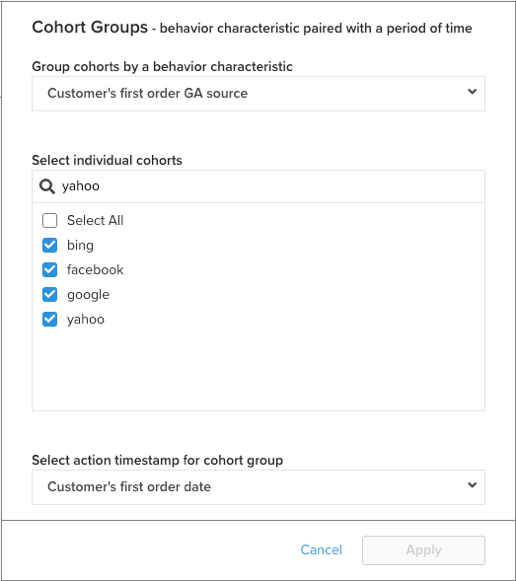

# [!DNL Cohort Report Builder] per coorti non basate su data

Il [`Cohort Report Builder`](../dev-reports/cohort-rpt-bldr.md) è utile per aiutare i commercianti a studiare il comportamento nel tempo di diversi sottoinsiemi di utenti. In passato, il `Cohort Report Builder` è stato ottimizzato per il raggruppamento degli utenti da un `cohort date` (ad esempio, il set di tutti i clienti che hanno effettuato il primo acquisto in un dato mese). Il `Non-Date Based Cohort` Questa funzione ora consente di raggruppare gli utenti in base a un’attività o a un attributo simile. Osserva alcuni casi d’uso per questa funzione.

## Casi d’uso

Questo non è un elenco completo, ma ecco alcune potenziali analisi che possono essere eseguite con questa funzione.

* Esame dei ricavi dei clienti acquisiti da [!DNL Google] rispetto a [!DNL Facebook]
* Analisi dei clienti il cui primo acquisto è stato effettuato negli Stati Uniti rispetto al Canada
* Osservare il comportamento dei clienti acquisiti da varie campagne pubblicitarie

## Come creare l’analisi

1. Clic **[!UICONTROL Report Builder]** nella scheda sinistra o **[!UICONTROL Add Report** > **Create Report]** in qualsiasi dashboard.

1. In `Report Builder Selection` schermata, fai clic su **[!UICONTROL Create Report]** accanto al `Visual Report Builder` opzione.

### Aggiunta di una metrica

Ora che sei nel `Report Builder`, aggiungi la metrica su cui desideri eseguire l’analisi (ad esempio: `Revenue` o `Orders`).

>[!NOTE]
>
>Nativa [!DNL Google Analytics] le metriche non sono compatibili con `Cohort Report Builder`. L’obiettivo di questo esempio è quello di esaminare i ricavi nel tempo per i clienti di primo ordine acquisiti tramite diversi [!DNL Google Analytics] origini.

### Attiva/Disattiva `Metric View` a `Cohort`

Viene visualizzata una nuova finestra in cui è possibile configurare i dettagli del rapporto per coorte.

Per creare un rapporto per coorte sono necessarie cinque specifiche:

1. Come raggruppare le coorti
1. Selezione delle coorti
1. Timestamp azione
1. Intervallo di tempo della prima azione della coorte
1. Intervallo di tempo dopo l’occorrenza della coorte

<!--{: width="200" height="224"}-->

#### 1. Raggruppamento `cohorts`

`Cohorts` sono raggruppati per una caratteristica di comportamento, in questo esempio `Customer's first order GA source`. Le opzioni disponibili qui sono colonne già designate come `groupable` per la metrica.

#### 2. Selezione delle coorti

È possibile visualizzare tutti i risultati per la caratteristica specificata. Poiché questo può comportare molti `cohorts`, è possibile selezionare il `cohorts` (che corrisponde ai vari valori disponibili per `Customer's first order GA source`) di cui hai bisogno.

<!--{: width="300" height="338"}-->

#### 3. `Action timestamp`

Questo consente di scegliere una colonna basata su data diversa da quella in cui viene creata la metrica. Di seguito, puoi vedere come selezionare l’intervallo di tempo applicabile al dato `action timestamp`.

#### 4. `Cohort first action time range`

Qui è dove si seleziona l’intervallo di date che contiene `cohorts action timestamp` (quindi, clienti che hanno effettuato il primo ordine da novembre 2017 a ottobre 2018). Può trattarsi di un intervallo di date mobile o fisso.

#### 5. `Time range after cohort occurrence`

Visualizzare il `cohorts` nel tempo per mese, settimana o anno? Le selezioni vengono effettuate qui. Sotto tale sezione, seleziona la `time range` dopo il `cohort action timestamp` si è verificato. Ad esempio, questo mostra 12 mesi di dati per i clienti che hanno effettuato il primo ordine durante l’intervallo di tempo dell’azione.

<!--{: width="400" height="557"}-->

>[!NOTE]
>
>[!UICONTROL Filters] applicate alle metriche rimangano intatte quando si passa da una `Standard` e `Cohort` visualizzazioni.

### Correlato

Consulta [`Perspectives`](../../data-analyst/dev-reports/cohort-rpt-bldr.md).
