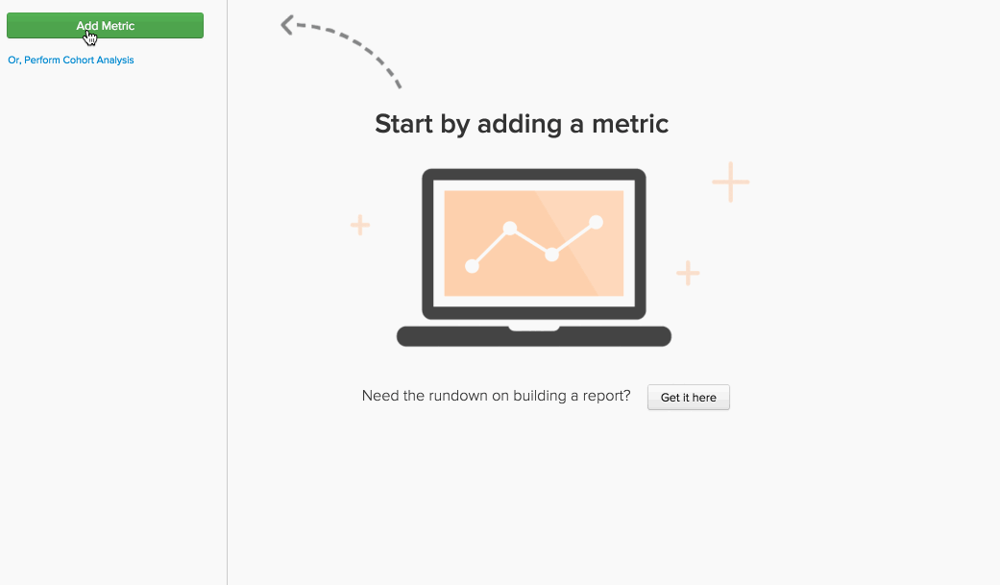

# Formule in `Report Builder`

In [`Report Builder`](../../tutorials/using-visual-report-builder.md), puoi creare visualizzazioni efficaci utilizzando le [metriche definite](../../data-user/reports/ess-manage-data-metrics.md) nel tuo account. La combinazione di queste metriche in una formula consente di ottenere ulteriori informazioni dai dati. Questo argomento descrive come utilizzare le formule in `Report Builder`.

## Cos&#39;è un `formula`? {#what}

In `Report Builder`, un `formula` è solo una combinazione di una o più metriche basate su una logica matematica. Un esempio tipico è simile al seguente:

In questo esempio si utilizzano `Number of orders metric (A)` e `Distinct buyers metric (B)` e l&#39;obiettivo è rispondere alla domanda: qual è il numero medio di ordini che i miei acquirenti effettuano ogni mese? I parametri della formula sono:

* `Definition`: applica la matematica alle metriche di input. In questo esempio, la divisione del numero di ordini per il numero di acquirenti distinti indica il numero medio di ordini. La definizione è (A/B).

* `Format`: la formula restituisce un numero, un periodo di tempo o un importo in valuta? Accanto alla definizione della formula è disponibile un elenco a discesa che consente di specificare il formato del risultato. In questo caso, è un numero.

* `Miscellaneous`: la marca temporale, i raggruppamenti, le prospettive e i filtri della formula sono tutti ereditati dalle relative metriche di input. Non c&#39;è niente da fare qui!

## Come posso usare `formulas` nei miei report? {#how}

Ora che hai trattato le nozioni di base, guarda alcuni esempi.

### Esempio: voglio scoprire quale percentuale delle mie entrate può essere attribuita a ordini nuovi.

In questo esempio sono state utilizzate le metriche `Revenue` e `Revenue (first time orders)`. Dividendo la metrica `Revenue (first time orders)(B)` per `Revenue metric (A)` e impostando il formato di restituzione su `Percent`, è possibile trovare la percentuale di ricavi che può essere attribuita agli ordini delle prime volte.

### Esempio: voglio sapere qual è il ricavo medio per ordine quando effettuo e non offro `promo code`.

In questo esempio sono state utilizzate le metriche `Revenue` e `Number of orders`. La risposta a questa domanda prevede due passaggi: dividere `Revenue (A)` per `Number of orders (B)` e impostare il formato restituito su `Currency`. Successivamente, è stato consentito solo al risultato della formula (`Avg. Revenue per order`) di visualizzare e raggruppare i risultati per `Promo code`.

### Esempio: voglio conoscere la distribuzione delle sorgenti UTM dei miei nuovi clienti.

La ricerca della risposta a questa domanda richiede alcuni passaggi:

1. È stata aggiunta la metrica `New Customers`, quindi raggruppata per `utm_source - all`. Metrica `A` o `New Customers (grouped)`.

1. Successivamente, hai duplicato la metrica `New Customers (grouped)` e l&#39;hai impostata per utilizzare una dimensione indipendente. La metrica `B` - `New customers (ungrouped)` - mostra il numero totale di nuovi clienti.

1. Dopo aver nascosto entrambe le metriche, impostare la definizione della formula su `A/B`. `New customers (grouped)` è diviso per `New Customers (ungrouped)`.

1. Impostare quindi il formato dei risultati su `Percent`.

In questo esempio è stata utilizzata la prospettiva `Stacked Columns` per visualizzare i risultati per mese. Questo ci permette di confrontare la distribuzione dei nuovi clienti su base mensile.

## Ritorno a capo {#wrapup}

Negli esempi precedenti è stato notato che le metriche di input della formula `timestamp`, `groupings`, `perspectives` e `filters` sono ereditate? Tieni presente che le formule possono essere utilizzate per utilizzare `perspectives` e [opzioni di tempo indipendenti](../../tutorials/time-options-visual-rpt-bldr.md){: target="_blank"}, proprio come le metriche.

Per ulteriori domande sull&#39;utilizzo delle formule in `Report Builder`, [contattare il supporto tecnico](https://experienceleague.adobe.com/docs/commerce-knowledge-base/kb/troubleshooting/miscellaneous/mbi-service-policies.html?lang=it).
