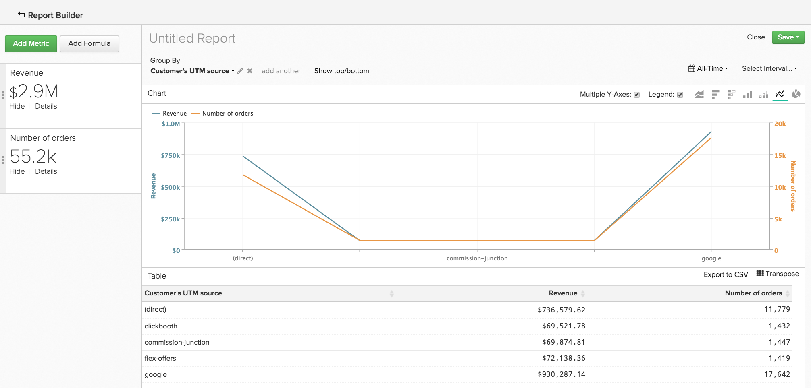

# Ordinamento dei dati tramite `Show Top/Bottom` funzionalità

Puoi fare di più nella sezione `Visual Report Builder` piuttosto che creare analisi con tendenze nel tempo. Ad esempio, puoi creare un rapporto per mostrare quanto sono preziosi i tuoi canali di acquisizione e marketing, ma puoi anche creare un rapporto che mostra solo i primi cinque esecutori. Allo stesso modo, puoi riorientare le attività di marketing creando un rapporto che mostra quali stati generano il maggior numero di ricavi.

Questo tipo di ordinamento dei dati può essere eseguito nei rapporti che utilizzano sia `Group By` e un `Time Interval of None`. Quando entrambi questi elementi sono in un rapporto, il `Show Top/Bottom` sopra l&#39;anteprima del grafico. Questa funzione consente di visualizzare i punti di dati superiori (dal più alto al più basso) e inferiori (dal più basso al più alto) in base ai parametri impostati.

## Come si utilizza? {#how}

Dopo aver fatto clic su **[!UICONTROL Show Top/Bottom link]**, viene visualizzata una finestra in cui è possibile impostare i parametri di visualizzazione e ordinamento. Il numero nella casella di testo può essere un numero intero, ad esempio `5`) o `ALL`. Successivamente, puoi scegliere di ordinare il rapporto in base alla metrica OPPURE in base al raggruppamento.

Ad esempio, per visualizzare le cinque origini di riferimento che hanno generato il maggior numero di ricavi, effettua le seguenti operazioni:

1. Aggiungi il `Revenue` metrica al rapporto.

1. Aggiungi un `Group By` segmentare la metrica per origine di riferimento.

1. Imposta `Time Interval` a `None`.

1. In `Show Top/Bottom` , impostare lo schermo su `5` pertanto, nel rapporto vengono incluse solo le origini di riferimento con i primi cinque importi totali dei ricavi.

>[!NOTE]
>
>Perché il report non ha un `Time Interval`, i valori, in questo caso le prime cinque sorgenti di riferimento, possono cambiare nel tempo. Se un&#39;origine di riferimento supera un&#39;altra in termini di ricavi, l&#39;ordine di visualizzazione delle origini cambia.

## E l’utilizzo di più metriche? {#multiplemetrics}

L’utilizzo di questa funzione si complica quando un rapporto contiene più di una metrica, perché ogni metrica può essere ordinata solo in base a se stessa o a uno dei raggruppamenti.

Supponiamo che tu abbia creato un rapporto con entrambi `Revenue` e `Number of orders` metriche, raggruppate per origine di riferimento. `Revenue` può essere ordinato solo per `Revenue` o origine di riferimento e `Number of orders` può essere ordinato solo per `Number of orders` o origine di riferimento.

Questo significa che mentre è possibile visualizzare `Revenue` solo dall&#39;alto `5` origini di riferimento che generano ricavi, non è possibile visualizzare il numero di ordini anche per la parte superiore `5` origini di riferimento che generano ricavi. In parole povere: quando sono presenti più metriche, la cosa migliore è ordinare ciascuna metrica in base al raggruppamento.

Di seguito è riportato un esempio di grafico che ha ordinato il `Revenue` metrica da sola anziché dal raggruppamento. Come puoi notare, il fatto di non ordinare la metrica per raggruppamento ha creato un rapporto strano (e in ultima analisi non utile):

Se avessi ordinato entrambe le metriche in base al raggruppamento, il grafico si presenterebbe così:

## Come vengono ordinati i valori per impostazione predefinita? {#defaultsorting}

Quando in un rapporto con una metrica è inclusa una sola `Group by` e un `Time Interval` di `None`, l&#39;ordine predefinito in `Visual Report Builder` mostra i primi valori in base alla metrica. In questo caso, il `Show Top/Bottom` Questa funzione potrebbe non essere necessaria se soddisfa le tue esigenze.

In questo esempio viene esaminato il numero di opportunità chiuse dagli agenti di vendita. Questa tabella viene ordinata automaticamente dal valore più alto a quello più basso in base alla metrica, in questo caso `Won Opportunities`.

Tuttavia, quando viene aggiunta una seconda metrica, l’impostazione predefinita consiste nell’ordinare la parte superiore in base al raggruppamento. Con l’aggiunta delle metriche e dei raggruppamenti, l’ordinamento predefinito si basa sul primo raggruppamento, quindi sul secondo e così via.

## Ritorno a capo {#wrapup}

Anche se alcune funzioni di base sono trattate qui, questa funzione ha molti utilizzi interessanti.

Pensa all’esempio precedente di rappresentante di vendita e opportunità. Rimozione di `Time Interval`, applicazione di un `Group By`, e l’ordinamento dei dati in base al raggruppamento ci ha permesso di ottenere un quadro dettagliato del numero di opportunità realizzate da ogni rappresentante. Inoltre, utilizzando `Show Top/Bottom` La funzione ci permette di scoprire chi sono i migliori interpreti.
