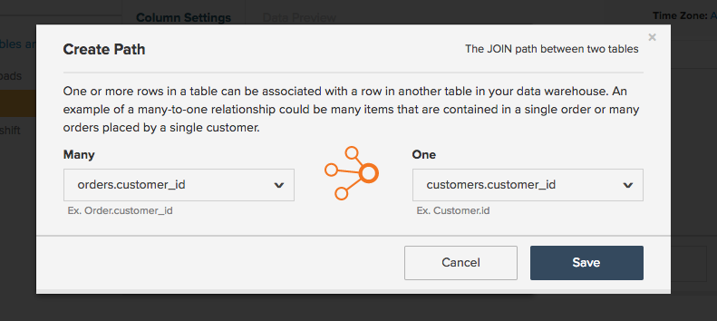

# Tradurre le query SQL in Commerce Intelligence

Ti sei mai chiesto come vengono tradotte le query SQL nelle [colonne calcolate](../data-warehouse-mgr/creating-calculated-columns.md), [metriche](../../data-user/reports/ess-manage-data-metrics.md) e [report](../../tutorials/using-visual-report-builder.md) che utilizzi in [!DNL Commerce Intelligence]? Se sei un utente SQL pesante, comprendere come SQL viene tradotto in [!DNL Commerce Intelligence] ti consente di lavorare in modo più intelligente in [Data Warehouse Manager](../data-warehouse-mgr/tour-dwm.md) e ottenere il massimo dalla piattaforma [!DNL Commerce Intelligence].

Alla fine di questo argomento, è disponibile una **matrice di traduzione** per clausole di query SQL e [!DNL Commerce Intelligence] elementi.

Inizia guardando una query generale:

| | |
|--- |--- |
| `SELECT` |  |
| `a,` | Report `group by` |
| `SUM(b)` | `Aggregate function` (colonna) |
| `FROM c` | Tabella `Source` |
| `WHERE` |  |
| `d IS NOT NULL` | `Filter` |
| `AND time < X`   `AND time >= Y` | Report `time frame` |
| `GROUP BY a` | Report `group by` |

Questo esempio copre la maggior parte dei casi di traduzione, ma con alcune eccezioni. Immergiti, a partire dalla traduzione della funzione `aggregate`.

## Aggregare funzioni

Le funzioni di aggregazione (ad esempio `count`, `sum`, `average`, `max`, `min`) nelle query assumono la forma di **aggregazioni metriche** o **aggregazioni colonne** in [!DNL Commerce Intelligence]. Il fattore di differenziazione è se è necessario un join per eseguire l&#39;aggregazione.

Osserva un esempio per ciascuno dei precedenti.

## Aggregazioni di metriche {#aggregate}

È richiesta una metrica per l&#39;aggregazione di `within a single table`. Ad esempio, la funzione di aggregazione `SUM(b)` della query precedente sarà probabilmente rappresentata da una metrica che somma la colonna `B`. 

Osservare un esempio specifico di come una metrica `Total Revenue` potrebbe essere definita in [!DNL Commerce Intelligence]. Osserva la query seguente che tenti di tradurre:

| | |
|--- |--- |
| `SELECT` |  |
| `SUM(order_total) as "Total Revenue"` | `Metric operation` (colonna) |
| `FROM orders` | Tabella `Metric source` |
| `WHERE` |  |
| `email NOT LIKE '%@magento.com'` | Metrica `filter` |
| `AND created_at < X`  `AND created_at >= Y` | Metrica `timestamp` (e reporting `time range`) |

Passare al generatore di metriche facendo clic su **[!UICONTROL Manage Data** > **&#x200B; Metriche &#x200B;**> **Crea nuova metrica]**, è innanzitutto necessario selezionare la tabella `source` appropriata, che in questo caso è la tabella `orders`. La metrica viene quindi impostata come mostrato di seguito:

## Aggregazioni di colonne

Una colonna calcolata è obbligatoria quando si aggrega una colonna unita in join da un&#39;altra tabella. Ad esempio, è possibile che nella tabella `customer` sia stata creata una colonna denominata `Customer LTV`, che somma il valore totale di tutti gli ordini associati al cliente nella tabella `orders`.

La query per questa aggregazione potrebbe essere simile alla seguente:

|  |  |
|--- |--- |
| `Select` | |
| `c.customer_id` | Proprietario aggregato |
| `SUM(o.order_total) as "Customer LTV"` | Operazione di aggregazione (colonna) |
| `FROM customers c` | Tabella del proprietario aggregato |
| `JOIN orders o` | Tabella origine aggregazione |
| `ON c.customer_id = o.customer_id` | Percorso |
| `WHERE o.status = 'success'` | Aggregate filter |

La configurazione in [!DNL Commerce Intelligence] richiede l&#39;utilizzo di Data Warehouse Manager, dove si crea un percorso tra la tabella `orders` e `customers` e quindi si crea una colonna denominata `Customer LTV` nella tabella del cliente.

Verificare come stabilire un nuovo percorso tra `customers` e `orders`. L&#39;obiettivo finale è la creazione di una nuova colonna aggregata nella tabella `customers`. Passare quindi alla tabella `customers` nel Data Warehouse, quindi fare clic su **[!UICONTROL Create a Column** > **&#x200B; Seleziona una definizione &#x200B;**> **SOMMA]**.

Successivamente, è necessario selezionare la tabella di origine. Se esiste un percorso per la tabella `orders`, selezionalo semplicemente dal menu a discesa. Tuttavia, se stai creando un nuovo percorso, fai clic su **[!UICONTROL Create new path]** e viene visualizzata la schermata seguente:

In questo caso è necessario considerare attentamente la relazione tra le due tabelle che si sta tentando di unire. In questo caso, sono potenzialmente presenti `Many` ordini associati al cliente `One`, pertanto la tabella `orders` è elencata sul lato `Many`, mentre la tabella `customers` è selezionata sul lato `One`.

>[!NOTE]
>
>In [!DNL Commerce Intelligence], `path` equivale a `Join` in SQL.

Una volta salvato il percorso, è possibile creare la colonna `Customer LTV`. Vedi di seguito:

Ora che hai creato la nuova colonna `Customer LTV` nella tabella `customers`, puoi creare un&#39;aggregazione di [metrica](#aggregate) utilizzando questa colonna (ad esempio, per trovare l&#39;LTV medio per cliente). È inoltre possibile `group by` o `filter` in base alla colonna calcolata in un report utilizzando le metriche esistenti create nella tabella `customers`.

>[!NOTE]
>
>Per quest&#39;ultimo, ogni volta che si crea una nuova colonna calcolata è necessario [aggiungere la dimensione alle metriche esistenti](../data-warehouse-mgr/manage-data-dimensions-metrics.md) prima che sia disponibile come `filter` o `group by`.

Consulta [creazione di colonne calcolate](../data-warehouse-mgr/creating-calculated-columns.md) con Data Warehouse Manager.

## `Group By` clausole

`Group By` funzioni nelle query sono spesso rappresentate in [!DNL Commerce Intelligence] come colonna utilizzata per segmentare o filtrare un report visivo. Ad esempio, rivediamo la query `Total Revenue` che hai esplorato in precedenza, ma questa volta segmentiamo i ricavi per `coupon\_code` per comprendere meglio quali coupon generano il maggior numero di ricavi.

Inizia con la query seguente:

| | |
|--- |--- |
| `SELECT coupon_code,` | Report `group by` |
| `SUM(order_total) as "Total Revenue"` | `Metric operation`(colonna) |
| `FROM orders` | Tabella `Metric source` |
| `WHERE` |  |
| `email NOT LIKE '%@magento.com'` | Metrica `filter` |
| `AND created_at < '2016-12-01'`   `AND created_at >= '2016-09-01'` | Metrica `timestamp` (e reporting `time range`) |
| `GROUP BY coupon_code` | Report `group by` |

>[!NOTE]
>
>L’unica differenza rispetto alla query avviata in precedenza è l’aggiunta del &quot;coupon\_code&quot; come raggruppamento._

Utilizzando la stessa metrica `Total Revenue` creata in precedenza, ora puoi creare il tuo report dei ricavi segmentati per codice coupon. Osserva il file gif qui sotto che mostra come impostare questo rapporto visivo con dati di settembre a novembre:

## Formule

A volte, una query può richiedere più aggregazioni per calcolare la relazione tra colonne separate. Ad esempio, è possibile calcolare il valore medio dell&#39;ordine in una query in uno dei due modi seguenti:

* `AVG('order\_total')` O
* `SUM('order\_total')/COUNT('order\_id')`

Il primo metodo richiede la creazione di una nuova metrica che esegue una media sulla colonna `order\_total`. Tuttavia, è possibile creare quest&#39;ultimo metodo direttamente nel generatore di report presupponendo che siano già impostate delle metriche per il calcolo di `Total Revenue` e `Number of orders`.

Fare un passo indietro e esaminare la query complessiva per `Average order value`:

| | |
|--- |--- |
| `SELECT` |  |
| `SUM(order_total) as "Total Revenue"` | Metrica `operation` (colonna) |
| `COUNT(order_id) as "Number of orders"` | Metrica `operation` (colonna) |
| `SUM(order_total)/COUNT(order_id) as "Average order value"` | Metrica `operation` (colonna) / Operazione metrica (colonna) |
| `FROM orders` | Tabella `source` della metrica |
| `WHERE` |  |
| `email NOT LIKE '%@magento.com'` | Metrica `filter` |
| `AND created_at < '2016-12-01'`  `AND created_at >= '2016-09-01'` | Timestamp della metrica (e intervallo di tempo di reporting) |

Si supponga ora di disporre già di metriche configurate per il calcolo di `Total Revenue` e `Number of orders`. Poiché queste metriche esistono, è sufficiente aprire `Report Builder` e creare un calcolo su richiesta utilizzando la funzione `Formula`:

## Ritorno a capo

Se si è un utente SQL molto attivo, pensare alla modalità di traduzione delle query in [!DNL Commerce Intelligence] consente di creare colonne, metriche e report calcolati.

Per un riferimento rapido, consulta la matrice seguente. Viene illustrato l&#39;elemento [!DNL Commerce Intelligence] equivalente di una clausola SQL e la modalità di mapping a più elementi, a seconda di come viene utilizzato nella query.

## Elementi Commerce Intelligence

| **`SQL Clause`** | **`Metric`** | **`Filter`** | **`Report group by`** | **`Report time frame`** | **`Path`** | **`Calculated column inputs`** | **`Source table`** |
|---|---|---|---|---|---|---|---|
| `SELECT` | X | - | X | - | - | X | - |
| `FROM` | - | - | - | - | - | - | X |
| `WHERE` | - | X | - | - | - | - | - |
| `WHERE` (con elementi di tempo) | - | - | - | X | - | - | - |
| `JOIN...ON` | - | X | - | - | X | X | - |
| `GROUP BY` | - | - | X | - | - | - | - |
