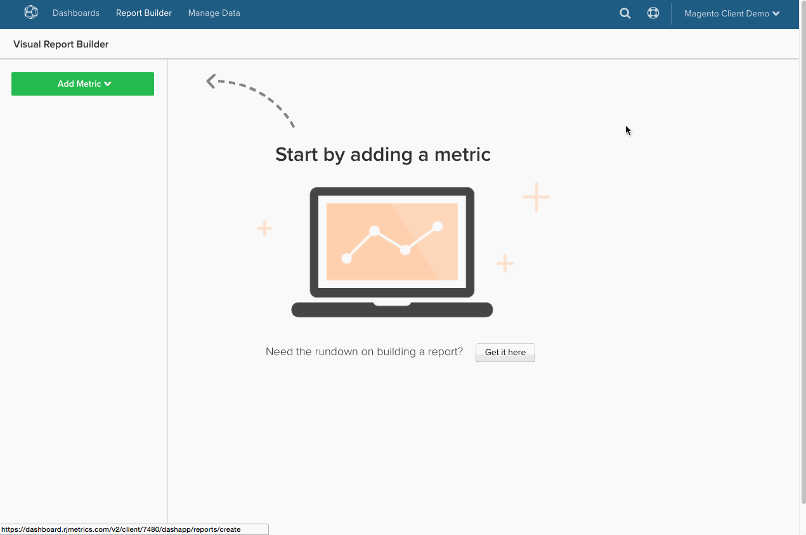

# Tradurre query SQL in MBI

Mai chiesto come le query SQL vengono tradotte in [colonne calcolate](../data-warehouse-mgr/creating-calculated-columns.md), [metriche](../../data-user/reports/ess-manage-data-metrics.md)e [rapporti](../../tutorials/using-visual-report-builder.md) in [!DNL MBI]? Se si è un utente SQL pesante, comprendere come SQL è tradotto in [!DNL MBI] consente di lavorare in modo più intelligente [Data Warehouse Manager](../data-warehouse-mgr/tour-dwm.md) e ottenere il massimo dal [!DNL MBI] piattaforma.

Alla fine di questo articolo, abbiamo incluso un **matrice di traduzione** per le clausole di query SQL e [!DNL MBI] elementi.

Iniziamo guardando una query generale:

|  |  |
|--- |--- |
| `SELECT` |  |
| `a,` | Rapporto `group by` |
| `SUM(b)` | `Aggregate function` (colonna) |
| `FROM c` | `Source` tabella |
| `WHERE` |  |
| `d IS NOT NULL` | `Filter` |
| `AND time < X`   `AND time >= Y` | Rapporto `time frame` |
| `GROUP BY a` | Rapporto `group by` |

Questo esempio copre la maggior parte dei casi di traduzione, ma ci sono alcune eccezioni. Iniziamo, iniziando da come `aggregate` La funzione è tradotta.

## Funzioni di aggregazione

Aggregare funzioni (ad esempio, `count`, `sum`, `average`, `max`, `min`) nelle query assume la forma di **aggregazioni metriche** o **aggregazioni di colonne** in [!DNL MBI]. Il fattore di differenziazione è la necessità o meno di un join per eseguire l&#39;aggregazione.

Diamo un&#39;occhiata ad un esempio per ciascuno dei precedenti.

## Aggregazioni metriche {#aggregate}

È necessaria una metrica quando si aggrega `within a single table`. Ad esempio, il `SUM(b)` la funzione di aggregazione dalla query di cui sopra sarà probabilmente rappresentata da una metrica che somma la colonna `B`. 

Vediamo un esempio specifico di come `Total Revenue` potrebbe essere definito in [!DNL MBI]. Dai un&#39;occhiata alla query qui sotto che cercheremo di tradurre:

|  |  |
|--- |--- |
| `SELECT` |  |
| `SUM(order_total) as "Total Revenue"` | `Metric operation` (colonna) |
| `FROM orders` | `Metric source` tabella |
| `WHERE` |  |
| `email NOT LIKE '%@magento.com'` | Metrica `filter` |
| `AND created_at < X`  `AND created_at >= Y` | Metrica `timestamp` (e reporting) `time range`) |

Navigazione al generatore di metriche facendo clic su **[!UICONTROL Manage Data** > ** Metriche **> **Crea nuova metrica]**, dobbiamo prima selezionare il `source` tabella, che in questo caso è `orders` tabella. Quindi la metrica viene impostata come mostrato di seguito:

## Aggregazioni colonna

Quando si aggrega una colonna unita da un’altra tabella, è necessaria una colonna calcolata. Ad esempio, potresti avere una colonna integrata nel tuo `customer` tabella denominata `Customer LTV`, che somma il valore totale di tutti gli ordini associati a tale cliente nel `orders` tabella.

La query per questa aggregazione può avere un aspetto simile a quello riportato di seguito:

|  |  |
|--- |--- |
| `Select` |  |
| `c.customer_id` | Proprietario aggregato |
| `SUM(o.order_total) as "Customer LTV"` | Operazione di aggregazione (colonna) |
| `FROM customers c` | Aggrega la tabella del proprietario |
| `JOIN orders o` | Tabella origine aggregazione |
| `ON c.customer_id = o.customer_id` | Percorso |
| `WHERE o.status = 'success'` | Filtro aggregato |

Impostazione di questo in [!DNL MBI] richiede l&#39;utilizzo del tuo gestore di Date Warehouse, dove potrai creare un percorso tra `orders` e `customers` quindi creare una nuova colonna denominata `Customer LTV` nella tabella del cliente.

Analizziamo innanzitutto come stabilire un nuovo percorso tra `customers` e `orders`. Il nostro obiettivo finale è quello di creare una nuova colonna aggregata nel `customers` quindi prima passa alla tabella `customers` nella Data Warehouse, quindi fai clic su **[!UICONTROL Create a Column** > ** Selezionare una definizione **> **SOMMA]**.

Quindi, devi selezionare la tabella sorgente. Se esiste già un percorso per il `orders` , è sufficiente selezionarlo dal menu a discesa . Tuttavia, se stai creando un nuovo percorso, fai clic su **[!UICONTROL Create new path]** e ti verrà presentata la schermata seguente:

Qui è necessario considerare attentamente la relazione tra le due tabelle che si sta tentando di unire insieme. In questo caso, vi sono `Many` ordini associati a `One` cliente, quindi `orders` è elencata nella tabella `Many` lato, mentre `customers` tabella selezionata nella `One` lato.

>[!NOTE]
>
>In [!DNL MBI], *path* equivale a un `Join` in SQL.

Una volta salvato il percorso, tutti gli utenti sono impostati per creare il nuovo `Customer LTV` colonna! Dai un&#39;occhiata a quanto segue:

Ora che hai costruito il nuovo `Customer LTV` nella colonna `customers` è possibile creare una tabella [aggregazione delle metriche](#aggregate) utilizzando questa colonna (ad esempio per trovare l’LTV medio per cliente), o semplicemente `group by` o `filter` dalla colonna calcolata in un rapporto utilizzando le metriche esistenti basate sul `customers` tabella.

>[!NOTE]
>
>Per quest&#39;ultimo, ogni volta che si crea una nuova colonna calcolata è necessario [aggiungere la dimensione alle metriche esistenti](../data-warehouse-mgr/manage-data-dimensions-metrics.md) prima che sia disponibile come `filter` o `group by`.

Vedi [creazione di colonne calcolate](../data-warehouse-mgr/creating-calculated-columns.md) con il tuo responsabile Data Warehouse.

## `Group By` clausole

`Group By` le funzioni nelle query sono spesso rappresentate in [!DNL MBI] come colonna utilizzata per segmentare o filtrare un rapporto visivo. Ad esempio, rivediamo il `Total Revenue` query precedentemente esplorata, ma questa volta Segmentiamo i ricavi per `coupon\_code` per comprendere meglio quali coupon generano il maggior numero di ricavi.

Innanzitutto, iniziamo con la query seguente:

|  |  |
|--- |--- |
| `SELECT coupon_code,` | Rapporto `group by` |
| `SUM(order_total) as "Total Revenue"` | `Metric operation`(colonna) |
| `FROM orders` | `Metric source` tabella |
| `WHERE` |  |
| `email NOT LIKE '%@magento.com'` | Metrica `filter` |
| `AND created_at < '2016-12-01'`   `AND created_at >= '2016-09-01'` | Metrica `timestamp` (e reporting) `time range`) |
| `GROUP BY coupon_code` | Rapporto `group by` |

>[!NOTE]
>
>L&#39;unica differenza dalla query con cui abbiamo iniziato prima è l&#39;aggiunta del &#39;coupon\_code&#39; come gruppo da._

Utilizzando lo stesso `Total Revenue` metrica creata in precedenza, ora siamo pronti a creare il nostro rapporto di ricavi segmentati per codice coupon! Osserva la gif qui sotto che mostra come impostare questo rapporto visivo sui dati da settembre a novembre:

## Formule

In alcuni casi, una query può includere più aggregazioni per calcolare la relazione tra colonne separate. Ad esempio, è possibile calcolare il valore medio dell’ordine in una query in uno dei due modi seguenti:

* `AVG('order\_total')` O
* `SUM('order\_total')/COUNT('order\_id')`

Il primo metodo implicherebbe la creazione di una nuova metrica che esegue una media `order\_total` colonna. Tuttavia, quest’ultimo metodo può essere creato direttamente nel generatore di report, supponendo che siano già state impostate delle metriche per calcolare il `Total Revenue` e `Number of orders`.

Facciamo un passo indietro e osserviamo la query complessiva per `Average order value`:

|  |  |
|--- |--- |
| `SELECT` |  |
| `SUM(order_total) as "Total Revenue"` | Metrica `operation` (colonna) |
| `COUNT(order_id) as "Number of orders"` | Metrica `operation` (colonna) |
| `SUM(order_total)/COUNT(order_id) as "Average order value"` | Metrica `operation` (colonna) / Funzionamento della metrica (colonna) |
| `FROM orders` | Metrica `source` tabella |
| `WHERE` |  |
| `email NOT LIKE '%@magento.com'` | Metrica `filter` |
| `AND created_at < '2016-12-01'`  `AND created_at >= '2016-09-01'` | Timestamp della metrica (e intervallo di tempo di reporting) |

Supponiamo inoltre che siano già state configurate delle metriche per il calcolo `Total Revenue` e `Number of orders`. Poiché queste metriche esistono già, possiamo semplicemente aprire il `Report Builder` e creare un calcolo ad hoc utilizzando `Formula` caratteristica:

## Ritorno a capo

Come accennato all&#39;inizio di questo articolo, se sei un utente SQL pesante, pensando a come le query si traducono in [!DNL MBI] ti consente di generare colonne, metriche e rapporti calcolati.

Per un riferimento rapido, controlla la matrice qui sotto. Mostra l&#39;equivalente di una clausola SQL [!DNL MBI] e come può essere mappato su più di un elemento, a seconda di come viene utilizzato nella query.

## Elementi MBI

|**`SQL Clause`**|**`Metric`**|**`Filter`**|**`Report group by`**|**`Report time frame`**|**`Path`**|**`Calculated column inputs`**|**`Source table`**| |—|—|—|—|—|—|—|—|—|—|—|—| |`SELECT`|X|-|X|-|-|X|-| |`FROM`|-|-|-|-|-|-|X| |`WHERE`|-|X|-|-|-|-|-|-| |`WHERE` (con elementi temporali)|-|-|-|X|-|-|-| |`JOIN...ON`|-|X|-|-|X|X|-| |`GROUP BY`|-|-|X|-|-|-|-|-|
