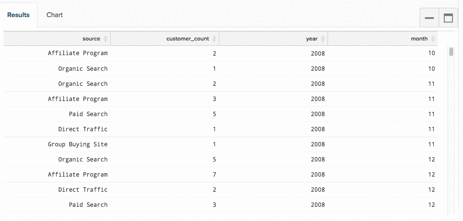

# Utilizzo di [!DNL SQL Report Builder]

>[!NOTE]
>
>Richiede le [autorizzazioni di amministratore](../../administrator/user-management/user-management.md) per creare e modificare i grafici SQL. `Standard` utenti possono riorganizzare questi grafici nei dashboard e `Read-only` utenti hanno la stessa esperienza dei grafici tradizionali. Inoltre, `Read-only` utenti non hanno accesso al testo della query.

Per ulteriori informazioni, consulta il [video di formazione](https://experienceleague.adobe.com/docs/commerce-knowledge-base/kb/how-to/mbi-training-video-sql-report-builder.html).

[!DNL SQL], o linguaggio di query strutturato, è un linguaggio di programmazione utilizzato per comunicare con i database. In [!DNL Commerce Intelligence], [!DNL SQL] viene utilizzato per eseguire query o recuperare dati dal Data Warehouse. Osserva i report sul tuo dashboard: dietro le quinte, ciascuno è alimentato da una query [!DNL SQL].

È possibile utilizzare [[!DNL SQL Report Builder]](../dev-reports/sql-rpt-bldr.md) per eseguire direttamente query sul Data Warehouse, visualizzare i risultati e trasformarli in un grafico. È possibile iniziare a creare un report con [!DNL SQL Report Builder] facendo clic su **[!UICONTROL Report Builder** > **[!DNL SQL Report Builder]]**.

Per ulteriori informazioni, consulta il [video di formazione](https://experienceleague.adobe.com/docs/commerce-knowledge-base/kb/how-to/mbi-training-video-sql-report-builder.html).

[!DNL SQL Report Builder] ti consente di eseguire query dirette sul tuo Data Warehouse, visualizzare i risultati e trasformarli rapidamente in un grafico. La parte migliore sull&#39;utilizzo di [!DNL SQL] per generare i rapporti è che non è necessario attendere i cicli di aggiornamento per eseguire iterazioni sulle colonne create. Se i risultati non sono corretti, puoi modificare ed eseguire nuovamente la query in modo rapido fino a quando le cose non corrispondono alle tue aspettative.

Questo argomento illustra come utilizzare [!DNL SQL Report Builder]. Dopo aver individuato il percorso da seguire, consulta l&#39;esercitazione [!DNL SQL] per le visualizzazioni oppure prova a ottimizzare alcune delle query scritte.

Coperto in questo articolo:

1. [Scrittura di una query](#writing)

1. [Esecuzione della query e visualizzazione dei risultati](#runquery)

1. [Creazione di una visualizzazione](#createviz)

1. [Salvataggio del report](#save)

## [!DNL SQL Report Builder] integrazioni

[[!DNL Google Analytics]](../importing-data/integrations/google-analytics.md) è l&#39;unica integrazione non disponibile per l&#39;utilizzo con [[!DNL SQL Report Builder]](../dev-reports/sql-rpt-bldr.md). Questa funzionalità è in fase di sviluppo.

Per iniziare a creare un report [!DNL SQL], fai clic su **[!UICONTROL Report Builder]** o **[!UICONTROL Add Report]** nella parte superiore di qualsiasi dashboard. Nella schermata [!DNL Report Picker], fare clic su **[!UICONTROL SQL Report Builder]** per aprire l&#39;editor [!DNL SQL].

## Introduzione

Per modificare un report, fare clic sull&#39;icona ingranaggio () nell&#39;angolo superiore destro di un grafico basato su [!DNL SQL] e fare clic su **[!UICONTROL Edit]**.

## Scrittura di una query {#writing}

>[!NOTE]
>
>[!DNL SQL Report Builder] query distinguono tra maiuscole e minuscole. Quando scrivi le query, assicurati di usare la maiuscola/minuscola corretta, altrimenti potresti riscontrare risultati imprevisti o errori.

Seguendo le [linee guida per l&#39;ottimizzazione delle query](../../best-practices/optimizing-your-sql-queries.md), scrivere una query nell&#39;editor [!DNL SQL].

>[!IMPORTANT]
>
>**Metriche nei report [!DNL SQL]** - Quando si inserisce una metrica in un report SQL, viene utilizzato il `current definition` della metrica.

Se la metrica verrà aggiornata in futuro, il report SQL *non* rifletterà le modifiche. Per rendere effettive le modifiche, è necessario modificare manualmente il rapporto.

Utilizzando i pulsanti nella parte superiore della barra laterale, è possibile alternare tra elenchi di tabelle e metriche disponibili per l&#39;utilizzo in [!DNL SQL Report Builder]. Se nell’elenco non trovi ciò che stai cercando, prova a cercarlo utilizzando la barra di ricerca nella parte superiore della barra laterale.

È inoltre possibile utilizzare la barra laterale nell&#39;editor [!DNL SQL] per inserire metriche, tabelle e colonne direttamente nelle query passando con il mouse sopra di esse e facendo clic su **[!UICONTROL Insert]**:

![Inserimento di una tabella nell&#39;editor [!DNL SQL].](../../assets/SQL_RB_Insert_Table.png)

>[!NOTE]
>
>Qualsiasi funzione [SELECT](https://www.postgresql.org/docs/9.5/sql-select.html#SQL-SELECT-LIST) o qualsiasi funzione che non muta dati supportata da PostgreSQL è supportata in SQL Report Builder. Sono inclusi, ma senza limitazioni, AVG, COUNT, COUNT DISTINCT, MIN/MAX e SUM.

Inoltre, qualsiasi tipo `JOIN` è supportato, ma Adobe consiglia di utilizzare solo INNER JOIN, in quanto è il meno costoso dei tipi `JOIN`.

## Esecuzione della query e visualizzazione dei risultati {#runquery}

Al termine della scrittura della query, fare clic su **[!UICONTROL Run Query]**. I risultati vengono visualizzati in una tabella sotto l&#39;editor SQL:

Se qualcosa non appare nei risultati, è possibile modificare la query ed eseguirla nuovamente fino a quando non si è soddisfatti.

A volte potresti visualizzare [messaggi sotto l&#39;editor con EXPLAIN](../../best-practices/optimizing-your-sql-queries.md). Se visualizzi uno di questi, significa che la query non è stata eseguita e richiede alcune regolazioni.

Dopo aver modificato la query, puoi passare alla creazione di una visualizzazione o al salvataggio del lavoro in una dashboard.

## Creazione di una visualizzazione {#createviz}

Per creare una visualizzazione con i risultati della query, fare clic sulla scheda **[!UICONTROL Chart]** nel riquadro `Results`. In questa scheda, seleziona:

* `Series` o la colonna che si desidera misurare, ad esempio **Elementi venduti**.
* `Category` o la colonna da utilizzare per segmentare i dati, ad esempio **origine acquisizione**.
* I valori `Labels` o dell&#39;asse X.

Ecco un rapido sguardo a come si presenta il processo di visualizzazione:

Per informazioni dettagliate su come creare una visualizzazione, consulta l&#39;[esercitazione Creazione di visualizzazioni da query SQL](../../tutorials/create-visuals-from-sql.md){: target="_blank"}.

## Salvataggio del report {#save}

Prima di salvare i dati, è necessario assegnare un nome al report. Ricorda di seguire le [linee guida sulle best practice per la denominazione](../../best-practices/naming-elements.md){: target="_blank"} e di scegliere qualcosa che comunichi chiaramente la natura del rapporto.

Fare clic su **[!UICONTROL Save]** nell&#39;angolo superiore destro dell&#39;editor [!DNL SQL] e selezionare il report `Type` (`Chart` o `Table`). Per concludere, seleziona il dashboard in cui salvare il report e fai clic su **[!UICONTROL Save to Dashboard]**.

### Analizzare i dati

#### [!DNL SQL Report Builder]

[[!DNL SQL Report Builder]](../dev-reports/sql-rpt-bldr.md) consente di eseguire query dirette sul Data Warehouse, visualizzare i risultati e trasformarli rapidamente in un report. L&#39;utilizzo di [!DNL SQL] consente inoltre a [di utilizzare [!DNL SQL] funzioni non disponibili](https://docs.aws.amazon.com/redshift/latest/dg/c_SQL_functions.html) nei Report Builder `Visual` o `Cohort`, offrendo così un maggiore controllo sui dati.

Le colonne calcolate create utilizzando [!DNL SQL] non dipendono dai cicli di aggiornamento, pertanto è possibile iterarle come si desidera e visualizzare immediatamente i risultati.

>[!NOTE]
>
>Questo vale solo per la struttura della colonna, non per l’aggiornamento dei dati. I nuovi dati dipendono ancora dai cicli di aggiornamento completati correttamente.

| **Questo è perfetto per...** | **Non è un&#39;ottima soluzione per...** |
|---|---|
| Analisti intermedi/avanzati | Principianti - è necessario conoscere [!DNL SQL]. |
| [!DNL SQL] esperto | Analisi semplici: la scrittura di una query può essere più efficace che utilizzare semplicemente [!UICONTROL Visual Report Builder]. |
| Creazione di colonne calcolate monouso | Condivisione con altri - considera il tuo pubblico: capiscono [!DNL SQL]? In caso contrario, potrebbero essere confusi dalla modalità di creazione del rapporto. |
| Dati con `one-to-many` relazioni |  |
| Verifica di una nuova colonna o analisi |  |

#### Risultati database e editor SQL

Nella maggior parte dei casi, le differenze nei risultati possono essere attribuite ai cicli di aggiornamento. Se [!DNL Commerce Intelligence] sta replicando i dati dal database al Data Warehouse, è possibile che vengano visualizzati risultati diversi anche quando si utilizza la stessa query.

Anche i problemi di connessione possono causare discrepanze. Passare alla pagina `Connections` facendo clic su **[!DNL Manage Data** > **Connections]** per estrarla. Si è verificato un errore per l&#39;integrazione del database in questione? In tal caso, potrebbe essere necessario [autenticare nuovamente l&#39;integrazione](https://experienceleague.adobe.com/docs/commerce-knowledge-base/kb/how-to/mbi-reauthenticating-integrations.html) per rieseguire l&#39;esecuzione.

Se tutte le integrazioni sono connesse correttamente e non sei nel bel mezzo di un ciclo di aggiornamento, qualcos’altro potrebbe non funzionare.

#### L&#39;eliminazione di un report [!DNL SQL] comporta anche l&#39;eliminazione delle colonne sottostanti dal mio Data Warehouse?

No, non si perdono colonne dal Data Warehouse, indipendentemente da come le si è create.

Le colonne create utilizzando `Data Warehouse Manager` non vengono modificate se si elimina un report o una query che le utilizza.

Le colonne create con [!DNL SQL Report Builder] non vengono salvate nel Data Warehouse.

#### `Report Builder` rispetto a `SQL Report Builder`

[!DNL SQL Report Builder] offre maggiore flessibilità durante la creazione e la strutturazione dei grafici. È possibile, ad esempio, selezionare i valori da visualizzare sugli assi `X` e `Y`. Per ulteriori informazioni sulla creazione di grafici in [!DNL SQL Report Builder], vedi l&#39;esercitazione [Creazione di visualizzazioni da [!DNL SQL] query](../../tutorials/create-visuals-from-sql.md).

#### `Cohort Report Builder` {#cohortrb}

A differenza di [!DNL Visual Report Builder], [[!DNL Cohort Report Builder]](../dev-reports/cohort-rpt-bldr.md) è destinato a uno scopo singolo, ovvero l&#39;analisi e l&#39;identificazione delle tendenze comportamentali di gruppi di utenti simili nel tempo. L&#39;utilizzo di [!DNL Cohort Report Builder] non richiede alcuna esperienza di [!DNL SQL], quindi puoi immergerti senza esitazioni se stai iniziando.

| **Questo è perfetto per...** | **Non è un&#39;ottima soluzione per...** |
|---|---|
| Analisti intermedi/avanzati | Principianti: sono necessarie coorti che definiscano la pratica. |
| Identificazione delle tendenze comportamentali nel tempo | Analisi qualitativa: può essere [completata](../dev-reports/create-qual-cohort-analysis.md), ma richiede assistenza Adobe. |

## Ricostruzione delle query dopo il ciclo di aggiornamento

Non è necessario ricreare le query. I report creati utilizzando [[!DNL SQL Report Builder]](../dev-reports/sql-rpt-bldr.md) vengono salvati come quelli creati nel `Report Builder` tradizionale. Il processo di aggiornamento per i grafici [!DNL SQL] è lo stesso: dopo l&#39;aggiornamento dei dati, i valori nei grafici verranno ricalcolati e rivisualizzati.

>[!NOTE]
>
>Quando si elimina un report/query [!DNL SQL], le colonne sottostanti non vengono eliminate dal Data Warehouse. Le colonne non vengono perse, indipendentemente dalla modalità di creazione.

* Le colonne create con Data Warehouse Manager non vengono influenzate dall&#39;eliminazione di un report o di una query che le utilizza.

* Le colonne create con SQL Report Builder non vengono salvate nel Data Warehouse.

## Ritorno a capo {#wrapup}

Se vuoi provare qualcosa di un po’ più impegnativo, perché non provare a scrivere una query ottimizzata per la visualizzazione? Per iniziare, consulta l&#39;[esercitazione sulla creazione di visualizzazioni da [!DNL SQL] query](../../tutorials/create-visuals-from-sql.md){: target="_blank"}.
