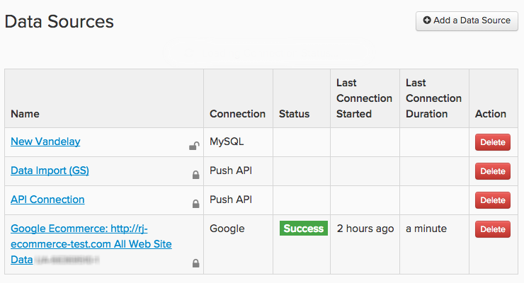

# Connettere i dati

In [!DNL Adobe Commerce Intelligence] le origini dati sono denominate `integrations`. Una volta connessa una `integration`, sarà possibile sfogliare le tabelle disponibili per la sincronizzazione in Data Warehouse Manager.

Le integrazioni vengono aggiunte e gestite utilizzando la pagina `Connections`, a cui è possibile accedere facendo clic su **[!UICONTROL Manage Data** > **Connections]**. Qui puoi vedere:

* un elenco di tutte le integrazioni connesse al tuo account

* il tipo di integrazione

* stato ([!DNL Google Analytics] e [!DNL Data Import API] connessioni hanno campi di stato vuoti)

* l&#39;ultima volta che è stato eseguito un test di connessione (`Last Connection Started` colonna)

## Tipi di integrazioni

Esistono quattro modi per immettere i dati in [!DNL Commerce Intelligence]: connettere un database, connettere un&#39;integrazione SaaS, caricare un file `.csv` o utilizzare l&#39;API Adobe.

## Integrazioni di database

[!DNL Commerce Intelligence] supporta database SQL e NoSQL come [MySQL](../../importing-data/integrations/mysql-via-ssh-tunnel.md), [Microsoft SQL](../integrations/microsoft-sql-server.md), [MongoDB](../integrations/mongodb-via-ssh-tunnel.md) e [PostgreSQL](../integrations/postgresql.md).

Sebbene sia possibile connettere direttamente il database a [!DNL Commerce Intelligence] utilizzando le credenziali del database, Adobe consiglia di utilizzare un metodo di crittografia collaudato, ad esempio un tunnel SSH. In questo modo i dati rimarranno sicuri durante la distribuzione nel Data Warehouse. Per la registrazione della chiave host SSH, gli errori e la risoluzione dei problemi, vedere [Verifica della chiave host SSH](../integrations/ssh-host-key-verification.md).

A seconda del metodo di connessione e del tipo di database, potrebbero essere necessarie alcune competenze tecniche per completare la configurazione.

## `SaaS` integrazioni

spree-commerce-logo.png

Le integrazioni `SaaS` sono servizi come [[!DNL Google Adwords]](../integrations/google-adwords.md), [[!DNL Salesforce]](../integrations/salesforce.md) e [[!DNL Zendesk]](../integrations/zendesk.md). Poiché i dati di terze parti risiedono sul server del fornitore, non è possibile accedervi direttamente come con i dati del database.

In genere, impostare un&#39;integrazione in [!DNL Commerce Intelligence] è semplice come immettere semplicemente le credenziali dell&#39;account. Alcuni servizi potrebbero richiedere una chiave API per completare l’autorizzazione. Consulta la [sezione integrazioni](../integrations/integrations.md) per istruzioni su come generare le credenziali necessarie.

## Caricamento file

Non sei sicuro di come ottenere i dati da un’origine supplementare nel tuo Data Warehouse? [L&#39;utilizzo della funzionalità `File Upload`](../connecting-data/using-file-uploader.md) è un buon modo per estrarre i dati che non sono necessari per prendere decisioni quotidiane. Seguendo le regole di formattazione, puoi caricare rapidamente `.csv` file nel tuo Data Warehouse e unirli ad altre origini dati.

## [!DNL Commerce Intelligence] `Import API`

Se si desidera automatizzare il recupero dei dati da una delle proprie origini, è possibile utilizzare [!DNL Commerce Intelligence] `Import API`. Fondamentalmente, se non si trova in un database o in un&#39;integrazione con `SaaS`, la funzione `Import API` è la scelta migliore.

L’utilizzo dell’API richiede un po’ di esperienza tecnica: chi ha familiarità con la scrittura e la manutenzione di un piccolo script Ruby o PHP è più che qualificato.

Per ulteriori informazioni su come iniziare a utilizzare `Import API`, consulta il [sito per sviluppatori](https://developer.adobe.com/commerce/services/reporting/) e [come generare una chiave API](https://developer.adobe.com/commerce/services/reporting/import-api/).

## Aggiungere un’integrazione

Per aggiungere un&#39;integrazione, fare clic su **[!UICONTROL Manage Data** > **Connections]** e quindi su **[!UICONTROL Add a New Data Source]**. Fai clic sull’icona dell’integrazione da aggiungere e segui le istruzioni contenute negli argomenti dell’Aiuto per configurare:

* [Domande frequenti sull’integrazione](https://support.magento.com/hc/en-us/sections/360003161871-Integration-FAQ)
* [Integrazioni disponibili: `SaaS` e `database`](../integrations/integrations.md)
* [Consolidamento delle tabelle](../../../best-practices/consolidating-your-tables.md)
* [Limitazione dell&#39;accesso al database](../../../administrator/account-management/restrict-db-access.md)

**Integrazione non visualizzata?** Per renderle visibili nel tuo account, è necessario attivare alcune integrazioni. Se si cerca qualcosa come [!DNL Facebook] ma non è elencato, [invia un ticket di supporto](https://experienceleague.adobe.com/docs/commerce-knowledge-base/kb/troubleshooting/miscellaneous/mbi-service-policies.html).

**Se viene visualizzato uno stato di errore per un&#39;integrazione**, consultare la [sezione per la risoluzione dei problemi](https://support.magento.com/hc/en-us/sections/360003078151).

## Monitorare lo stato degli aggiornamenti (facoltativo)

Dopo aver connesso le origini, potrebbe essere utile automatizzare un controllo di integrità di base per verificare il completamento degli aggiornamenti completi. Utilizza l&#39;API [Aggiorna stato ciclo](https://developer.adobe.com/commerce/services/reporting/update-cycle-status-api/) nella documentazione per gli sviluppatori per recuperare il ciclo di aggiornamento completato più recente per il client e visualizzarlo in dashboard o avvisi interni.

