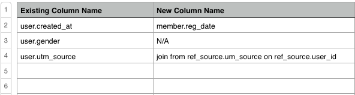

# Migrazione dei dati

La migrazione a un nuovo schema di database, server o database di reporting non deve essere troppo complessa. Il [[!DNL Adobe] team dei servizi](https://experienceleague.adobe.com/docs/commerce-knowledge-base/kb/troubleshooting/miscellaneous/mbi-service-policies.html) offre assistenza per la migrazione.

Per garantire una transizione quanto più fluida possibile, è necessario essere il più dettagliati possibile durante l’invio della richiesta di migrazione. Questo argomento contiene tutto il necessario per inviare una richiesta e iniziare a eseguire la migrazione. Fornendoci un quadro completo delle tue esigenze, assicurati che il tuo progetto abbia un ambito appropriato e che la stima sia accurata.

## Introduzione {#started}

Prima di iniziare, è necessario conoscere le risposte alle seguenti domande:

* **Il nuovo database si trova su un nuovo server?** Prima di inviare una richiesta, aggiornare le impostazioni della connessione dati in **[!UICONTROL Manage Data** > **Connections]**. Se è necessario un aggiornamento su come eseguire questa operazione, passare alla sezione [`Integrations`](../integrations/integrations.md) e trovare le istruzioni per il tipo di database utilizzato.

* **Nel nuovo database sono presenti tutti i dati storici o è necessario eseguirne la migrazione?** È possibile consolidare i dati storici e i nuovi dati durante il processo di migrazione. Anche se non hai bisogno di un consolidamento, comunicaci nella tua richiesta.

Dopo aver ricevuto le risposte a quanto sopra, è necessario conoscere il tipo di migrazione. Il nuovo database avrà lo schema [`same`](#sameschema) o uno schema [`different`](#newschema)? Nelle discussioni seguenti trovi istruzioni dettagliate per ciascun tipo di migrazione.

## Migrazione a un nuovo database con lo stesso schema {#sameschema}

Quando si invia la richiesta, verificare che lo schema del database non stia cambiando e che la connessione sia già impostata in [!DNL Adobe Commerce Intelligence].

Se il database ha un nuovo nome, includilo nella richiesta in modo che sia possibile migrare correttamente le dashboard.

Se il nome del database non viene modificato, la migrazione è completa. Le dashboard e i rapporti verranno aggiornati al termine del prossimo aggiornamento completo.

## Migrazione a un nuovo database con uno schema diverso {#newschema}

>[!IMPORTANT]
>
>Se alcune colonne di dati non hanno colonne equivalenti nel nuovo database, è possibile che alcune analisi vadano perse nel processo.

Per completare correttamente questo tipo di migrazione, le colonne di dati esistenti devono corrispondere ai loro equivalenti nel nuovo database. Questo non è obbligatorio, ma l’esecuzione della corrispondenza per Dell consente di velocizzare il tempo di risposta della richiesta e ridurre il prezzo della migrazione.

Se ti senti a tuo agio a fare da solo la corrispondenza, segui queste istruzioni e allega alla tua richiesta il foglio di calcolo finito:

1. Esaminare tutte le tabelle e le colonne attualmente sincronizzate con il Data Warehouse (**[!UICONTROL Manage Data** > **Data Warehouse]**).

1. In un foglio di calcolo creare una scheda per ogni tabella da migrare al nuovo database.

1. In ogni scheda, crea una colonna per tutte le colonne esistenti da migrare. Adobe consiglia di denominarlo in modo analogo a `Existing column name`.

1. È inoltre necessario creare un&#39;altra colonna per gli equivalenti di colonna nel nuovo database in ogni scheda del foglio di calcolo. Adobe consiglia di denominare la colonna in modo analogo a `New column name`.

1. Inserire le colonne esistenti e le relative equivalenti. Se una colonna esistente non ha un nuovo equivalente, immettere `N/A`.

   Inoltre, se esiste un nuovo metodo per calcolare le stesse informazioni nel nuovo database, immetterlo nella colonna [`New column name`].

Ecco un esempio:

>[!NOTE]
>
>Se alcune colonne di dati non hanno colonne equivalenti nel nuovo database, è possibile che alcune analisi vadano perse nel processo.

## Come si invia una richiesta? {#submitreq}

Puoi contattarci inviando [una richiesta di supporto](https://experienceleague.adobe.com/docs/commerce-knowledge-base/kb/troubleshooting/miscellaneous/mbi-service-policies.html).

Se hai seguito i passaggi della sezione precedente per creare il foglio di calcolo corrispondente alle colonne, non dimenticare di allegarlo.

## Cosa succede dopo? {#wrapup}

La determinazione dell’ambito del progetto richiede una certa collaborazione tra l’utente e l’analista del team di Commerce Services che esegue la migrazione. La complessità delle modifiche e la reattività dell’utente e dell’analista influiscono direttamente sul tempo necessario per la migrazione. Dopo aver individuato i dettagli, verrà stabilita una sequenza temporale e inviata all&#39;utente con una descrizione del lavoro.
