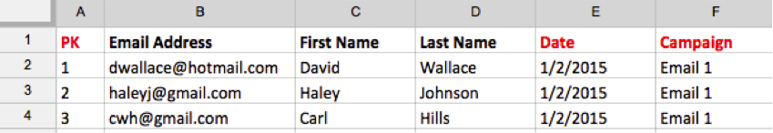

# Importa dati [!DNL Mailchimp]

Per ottenere un quadro completo delle tue attività di campagna, puoi importare i dati della tua campagna e-mail di [!DNL Mailchimp] in [!DNL Commerce Intelligence]. Per completare l&#39;importazione, eseguire le operazioni seguenti per ogni campagna [!DNL Mailchimp]:

## Esporta dati di apertura {#opens}

1. Dopo aver effettuato l&#39;accesso a [!DNL Mailchimp], passare alla scheda `Campaigns`.

   

1. Fare clic su **[!UICONTROL View Report]** accanto al nome della campagna.

   

1. Fare clic sul numero **[!UICONTROL Opened]**.

   

1. Fare clic su **[!UICONTROL Export]** e salvare il file `.csv`.

   Aggiungere `primary key`, `date (mm/dd/yyyy)` e `campaign name` colonne a questo file. Assicurarsi che `primary keys` siano univoci per ogni riga.

   

## Esporta dati clic {#clicks}

1. Tornare alla schermata `View Report` per la campagna.

1. Fare clic sul numero `Clicked`.

   

1. Fare clic sul numero sotto la colonna `Total Clicks` OPPURE `Unique Clicks`.

   

1. Fare clic su **[!UICONTROL Export]** e salvare il file `.csv`.

   Aggiungere `Primary Key`, `date (mm/dd/yyyy)`, `campaign name` e `URL` colonne a questo file. Non è necessario aggiungere l’URL completo, solo un elemento che consente di sapere cosa è stato fatto clic.

   

1. Ripeti i passaggi 3 e 4 per ogni URL su cui hai fatto clic nell&#39;e-mail, combinando tutti i dati nello stesso file `.csv` al termine.

## Esporta dati inviati {#sent}

1. Passa alla scheda `Campaigns` di [!DNL Mailchimp].

1. Fai clic su **[!UICONTROL View Report]** accanto al nome della campagna.

1. Fare clic sul numero accanto a `Recipients`.

   

1. Fare clic su **[!UICONTROL Export]** e salvare il file `.csv`.

   Aggiungere `Primary Key`, `date (mm/dd/yyyy)` e `campaign name` colonne a questo file.

   

## Prepara i file per il caricamento in [!DNL Commerce Intelligence] {#upload}

Ogni file - `Opens`, `Clicks` e `Sent` - deve essere caricato in [!DNL Commerce Intelligence] come file separato. Adobe consiglia di denominare i file utilizzando questa convenzione di denominazione: `MailChimp\_ACTION\_DATE`. Sostituisci `ACTION` con `Open`, `Click` o `Sent` e sostituisci `DATE` con la data di esportazione.

Quando sei pronto a caricare i file, utilizza la funzionalità [`File Upload`](../connecting-data/using-file-uploader.md) per inserire i dati nel tuo Data Warehouse.
