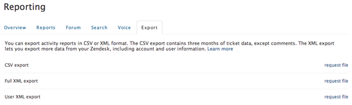

# Controlla dati Zendesk

Hai trovato qualcosa di strano nei tuoi [[!DNL Zendesk] dati](../integrations/exp-zendesk-data.md)? Per individuare il problema, è necessario esplorare i dati. È possibile eseguire l&#39;operazione esportando i dati di [!DNL Zendesk] in un file scaricabile.

## Abilitazione dell’esportazione dei dati

Esportazione dati non attualmente abilitata per tutti gli account [!DNL Zendesk]. Per attivare questa funzionalità, [invia un ticket di supporto](https://experienceleague.adobe.com/docs/commerce-knowledge-base/kb/troubleshooting/miscellaneous/mbi-service-policies.html?lang=it), specificando il nome del sottodominio [!DNL Zendesk].

>[!NOTE]
>
>Solo `Enterprise` e `Plus` piani hanno attualmente accesso a questa funzione.

Dopo aver abilitato l&#39;esportazione dei dati, solo gli amministratori di un dominio e-mail specifico possono esportare i dati dall&#39;account [!DNL Zendesk]. Questo dominio e-mail è in genere lo stesso dominio e-mail di [!DNL Zendesk]. Il dominio e-mail del proprietario dell’account viene utilizzato come predefinito, ma puoi modificarlo se necessario.

## Esportazione in un file scaricabile

1. Fare clic sull&#39;icona Admin (logo ingranaggio) nella barra laterale e scegliere **[!UICONTROL Manage** > **Reports]**.
1. Fare clic sulla scheda **[!UICONTROL Export]**.
1. Fare clic su **[!UICONTROL Request file]** accanto a Esportazione XML completa come illustrato nell&#39;immagine seguente.

   A questo punto, inizia una build; ricevi una notifica tramite e-mail al completamento.
   

1. Fai clic sul collegamento nella notifica e-mail per scaricare un file zip contenente il rapporto.

   Questo link di download è valido per almeno tre giorni.

Questo processo crea un file XML contenente tutte le informazioni memorizzate nell&#39;account [!DNL Zendesk] corrente, inclusi i dati dei ticket (con commenti), i dati utente e i dati account. A questo punto, puoi [inviare un ticket di supporto](https://experienceleague.adobe.com/docs/commerce-knowledge-base/kb/troubleshooting/miscellaneous/mbi-service-policies.html?lang=it) (assicurati di allegare il file!) per esaminare più da vicino i tuoi dati. Se il file è troppo grande, condividerlo con il team [!DNL Commerce Intelligence] tramite [!DNL Dropbox] o [!DNL Google Drive].

Per ulteriori informazioni sulle [!DNL Zendesk] esportazioni di file, consulta la [[!DNL Zendesk] documentazione di esportazione ufficiale](https://support.zendesk.com/hc/en-us/articles/4408886165402-Exporting-data-to-a-JSON-CSV-or-XML-file).
