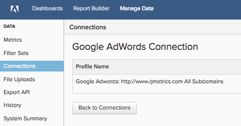

# Connetti [!DNL Google Adwords]

>[!NOTE]
>
>Richiede [Autorizzazioni amministratore](../../../administrator/user-management/user-management.md).

Hai fatto la tua ricerca, creato i tuoi annunci, lanciato la tua campagna [!DNL Google]. Ora è il momento di analizzare i dati di spesa degli annunci e verificare se i soldi vengono spesi in modo efficace. Utilizzando i dati di spesa degli annunci, puoi [misurare il ROI delle campagne unendo i costi pubblicitari e il valore del ciclo di vita del cliente (CLV)](../../analysis/roi-ad-camp.md) degli utenti acquisiti dalle campagne.

Inizia immettendo le tue credenziali di [!DNL Google Adwords] in [!DNL Commerce Intelligence].

1. Vai alla pagina `Connections` in **Gestisci dati > Integrazioni**.
1. Fai clic su **Aggiungi integrazione**, in alto a destra nella schermata.
1. Fare clic sull&#39;icona **[!DNL Google Adwords]**. Verrà aperta la pagina delle credenziali [!DNL Google Adwords].
1. Immetti le tue credenziali di [!DNL Google Analytics]. Al termine del processo di autorizzazione, l&#39;utente viene reindirizzato a [!DNL Commerce Intelligence].
1. Viene visualizzato un elenco di ID profilo. Controllare i profili a cui connettersi [!DNL Commerce Intelligence].

   

1. Le modifiche vengono salvate automaticamente, quindi al termine fai clic su **[!UICONTROL Back to Connections]**.

Se hai più profili e hai bisogno di aiuto per identificare quale sia, consulta la sezione `Connecting Multiple Google Analytics profiles` di seguito.

## Connessione di più profili [!DNL Google Analytics]

È possibile che più siti Web siano connessi a un unico account [!DNL Google Analytics], identificato dal proprio ID profilo [!DNL Google Analytics]. In questo caso, puoi includere tutti gli ID profilo in [!DNL Commerce Intelligence]. Controlla gli ID profilo che vuoi includere durante il passaggio di selezione del profilo.

**Per identificare l&#39;ID profilo Google Analytics di un sito Web specifico:**

1. Accedi a [!DNL Google Analytics]
1. Passa alla dashboard [!DNL Google Analytics] del sito Web specifico
1. Controlla l&#39;URL: l&#39;ID profilo corrisponde agli otto numeri seguenti `p` alla fine della riga:

   `www.google.com/analytics/web/#home/a11345062w43527078p**XXXXXXXX**`

## Disconnessione di [!DNL Google Adwords]

1. Visita la pagina delle [!DNL Google] [impostazioni account](https://www.google.com/account/about/?hl=en).
1. Nella sezione `Security`, fare clic su **[!UICONTROL edit]** accanto a `Authorizing` applicazioni e siti.
1. Fare clic su **[!UICONTROL revoke access]**.

## Correlato

* [Nuova autenticazione delle integrazioni](https://experienceleague.adobe.com/docs/commerce-knowledge-base/kb/how-to/mbi-reauthenticating-integrations.html)
* [Tracciare l&#39;origine di riferimento dell&#39;ordine tramite [!DNL Google ECommerce]](../integrations/google-ecommerce.md)
* [Tracciare l&#39;origine di riferimento dell&#39;utente nel database](../../analysis/google-track-user-acq.md)
* [Scopri le fonti e i canali di acquisizione più importanti](../../analysis/most-value-source-channel.md)
* [Aumentare il ROI nelle campagne pubblicitarie](../../analysis/roi-ad-camp.md)
* [Come funziona l&#39;attribuzione  [!DNL Google Analytics] UTM?](../../analysis/utm-attributes.md)
