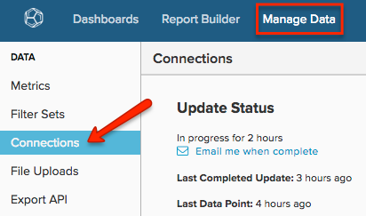

# Connetti server [!DNL Microsoft SQL]

>[!NOTE]
>
>Richiede [Autorizzazioni amministratore](../../../administrator/user-management/user-management.md).

In questo argomento viene illustrato come connettere il database [!DNL Microsoft SQL] a [!DNL Commerce Intelligence] in un processo in quattro fasi. Questo processo richiede alcune competenze tecniche relative alle connessioni server e a SQL e potrebbe richiedere il supporto degli sviluppatori del team.

[!DNL Commerce Intelligence] supporta [!DNL Amazon RDS], [!DNL EC2], [!DNL Microsoft SQL Azure] e la maggior parte degli altri provider di server cloud. Se hai una domanda sul tuo host specifico, [invia un ticket di supporto](https://experienceleague.adobe.com/docs/commerce-knowledge-base/kb/troubleshooting/miscellaneous/mbi-service-policies.html) chiedendoci di fornirci queste informazioni.

Il sistema deve eseguire le query SELECT sul database. Questa operazione viene eseguita inizialmente per ottenere un’istantanea della struttura del database e quindi regolarmente nel corso del tempo per mantenere i dati aggiornati. Gli aggiornamenti sono incrementali e Adobe limita la frequenza e il tempo di aggiornamento per evitare carichi indesiderati sul server.

Il modo migliore per eseguire questa operazione è connettersi al server di database tramite TCP/IP. Creare un utente che possa eseguire solo query SELECT e, facoltativamente, che possa selezionare solo i dati delle tabelle specificate. Questa operazione deve essere eseguita per ciascuno dei server a cui ci si connette [!DNL Commerce Intelligence].

## Connessione di `Microsoft SQL` a [!DNL Commerce Intelligence]:

1. Verificare che il server consenta connessioni su TCP/IP e autenticazione in modalità mista.

1. Verificare che il firewall consenta la connessione dell&#39;IP dedicato del server.

   L&#39;indirizzo IP utilizzato per connettersi al server è disponibile nella sezione connessioni della pagina `Settings`.

1. Creare un utente per accedere al server di database. Sono disponibili due opzioni: tramite `UI` o tramite `query`:
   * `UI`
   * `Query`

1. Immettere l&#39;indirizzo IP del server, il nome utente e la password in [!DNL Commerce Intelligence] in **[!UICONTROL Manage Data** > **Connections]**.

   

1. Fare clic su **[!UICONTROL Add a Data Source]**.

1. Selezionare per connettere un database `Microsoft SQL` e immettere le credenziali nei campi della nuova pagina `Connections`.

   Se si utilizza `Windows Azure`, è necessario specificare anche un nome di database.
