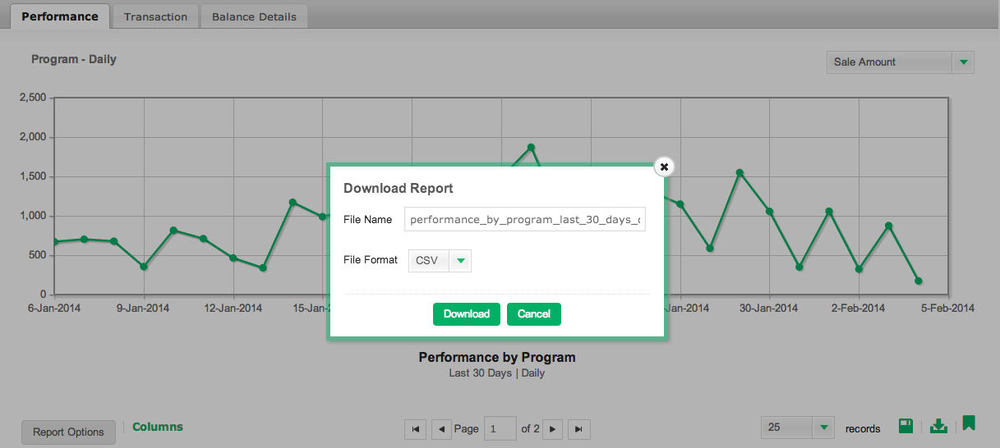

# Convalida dati in [!DNL Mixpanel]

Quando [!DNL Adobe Commerce Intelligence] si connette per la prima volta ai dati di [!DNL Mixpanel], l&#39;Account Manager o l&#39;analista potrebbe richiedere di fornire esportazioni di dati da [!DNL Mixpanel] a scopo di convalida. Ciò ti consente di confermare che hai sincronizzato tutti gli stessi dati disponibili direttamente in [!DNL Mixpanel].

## Processo di esportazione dati: `Events`

1. Visita la sezione `Segmentation` e visualizza `Your Top Events`.

   

1. Seleziona `Past 96 Hours` per l&#39;intervallo di tempo

   

1. Scorri fino alla parte inferiore destra del report ed esporta un file `.csv`:

   

1. Invia il file `.csv` all&#39;account manager o all&#39;analista con cui stai lavorando in questo processo di convalida.

