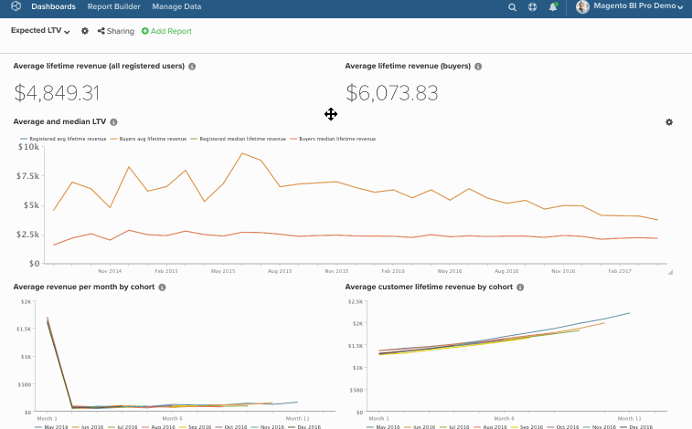

# Modifica in serie dei grafici nei dashboard

La funzione di modifica in serie consente di modificare facilmente i nomi dei grafici e le date nei dashboard. Ad esempio, si desidera che tutti i grafici di un dashboard specifico facciano riferimento a un singolo store e a un report su base mensile anziché trimestrale. Anziché modificare tutto manualmente, lasciare che la funzionalità `bulk-editing` esegua il lavoro. In questo argomento imparerai a utilizzare:

* [Funzionalità  [!DNL Find/Replace] &#x200B;](#findreplace)

* [Funzionalità  [!DNL Prepend Name] &#x200B;](#prepend)

* [Funzionalità  [!DNL Change Dates] &#x200B;](#dates)

Detto questo, considera questo - *Queste modifiche devono essere permanenti?* In caso contrario, provare a clonare il dashboard e quindi a modificare le date nel nuovo dashboard. In questo modo è possibile mantenere il dashboard originale senza interrompere le modifiche necessarie.

>[!NOTE]
>
>Se stai modificando numerosi rapporti, il processo di aggiornamento potrebbe richiedere un po’ di tempo.

## Utilizzo di [!DNL Find/Replace] {#findreplace}

1. Fai clic sull&#39;icona a forma di ingranaggio () accanto al nome del dashboard, quindi sulla finestra [!UICONTROL Bulk Edit Reports].

1. Fare clic su **[!UICONTROL Chart Title Find and Replace]** nel popup.

1. Nel campo `Chart Title Find` digitare le parole o i caratteri che si desidera trovare.

1. Nel campo `Replace With` digitare le parole o i caratteri che devono sostituire il contenuto del campo `Find`.

1. Fare clic su **[!UICONTROL Update Reports]**.

Esempio:

## Anteprima di `Chart Names` {#prepend}

1. Fai clic sull&#39;icona a forma di ingranaggio () accanto al nome del dashboard, quindi sulla finestra [!UICONTROL Bulk Edit Reports].

1. Fare clic su **[!UICONTROL Prepend Report Names]** nel popup.

1. Digitare le parole o i caratteri con cui si desidera anteporre i grafici.

1. Fare clic su **[!UICONTROL Update Reports]**.

Esempio:

## Modifica di `Dates` {#dates}

1. Fai clic sull&#39;icona a forma di ingranaggio () accanto al nome del dashboard, quindi seleziona la finestra [!UICONTROL Bulk Edit Reports].

1. Fare clic su **[!UICONTROL Change Dates]** nella finestra popup.

1. Imposta i nuovi `Start/End Date` e `Time Interval`. È inoltre possibile lasciare invariati questi campi.

1. Fare clic su **[!UICONTROL Update Reports]**.

Esempio:

