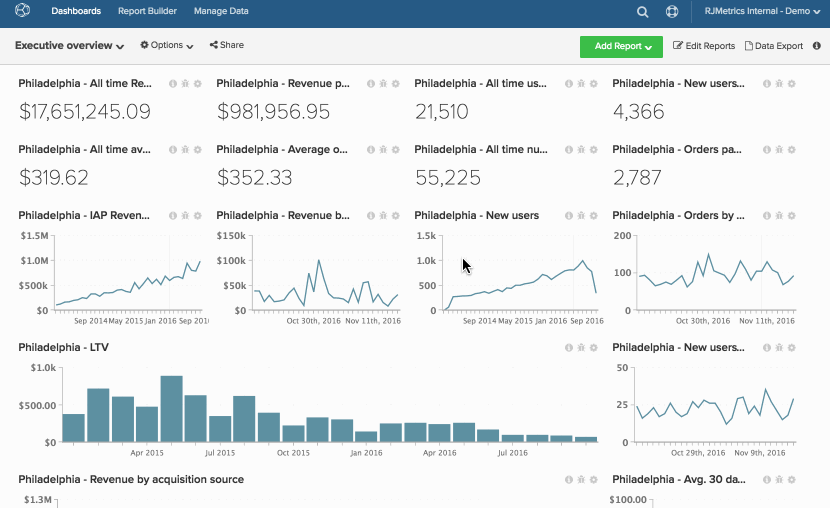

# Clonare un dashboard

La clonazione di un dashboard consente di copiare tutti i report di un dashboard in un nuovo dashboard.

Questa funzione è utile se desideri ricreare un set di grafici esistente ma cambiare la prospettiva (ad esempio, una visualizzazione dati diversa, un mercato diverso, un sito Web o un negozio diversi). Dopo aver duplicato il dashboard, puoi modificare ciascuno dei nuovi grafici per modificarne la metrica, la visualizzazione dati, il filtro o il raggruppamento.

1. Per clonare un dashboard, fare clic su **[!UICONTROL Options]** nella parte superiore dello schermo.

1. Nel menu a discesa , fare clic su **[!UICONTROL Save As]**.

1. Quando richiesto, immettere `New Dashboard Name`. Adobe consiglia di assegnare nomi che indichino immediatamente quali informazioni sono contenute nel dashboard.

   Si sta ad esempio clonando un dashboard denominato `Customer Activity`. Questa dashboard conteneva informazioni sull’attività del cliente per la tua posizione a Philadelphia, ma ora desideri creare una dashboard per la posizione a New York. Questo dashboard potrebbe essere denominato `New York City - Customer Activity`.

1. Utilizzare i campi `Chart Title Find` e `Chart Title Replace` per trovare tutti i grafici con `Philadelphia` nel titolo e sostituirli con `New York City`.

   Se non si immettono valori in questi campi, un `(2)` aggiunge automaticamente alla fine di tutti i titoli del grafico nel nuovo dashboard.

1. Fare clic su **[!UICONTROL Save]** per clonare il dashboard.

Esempio:

