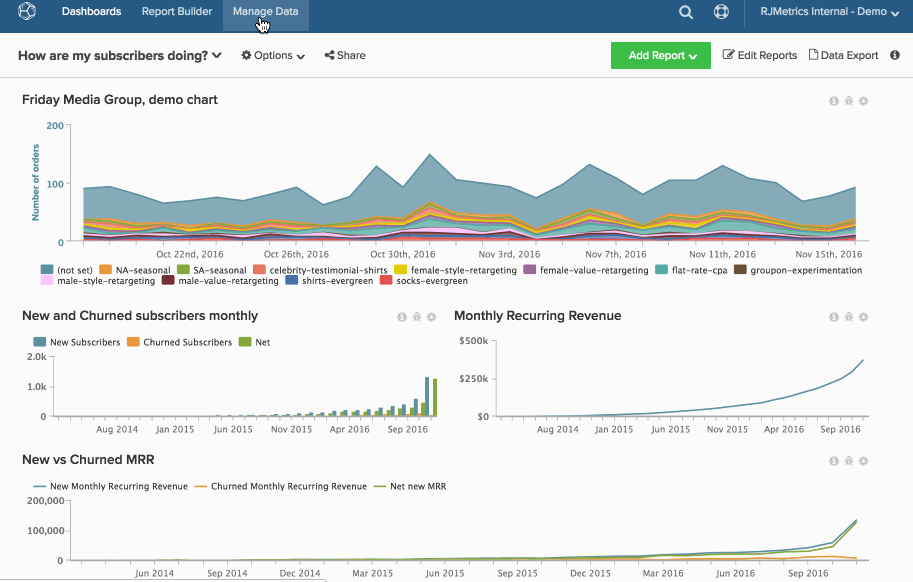

# Eliminare definitivamente un grafico

Anche se [rimuovi un grafico dal dashboard](../../data-user/dashboards/remove-charts-dashboard.md), questo esiste ancora nel tuo account [!DNL Commerce Intelligence].

Per eliminare definitivamente un grafico:

1. Fare clic su **[!UICONTROL Account Setting]** nella barra laterale.

1. Fare clic su **[!UICONTROL Charts]**.

1. I grafici che puoi eliminare (in base alle autorizzazioni dell’utente e alla proprietà) vengono visualizzati sul lato destro dello schermo.

1. Fare clic sulla casella di controllo accanto alla linea del grafico che si desidera eliminare.

1. Fare clic su **[!UICONTROL Delete Selected]**.

   >[!NOTE]
   >
   >Se il grafico viene utilizzato in un dashboard o in un riepilogo e-mail, viene visualizzata una notifica. Per continuare, confermare l&#39;eliminazione e quindi fare clic su **[!UICONTROL Force Deletion]**.

Esempio:

<!--{: width="630" height="402"}-->
