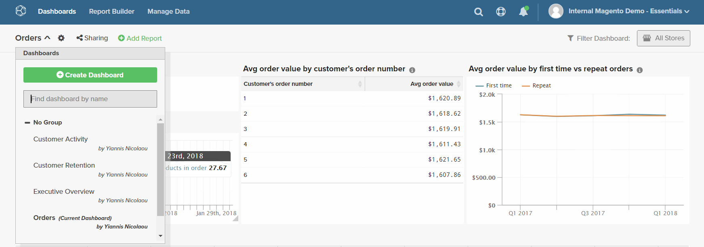
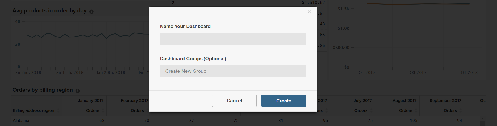

# Dashboard

Le dashboard di [!DNL Adobe Commerce Intelligence] offrono una rapida panoramica delle prestazioni del tuo negozio e dell&#39;attività di vendita. I singoli dashboard possono essere condivisi con altri utenti e organizzati in gruppi logici. È inoltre possibile impostare diversi livelli di autorizzazione per altri utenti.

È facile creare un rapporto, aggiungerlo a una dashboard ed esportare i dati in Excel. Grafici e report possono essere ridimensionati e trascinati nella posizione desiderata nel dashboard.

## Creazione di dashboard {#createdash}

Le dashboard sono contenitori condivisibili a tema per le analisi create in Report Builder. In questo modo puoi incoraggiare il tuo team a collaborare e mantenere un’unica fonte di verità in tutta l’organizzazione.

*Se sei un amministratore o un utente Standard*, puoi creare un dashboard facendo clic sul menu a discesa `Dashboard Options` e scegliendo `Create New dashboard`.

Sta a te definire l’aspetto delle dashboard create. Puoi disporre e ridimensionare gli elementi nel dashboard in qualsiasi modo desideri in base alle tue esigenze e al tuo flusso di lavoro.

### Creare un dashboard

1. Scegliere **[!UICONTROL Dashboards]** dal menu.

1. Il nome del dashboard di default viene visualizzato nell&#39;angolo superiore sinistro dell&#39;intestazione del dashboard. Fare clic sulla freccia giù () per visualizzare le opzioni disponibili.

   

1. Fare clic su **[!UICONTROL Create Dashboard]**. Quindi, effettua le seguenti operazioni:

   * Immetti `Name` per il dashboard.

   * Per creare un `Group` per il dashboard, immettere il nome del gruppo.

     Se, ad esempio, nell&#39;installazione di Commerce sono presenti più visualizzazioni dello store, è possibile creare un gruppo per ogni visualizzazione dello store.

   * Fare clic su **[!UICONTROL Create]**.

   

   * Il nome del nuovo dashboard viene visualizzato nell&#39;angolo superiore sinistro. Fare clic sulla freccia giù () per visualizzare le opzioni. Se avete creato un gruppo, il nuovo quadro comandi viene visualizzato sotto il gruppo nell&#39;elenco.

### Aggiungere un rapporto

1. Per aggiungere un rapporto, effettuare una delle seguenti operazioni:

   * Fare clic sul prompt **[!UICONTROL Add a report]** sulla pagina.

   * Nell&#39;intestazione del dashboard, fare clic su **[!UICONTROL Add Report]**.

     

1. Fare clic su **[!UICONTROL Create Report]** per visualizzare **[!UICONTROL Report Builder Options]**.

   

## Disporre gli elementi su un dashboard

* Per ridimensionare un grafico o un report, trascinare l&#39;angolo inferiore destro sulla nuova dimensione.

* Per spostare un grafico o un report, posizionare il cursore del mouse sul titolo o sull&#39;intestazione fino a quando il cursore non assume la forma di una croce. Quindi trascinarlo nella posizione desiderata.

## Gestione delle dashboard {#managedash}

In **[!DNL Manage Data** > **Dashboards]** è possibile gestire le autorizzazioni utente per i dashboard di tua proprietà, eliminare i dashboard non più necessari e impostare un dashboard predefinito.

### Condivisione delle dashboard {#sharingdash}

Per ridimensionare [!DNL Commerce Intelligence] in tutta l&#39;organizzazione e ottenere informazioni utili, Adobe ti incoraggia a condividere le dashboard create con altri membri del team. *Puoi condividere i dashboard di tua proprietà* facendo clic sull&#39;opzione `Share Dashboard` nella parte superiore della pagina.

Quando condividi una dashboard, puoi assegnare le autorizzazioni in tutta l’organizzazione OPPURE su base individuale, il che significa che puoi decidere chi può visualizzare e modificare i rapporti.

>[!NOTE]
>
>`Read-Only` utenti hanno accesso solo alle dashboard che sono condivise direttamente con loro e non possono cercare e aggiungere dashboard da soli. Non dimenticate di tenerli in loop!

### Accesso ai dashboard condivisi {#accessshared}

*Se sei un utente Amministratore o Standard* e desideri aggiungere un dashboard condiviso al tuo account, fai clic su **[!UICONTROL Dashboard Options]** e quindi su **[!UICONTROL Find]** nel menu a discesa.

<!--{: width="1000" height="535"}-->

### Gestire le impostazioni del dashboard

1. Scegliere **[!DNL Manage Data** > **Dashboards]** dal menu.

1. Se applicabile, immettere un nuovo `Dashboard Name`.

1. Per assegnare il dashboard a un `Dashboard Group` specifico, scegliere dall&#39;elenco dei gruppi.

   **`Permissions`**

   Per concedere a tutti gli utenti lo stesso livello di accesso al dashboard, effettua le seguenti operazioni:

   1. In **`Shared with`** scegliere una delle opzioni seguenti:

      * `View`
      * `Edit`
      * `None`

   1. Quando viene richiesta la conferma, fare clic su **[!UICONTROL OK]** per aggiornare il livello di autorizzazioni per ogni utente.

   1. Per modificare il livello di autorizzazione di una persona, individuare l&#39;utente nell&#39;elenco e modificare il livello di autorizzazione. La modifica viene salvata automaticamente.

   **`Default`**

   1. Per impostare questo dashboard come predefinito per l&#39;account [!DNL Commerce Intelligence], fare clic su **[!UICONTROL Make Default]**.

   **`Remove`**

   1. Per rimuovere il dashboard, fare clic su **[!UICONTROL Delete Dashboard]**.
