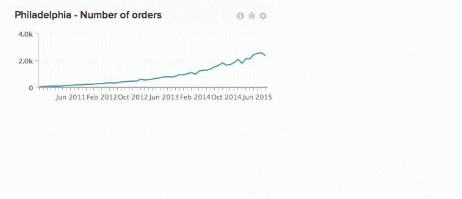

# Utilizzo dei grafici nei dashboard

Numeri scalari. Grafici a barre. Grafici che si estendono per lunghi periodi. Ogni grafico visualizza le informazioni in modo diverso, il che significa che le dimensioni e la posizione dei grafici non costituiscono una soluzione valida per tutti. In [!DNL Commerce Intelligence] è possibile ridimensionare e ridisporre i grafici per creare l&#39;area di lavoro ideale.

*Per ridimensionare un grafico*, fare clic e trascinare l&#39;angolo inferiore destro di qualsiasi grafico.

*Per spostare un grafico*, posizionare il cursore del mouse sulla parte superiore del grafico finché non viene visualizzato il cursore `Move`. Fare clic e tenere premuto, quindi trascinare il grafico nella posizione desiderata. Rilascia fai clic su per posizionare il grafico.

