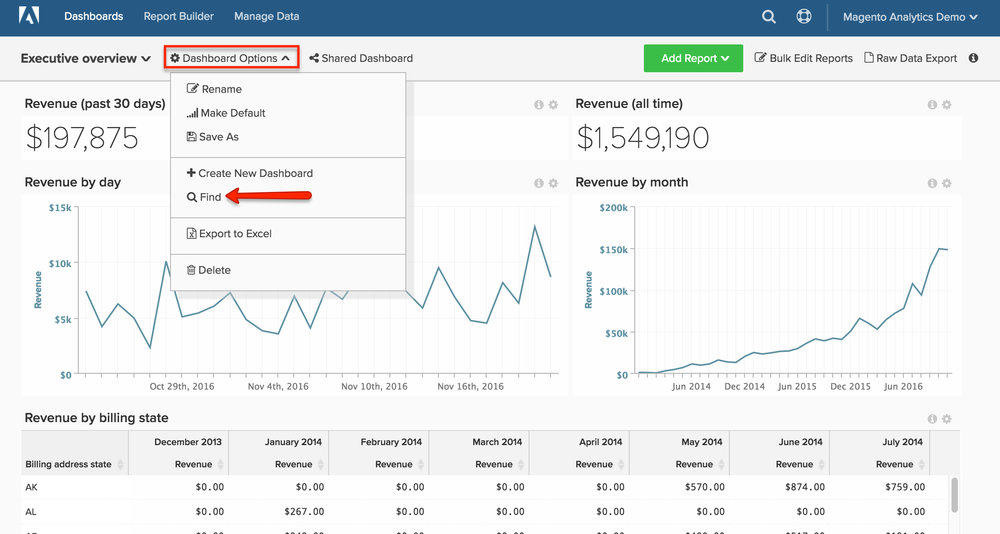

# Cercare un dashboard

In questo argomento viene illustrato come utilizzare la [[!DNL Global Search] funzionalità](#global) per cercare dashboard e come cercare [dashboard di proprietà di altri utenti](#other).

## Ricerca globale {#global}

Il menu [!DNL Global Search] consente di cercare e selezionare i dashboard da visualizzare.

* *Per visualizzare un elenco dei dashboard esistenti*, fare clic sul dashboard.

* *Per cercare un dashboard*, immettere alcuni criteri di ricerca nella barra di ricerca dopo aver fatto clic sul menu a discesa del dashboard. Se una dashboard corrisponde ai criteri, viene visualizzata per prima nell’elenco.

Esempio:

## Trova dashboard di proprietà di altri utenti {#other}

Cerchi un dashboard di proprietà di un altro utente? Se altri utenti possono visualizzare il dashboard, è possibile cercarlo facendo clic su **[!UICONTROL Find]** nel menu a discesa `Dashboard Options`.

