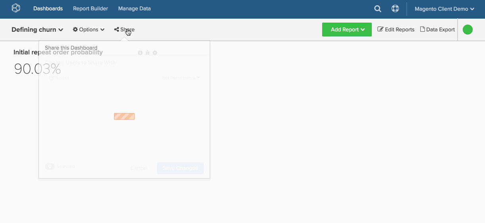

# Condividere dashboard a livello di organizzazione

È facile assicurarsi che ogni utente abbia accesso alle dashboard aziendali essenziali in [!DNL Adobe Commerce Intelligence]. La condivisione universale dei dashboard facilita una maggiore collaborazione e trasparenza in tutta l’organizzazione, fornendo un’unica &quot;fonte di verità&quot;.

1. Per mostrare le tue informazioni ai tuoi colleghi, fai clic su **[!UICONTROL Share this Dashboard]** nella parte superiore della schermata.

1. Verrà visualizzato l’elenco degli utenti. Il primo utente dell’elenco sarà la tua organizzazione. Fai clic sulla casella di controllo accanto al nome.

1. Impostare il livello di `Permissions` che si desidera assegnare ad altri utenti - `View`, `Edit` o `None`.

1. Fare clic su **[!UICONTROL Save Changes]**.

   Se `Permissions` è impostato su `View` o `Edit` e gli utenti cercano il dashboard, il dashboard verrà visualizzato nei risultati della ricerca.

Esempio:

<!--{: width="675" height="311"}-->
