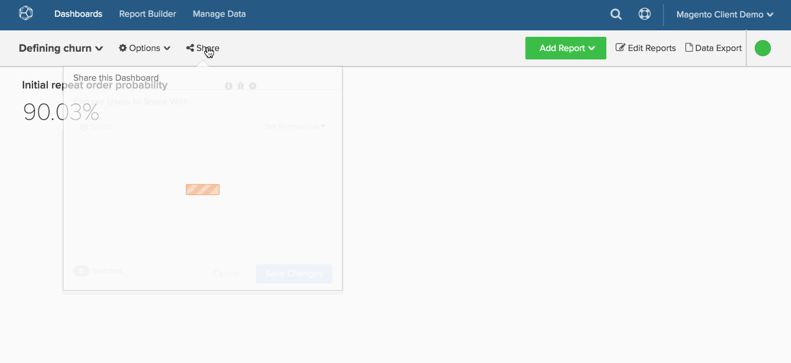

# Condivisione di dashboard a livello aziendale

È facile garantire che ogni utente abbia accesso a dashboard aziendali essenziali in [!DNL MBI]. La condivisione universale del dashboard facilita una maggiore collaborazione e trasparenza in tutta l&#39;organizzazione fornendo un&#39;unica &quot;fonte di verità&quot;.

1. Per mostrare le tue informazioni ai tuoi colleghi, fai clic su **[!UICONTROL Share this Dashboard]** nella parte superiore dello schermo.

1. Verrà visualizzato l’elenco degli utenti. Il primo utente dell’elenco sarà la tua organizzazione. Fare clic sulla casella di controllo accanto al nome corrispondente.

1. Imposta il livello di `Permissions` vuoi che altri utenti abbiano - `View`, `Edit`oppure `None`.

1. Fai clic su **[!UICONTROL Save Changes]**.

   Se `Permissions` sono impostate su `View` o `Edit` e gli utenti cercano il dashboard, il dashboard verrà visualizzato nei risultati della ricerca.

Esempio:

<!--{: width="675" height="311"}-->
