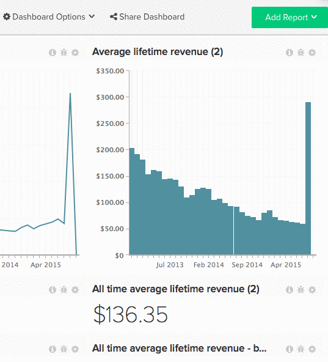

# Condividere dashboard con altri utenti

La condivisione di dashboard è un ottimo modo per mantenere il team in loop e incoraggiare la discussione collaborativa. Creando e condividendo una dashboard centrale, puoi fornire al team le informazioni necessarie mantenendo il controllo. [[!DNL Adobe] consiglia](../../best-practices/share-dashboard-best-practice.md){: target="_blank"} di concedere a `Edit` i diritti di alcuni per ridurre al minimo le modifiche accidentali.

>[!NOTE]
>
>Se il dashboard condiviso contiene report generati con metriche a cui un utente specifico non ha accesso, i report visualizzano un messaggio `Error Loading Data`. Se desideri che i dati vengano visualizzati all&#39;utente specifico, un [utente amministratore](../../administrator/user-management/user-management.md) deve concedere l&#39;accesso a tutte le metriche utilizzate in tali rapporti.

## Condividere un dashboard

1. Fai clic su **[!UICONTROL Share Dashboard]** nella parte superiore della schermata.

   Verrà visualizzato un elenco di tutti gli utenti nel tuo account [!DNL Commerce Intelligence].

1. Per selezionare un utente con cui condividere il dashboard, seleziona la casella a sinistra del nome.

   Per selezionare/deselezionare tutti gli utenti, fare clic su **[!UICONTROL Select]** e selezionare rispettivamente `Everyone` o `None`.

1. Le autorizzazioni possono essere impostate utente per utente o in massa.

   *Per impostare singole autorizzazioni*, fare clic su **[!UICONTROL None]** a destra del nome dell&#39;utente. Da questo elenco a discesa, seleziona il tipo di autorizzazioni di cui l’utente deve disporre.

   *Per impostare le autorizzazioni in massa*, fare clic su **[!UICONTROL Set Permissions]**. Da questo elenco a discesa, seleziona il tipo di autorizzazioni che gli utenti selezionati devono avere.

   >[!NOTE]
   >
   >È inoltre possibile utilizzare questa funzione per aggiornare le autorizzazioni precedentemente impostate. Se ad esempio si desidera interrompere la condivisione del dashboard con un altro utente, impostare le relative autorizzazioni su `None`.

1. Per condividere il dashboard, fare clic su **[!UICONTROL Save Changes]**. Gli utenti selezionati riceveranno un&#39;e-mail con l&#39;invito a visualizzare la dashboard.

Esempio:

