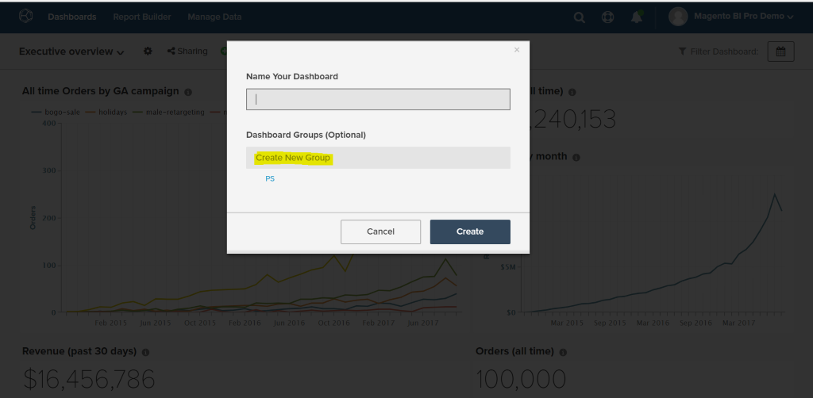

# Utilizzare i gruppi del dashboard

I gruppi di dashboard consentono una migliore organizzazione delle dashboard. Il caso d’uso più comune consiste nel raggruppare dashboard simili sotto lo stesso &quot;gruppo&quot;. Ad esempio, tutte le dashboard relative al marketing possono essere raggruppate in un gruppo di dashboard &quot;Marketing&quot;.

Nel menu a discesa per la selezione della dashboard, i gruppi della dashboard sono visualizzati in ordine alfabetico, con tutte le dashboard nella sezione &quot;Nessun gruppo&quot; visualizzate per ultime. All’interno di ogni gruppo, i dashboard dello stesso gruppo vengono visualizzati insieme e in ordine alfabetico.

## Condivisione gruppo dashboard

I gruppi del dashboard non possono essere condivisi direttamente tra gli utenti. Quando un dashboard viene condiviso con gli utenti, il gruppo di dashboard in cui si trova viene creato automaticamente per tali utenti se non esiste. Se il gruppo di dashboard esiste, il dashboard viene aggiunto all’elenco.

Quando il proprietario modifica il gruppo di un dashboard, la modifica viene applicata automaticamente a tutti gli utenti con cui il dashboard è stato condiviso. Gli utenti non possono modificare il gruppo di dashboard per dashboard di cui non sono proprietari.

## Creare gruppi di dashboard

I gruppi di dashboard possono essere creati in uno dei due modi seguenti:

1. Durante la creazione di un dashboard:

   

1. Quando si modifica il gruppo di un dashboard esistente dalla pagina `Manage Data > Dashboards`:

   1. Fate clic sul quadro comandi per il quale desiderate creare il gruppo.

   1. In `Dashboard Group (optional)` viene visualizzato il gruppo di dashboard corrente.

   1. Per creare un gruppo, digitarne il nome e fare clic all&#39;esterno della casella.

      

## Aggiungere dashboard esistenti ai gruppi esistenti

1. Nella pagina `Manage Data > Dashboards`, scegliere il dashboard per il quale modificare il gruppo.

1. Il testo in `Dashboard Group (optional)` mostra il gruppo di dashboard corrente del dashboard.

1. Per modificare il gruppo del dashboard, scegliere un altro gruppo dall&#39;elenco, in questo caso `PS`, `Campaigns`.

   

## Elimina gruppi dashboard

Quando un gruppo di dashboard non dispone di dashboard al suo interno, viene eliminato automaticamente.
