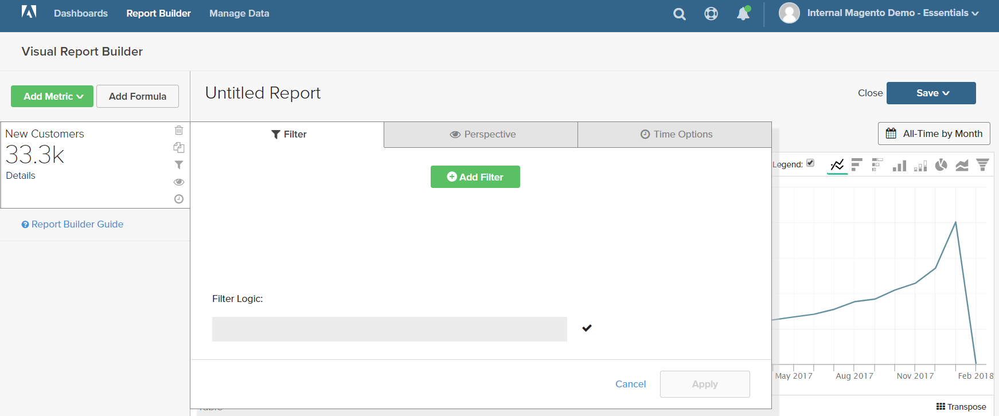
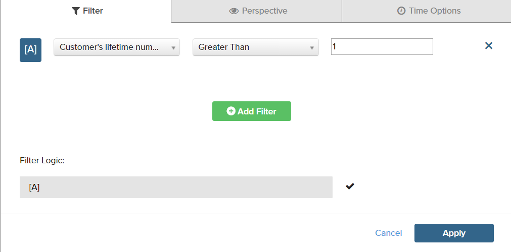
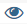

# Filtri

È possibile aggiungere uno o più filtri per limitare i dati utilizzati per produrre un rapporto. Ogni filtro è un&#39;espressione che include una colonna della tabella associata, un operatore e un valore. Ad esempio, per includere solo i clienti frequenti, puoi creare un filtro che includa solo i clienti che hanno effettuato più ordini. È possibile utilizzare più filtri con operatori `AND/OR` logici per aggiungere logica al report.

>[!TIP]
>
>Un rapporto può avere un massimo di 3.500 punti dati. Per ridurre il numero di punti dati, utilizza un filtro per ridurre la quantità di dati utilizzati per generare il rapporto.

[!DNL Adobe Commerce Intelligence] include una selezione di filtri che è possibile utilizzare &quot;preconfigurati&quot; o modificare in base alle proprie esigenze. Non esiste alcun limite al numero di filtri che è possibile creare.

## Per aggiungere un filtro:

1. Nel grafico, passa il cursore su ogni punto dati.

   In questo rapporto, ogni punto dati mostra il numero totale di clienti per il mese.

1. Nel pannello sinistro fare clic sull&#39;icona Filtri ().

   

1. Fare clic su **[!UICONTROL Add Filter]**.

   I filtri sono numerati alfabeticamente e il primo è `[A]`. Le prime due parti del filtro sono opzioni a discesa e la terza parte è un valore.

   

   * Fare clic sulla prima parte del filtro e scegliere la colonna da utilizzare come oggetto dell&#39;espressione.

     

   * Fai clic sulla seconda parte del filtro e scegli l’operatore.

     

   * Nella terza parte del filtro immettere il valore necessario per completare l&#39;espressione.

     

   * Al termine del filtro, fare clic su **[!UICONTROL Apply]**.

     Il rapporto ora include solo i clienti frequenti e il numero di record dei clienti recuperati per il rapporto è stato ridotto da 33.000 a 12.600.

     <!--{: .zoom}-->

1. Nella barra laterale fare clic sull&#39;icona Prospettiva ().

   <!--{: .zoom}-->

1. Nell&#39;elenco delle impostazioni scegliere `Cumulative`. Quindi fare clic su **[!UICONTROL Apply]**.

   

   La prospettiva `Cumulative` distribuisce la modifica nel tempo, anziché mostrare le modifiche su e giù per ogni mese.

1. Immetti un `Title` per il report e fai clic su **[!UICONTROL Save]** come `Chart` nel dashboard.

   
