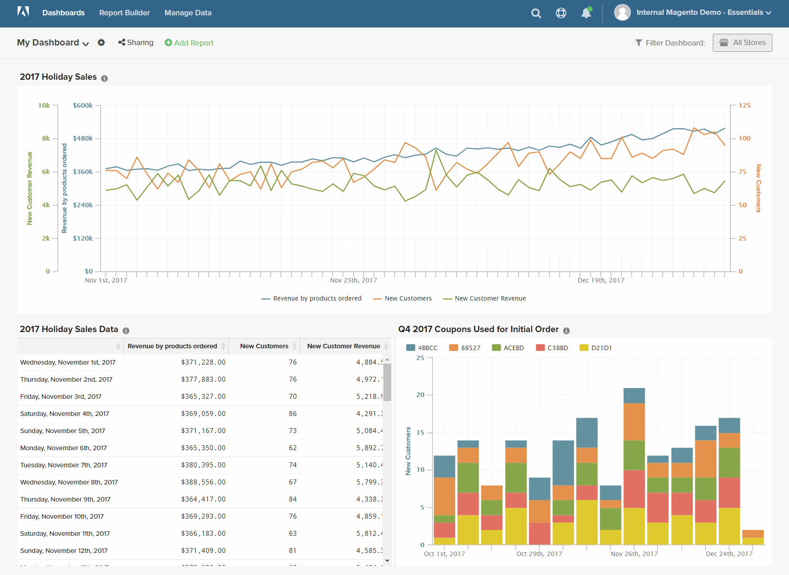

# Formule

Una formula combina più metriche e logica matematica per rispondere a una domanda. Ad esempio, quanto dei ricavi per prodotto durante le feste è stato generato dai nuovi clienti?

## Passaggio 1: Creare il rapporto di base

1. Nel menu , scegli `Report Builder`.

1. Fai clic su **[!UICONTROL Add Metric]** e scegli la prima metrica per il rapporto.

   Per questo esempio, la `Revenue by products ordered` viene utilizzata la metrica .

1. Fai clic su **[!UICONTROL Add Metric]** di nuovo e scegli la seconda metrica per il rapporto.

   Per questo esempio, la `New Customers` viene utilizzata la metrica .

1. Nella barra laterale, fai clic su **[!UICONTROL Details]** per visualizzare informazioni su ogni metrica.

   

1. Nella barra laterale fai clic sul nome di ogni metrica per aprire la pagina delle impostazioni in una nuova scheda del browser. Scorri verso il basso per visualizzare ogni componente della metrica, inclusi query metrica, filtro e dimensioni.

   

1. Per tornare al rapporto, fai clic sulla scheda del browser precedente.

1. Nel grafico, passa il cursore del mouse su alcuni punti di dati su ciascuna riga per visualizzare gli importi associati a ciascuna metrica.

## Passaggio 2: Aggiungi una formula

1. Nella parte superiore della barra laterale, fai clic su **[!UICONTROL Add Formula]**.

   La casella della formula mostra le metriche come input disponibili `A` e `B`e include una casella di immissione in cui è possibile immettere la formula.

   Effettua le seguenti operazioni:

   * In `Enter your Formul` casella di input, immettere `A/B`.

      In questo modo i ricavi verranno suddivisi per prodotti ordinati per il numero di nuovi clienti.

   * Imposta `Select format` a `123Number`.

   * Nella barra laterale sostituisci `Untitled` con un nome per la formula.

   

1. Al termine, fai clic su **[!UICONTROL Apply]**.

   Il rapporto ora ha una nuova riga per la formula, `New Customer Revenue`, e la barra laterale mostra la quantità totale di ricavi generati dai nuovi clienti.

   

## Passaggio 3: Aggiungere un intervallo di date

1. Fai clic su **[!UICONTROL Date Range]** nell&#39;angolo in alto a destra.

1. Sulla `Fixed Date Range` esegui le seguenti operazioni:

   * Nei calendari, scegli l’intervallo di date.

      Per questo esempio, la stagione festiva va dal 1° novembre al 31 dicembre.

   * Sotto `Select Time Interval`, scegli `Day`.

      

   * Al termine, fai clic su **[!UICONTROL Apply]**.

   Il rapporto è ora limitato alla stagione delle vacanze, con un punto dati per ogni giorno.

   

## Passaggio 4: Salvare il rapporto

In questo passaggio, il rapporto verrà salvato come grafico e anche come tabella.

1. Fai clic su `Untitled Report` nella parte superiore della pagina e immetti un titolo descrittivo. In questo esempio, il titolo del rapporto è `2017 Holiday Sales`.

   Quindi, procedi come segue:

   * Nell&#39;angolo in alto a destra, fai clic su **[!UICONTROL Save]**.

   * Per `Type`, accetta il valore predefinito `Chart` impostazione.

   * Scegli la `Dashboard` dove la relazione deve essere disponibile.

   * Fai clic su **[!UICONTROL Save to Dashboard]**.

1. Fai clic sul titolo del rapporto e modifica il nome. In questo esempio, il titolo del rapporto viene modificato in `2017 Holiday Sales Data`.

   Quindi, procedi come segue:

   * Nell’angolo in alto a destra, fai clic su **[!UICONTROL Save a Copy]**.

   * Imposta `Type` a `Table`.

   * Scegli la `Dashboard` dove la relazione deve essere disponibile.

   * Fai clic su **[!UICONTROL Save a Copy to Dashboard]**.

1. Per visualizzare i rapporti nel dashboard, effettua una delle seguenti operazioni:

   * Fai clic su **[!UICONTROL Go to Dashboard]** nel messaggio nella parte superiore della pagina.

   * Nel menu , scegli **[!UICONTROL Dashboards]**. Fare clic sul nome del dashboard corrente per visualizzare l&#39;elenco. Quindi, fai clic sul nome del dashboard in cui è stato salvato il rapporto.
