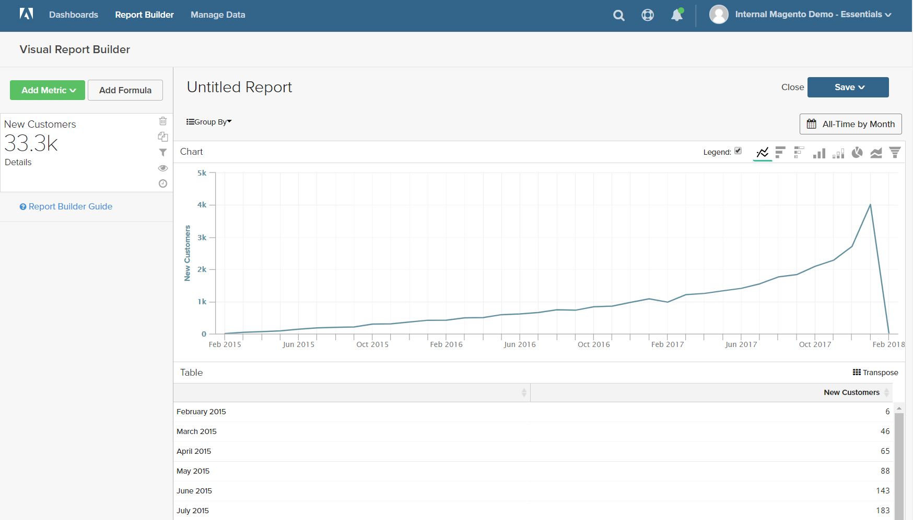
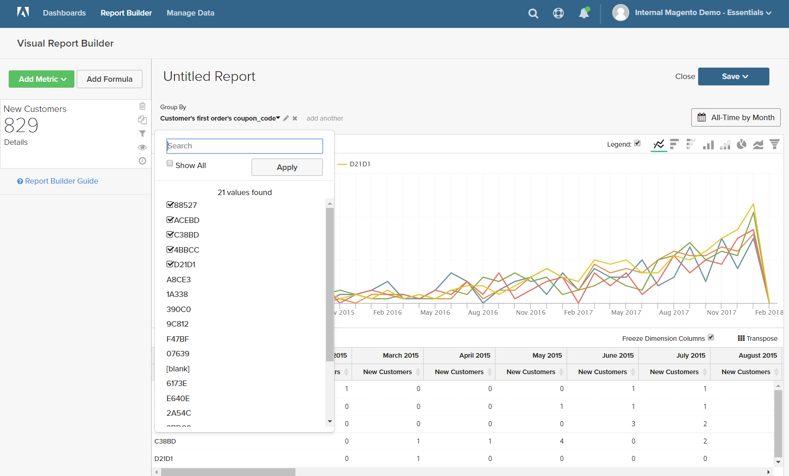
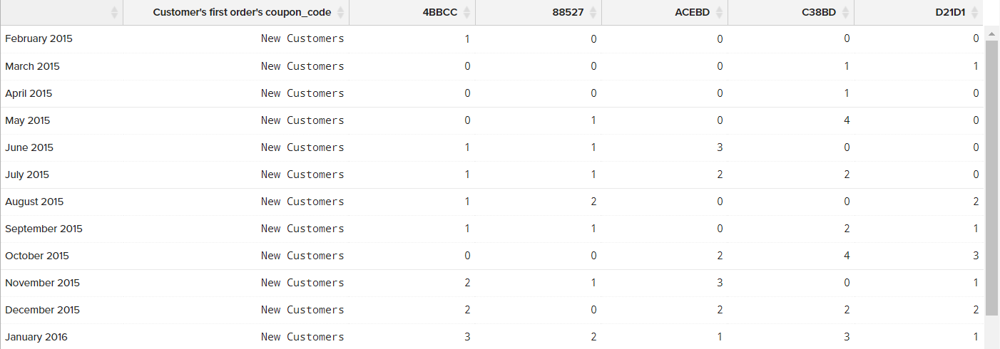
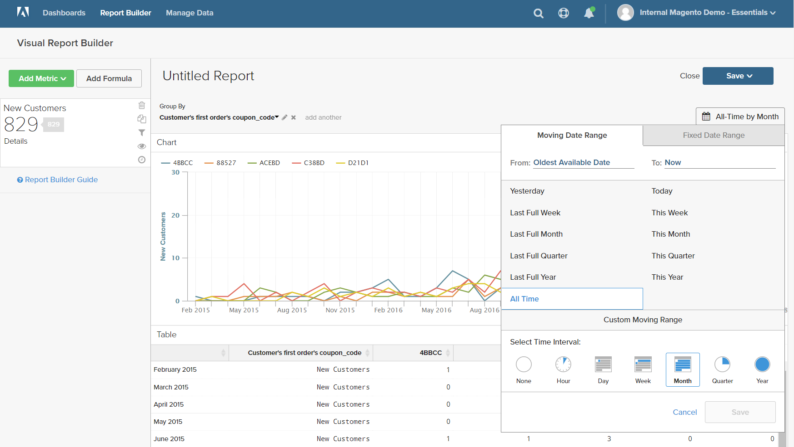

# [!DNL Visual Report Builder]

[!DNL Visual Report Builder] semplifica la creazione di report rapidi basati su metriche predefinite. Ogni metrica include una query che definisce il set di dati per il rapporto.

Nell&#39;esempio seguente viene illustrato come creare un report semplice, raggruppare i dati per una dimensione aggiuntiva, impostare l&#39;intervallo di data e ora, modificare il tipo di grafico e salvare il report in un dashboard.

## Per creare un rapporto semplice:

1. Nel menu [!DNL Commerce Intelligence], fare clic su **[!UICONTROL Report Builder]**.

1. In [!UICONTROL Visual Report Builder], fare clic su **[!UICONTROL Create Report]** ed eseguire le operazioni seguenti:

   * Fare clic su **[!UICONTROL Add Metric]**.

     Le metriche disponibili possono essere elencate in ordine alfabetico o per tabella.

     

   * Scegli la [metrica](../../data-user/reports/ess-manage-data-metrics.md) che descrive il set di dati da utilizzare per il rapporto.

     La metrica `New Customers` utilizzata in questo esempio conta tutti i clienti e ordina l&#39;elenco in base alla data in cui il cliente si è iscritto a un account. Il rapporto iniziale include un semplice grafico a linee seguito dalla tabella dei dati.

     Il riepilogo a sinistra mostra il nome della metrica corrente, seguito dal risultato di eventuali calcoli sui dati delle colonne specificati nella metrica. In questo esempio, nel riepilogo viene visualizzato il conteggio totale dei clienti.

     

1. Nel grafico, passa il cursore del mouse su ogni punto dati della linea. Ogni punto dati mostra il numero totale di nuovi clienti che si sono iscritti durante quel mese.

1. Seguire queste istruzioni per raggruppare i dati, modificare l&#39;intervallo di date e il tipo di grafico.

   **`Group By`**

   Il controllo `Group By` consente di aggiungere più dimensioni per gruppo o segmento. I Dimension sono colonne della tabella che possono essere utilizzate per raggruppare i dati.

   * Scegliere una delle dimensioni disponibili dall&#39;elenco delle opzioni `Group By`.

     Per questo esempio, il sistema ha trovato cinque codici coupon utilizzati dai clienti durante il primo ordine.

     

     Nel dettaglio `Group By` sono elencati tutti i coupon utilizzati dai clienti. I coupon utilizzati per effettuare l&#39;ordine iniziale sono contrassegnati da una casella di controllo. Il grafico ora presenta più linee colorate che rappresentano ogni coupon utilizzato per un primo ordine. La legenda è codificata per colore in modo da corrispondere a ogni riga di dati.

   * Fare clic su **[!UICONTROL Apply]** per chiudere il dettaglio Raggruppa per.

     

   * Passa il cursore del mouse su alcuni punti dati su ciascuna riga per vedere il numero di clienti che hanno utilizzato quel coupon durante il primo ordine.

   * La tabella di dati ora dispone di una dimensione aggiuntiva, con una colonna per ogni mese e una riga per ogni codice coupon.

     

   * Fare clic sul controllo Trasposizione () nell&#39;angolo superiore destro della tabella per modificare l&#39;orientamento dei dati.

     L’asse dei dati viene capovolto e la tabella ora ha una colonna per ciascun codice coupon e una riga per ogni mese. Questo orientamento potrebbe risultare più semplice da leggere.

     

   **`Date Range`**

   Il controllo `Date Range` mostra le impostazioni correnti dell&#39;intervallo di date e dell&#39;intervallo di tempo e si trova appena sopra il grafico a destra.

   * Fare clic sul controllo `Date Range`, in questo esempio impostato su `All-Time by Month`.

     

   * Apporta le seguenti modifiche:

      * Per ingrandire la visualizzazione, impostare l&#39;intervallo di date su `Last Full Quarter`.
      * In `Select Time Interval` scegliere `Week`.
      * Al termine, fare clic su **[!UICONTROL Save]**.

     Il rapporto ora include solo i dati dell’ultimo trimestre, per settimana.

     

   **Tipo di grafico**

   * Fare clic sui controlli nell&#39;angolo superiore destro per trovare il grafico migliore per i dati.

     Alcuni tipi di grafico non sono compatibili con i dati multidimensionali.

     | | |
     |-----|-----|
     |  | Grafico a linee |
     |  | Barre orizzontali |
     |  | Barre orizzontali sovrapposte |
     |  | Barra verticale |
     |  | Barre verticali sovrapposte |
     |  | Torta |
     |  | Superfici |
     |  | Funnel |

     {style="table-layout:auto"}

1. Per assegnare al report un `title`, sostituisci il testo `Untitled Report` nella parte superiore della pagina con un titolo descrittivo.

1. Nell&#39;angolo superiore destro fare clic su **[!UICONTROL Save]** ed effettuare le seguenti operazioni:

   * Per `Type`, accettare l&#39;impostazione predefinita, `Chart`.

   * Scegliere `Dashboard` in cui il report deve essere disponibile.

   * Fare clic su **[!UICONTROL Save to Dashboard]**.

     

1. Per visualizzare il grafico in un dashboard, effettuare una delle seguenti operazioni:

   * Fare clic su **[!UICONTROL Go to Dashboard]** nel messaggio nella parte superiore della pagina.

   * Scegliere `Dashboards` dal menu e fare clic sul nome del dashboard corrente per visualizzare l&#39;elenco. Quindi, fai clic sul nome della dashboard in cui è stato salvato il rapporto.

     
